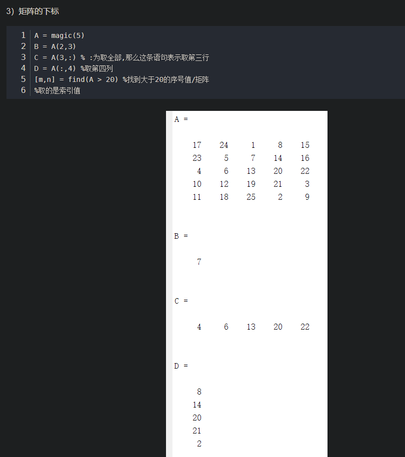

# matlab

Owner: -QVQ-


- 数组和矩阵函数
    - 1）数组基本函数
        
        display：显示字符或者数组
        
        ---
        
        isempty :判断数组是否为空，空返回1，不空返回0
        
        ---
        
        isequal :判断数组是否相同 （认为NaN不同）
        
        ---
        
        isequalwithequalnans:判断数组是否相同，把NaN看成相同的数
        
        ---
        
        isfinite :判断数组元素是否为有限数
        
        ---
        
        isfloat :判断数组元素是否为浮点数
        
        ---
        
        isinf :判断数组元素是否为无限数
        
        ---
        
        isinteger :判断元素是否为整数
        
        ---
        
        islogical ：判断元素是否为逻辑变量
        
        ---
        
        isnan ：判断元素是否为NaN
        
        ---
        
        isnumeric ：判断数组元素是否为数值
        
        ---
        
        isscalar ：判断输入是不是离散量
        
        ---
        
        issparse ：判断矩阵是否为稀疏矩阵
        
        ---
        
        isvector ：判断输入是否为向量
        
        ---
        
        length ：计算向量的长度
        
        ---
        
        max ：找出向量中的最大元素
        
        ---
        
        C=max(A) A为一个向量，返回向量最大值，矩阵A，返回每列向量最大值
        
        ---
        
        C=max(A,B) A、B维数一样，返回对应位置最大元素
        
        ---
        
        max(A,[],dim)
        
        ---
        
        [C,I]=max(A)找出最大值和索引
        
        ---
        
        min ：找出向量中的最小元素
        
        ---
        
        ndims ：计算矩阵的维数  
          ndims同length(size(x)) 一致
        
        ---
        
        numel：计算数组中元素的个数或者下标数组表达式的个数
        
        ---
        
        size ：计算数组维数大小  d=size(X)
          [m,n]=size(X)m行n列 m=size(X,dim)
        
    - 2）数组操作函数
        
        bsxfun：两个数组间元素逐个计算  C=bsxfun(fun,A,B)
        
        @plus(加)@minus（减）@times(数组乘)@rdivide（左除）@ldivide（右除）@power（幂）@max@min@rem（整除）@mod（模除）
        
        ---
        
        dot :向量点乘 C=dot(A,B)
        
    - 3）基础矩阵函数
        
        create :生成随机数流  
          [s1,s2,…]=RandStream.create('gentype','NumStreams',n)
        
        ---
        
        eye :生成单位矩阵 Y=eye(m,n)对角线1，其他0
        
        ---
        
        ones :生成元素为1的数组  Y=ones(n)
          Y=ones(m,n)
        
        ---
        
        rand :生成均匀分布的伪随机数矩阵 r=rand(n)
          rand(m,n,p,…)
        
        ---
        
        randi :生成均匀分布的伪随机整数矩阵 randi(imax)
          r=randi(imax,n)
        
        ---
        
        r=randi(imax,m,n,p,…)
          r=randi([imin,imax],…) 例：r=randi([5,10],[2,3])
        
        ---
        
        randn :生成[-1,1]之间随机分布数矩阵 r=randn(n)
          randn(m,n)randn(m,n,p,…)
        
        ---
        
        randstream :生成随机数据流
        
        ---
        
        set (RandStream)
          :设置随机数据流属性set(S,'PropertyName',Value)
        
        ---
        
        set(S,'Property')
        
    - 4)矩阵处理函数
        
        reshape ：改变矩阵维数  
          B=reshape(A,m,n)
        
        ---
        
        sort :把数组元素按升序或降序排列
        
        ---
        
        B=sort(A,dim) B=sort(...,mode)
          [B,IX]=sort(A,2)返回B元素在A中的位置的索引
        
        ---
        
        sortrows :矩阵行按照升序排列
        
        inv()：求逆
        
    - 5）矩阵分析函数
        
        det :求方阵行列式值
        
        ---
        
        norm :计算向量或者矩阵范数   n=norm(A)
          n=norm(A,p)
        
        ---
        
        normest :返回矩阵2-范数估计值
        
        ---
        
        null :计算矩阵零空间
        
        ---
        
        rank :返回矩阵的秩
        
        triu(A)上三角矩阵
        
        tril(A)下三角矩阵
        
        ---
        
        subspace :返回两个子空间夹角
        
        ---
        
        trace :返回矩阵的迹对角元素之和
        
    - 6）矩阵特征值函数
        
        eig :计算矩阵特征值和特征向量
        
        ---
        
        condeig :计算特征值对应的条件数
        
        ---
        
        eigs :计算矩阵的最大特征值和特征向量
        
        ---
        
        gsvd :矩阵广义奇异值分解
        
        ---
        
        svd :矩阵奇异值分解
        
        vrho：求谱半径
        
        ---
        
- 数据运算
    
    +：加法运算符
    
    - ：减法运算符
    - ：矩阵乘法
    
    .*：数组乘法
    
    /：斜杠或者矩阵右除   B/A等于公式B*inv(A)
    
    ./：数组右除    A./B等于A(i,j)/B(i,j)
    
    \：反斜杠或者矩阵左除    A\B等于inv(A)*B
    
    .\：数组左除     A.\B等于B(i,j)/A(i,j)
    
    ^：矩阵幂计算
    
    .^：数组幂计算    A.^B等于A(i,j)的B(i,j)次幂
    
    ’：矩阵转置
    
    []：表示空矩阵，A(m,:)删除A中的一行，A(:,n)删除A中的一列
    
    {}：元胞组赋值
    
    关系操作符：< <= > >= == ~ =
    
    逻辑操作符 : 逻辑：&&  ||  数组：&  |  ~
    
- 统计分析函数
    
    brush:交互式标记、删除、修改以及保存图片中的观测量位   data brush
    
    corrcoef ：计算相关性系数  R=corrcoef(X)
    
    cov ：返回协方差矩阵  cov(x)
    
    max ：求数组中的最大元素     C=max(A) C=max(A,B) C=max(A,[],dim)
    
    mean ：求数组的平均数或者均值  M=mean(A) M=mean(A,dim)
    
    median ：返回数组的中间值  M=median(A) M=median(A,dim)
    
    mode ：求数组中出现频率最多的值    M=mode(X) M=mode(X, dim)
    
    [M,F]=mode(X, ...)
    
    std ：计算标准差 s=std(X)
    
    var ：计算方差  V=var(X)
    

A = rand(m,n)  %生成m*n的矩阵给A

x = zeros(n, 1) %创建n*1的矩阵（向量），值全赋0，给x

- 矩阵的变量操作
    
    a = randperm(20)
    
    a(1:5) %取向量a中第1个到第5个元素



    
- 基本操作
    - 循环
        
        ```matlab
        for i = 初始值（: 增值）:终止数
                       执行语句
        end
        
        while 条件表达式
                        当条件表达式符合则执行 
        end
        ```