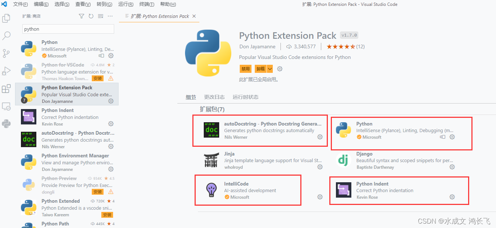
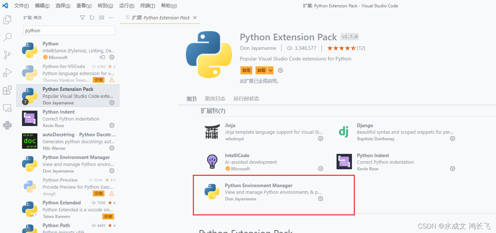
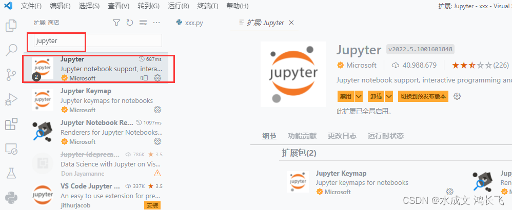
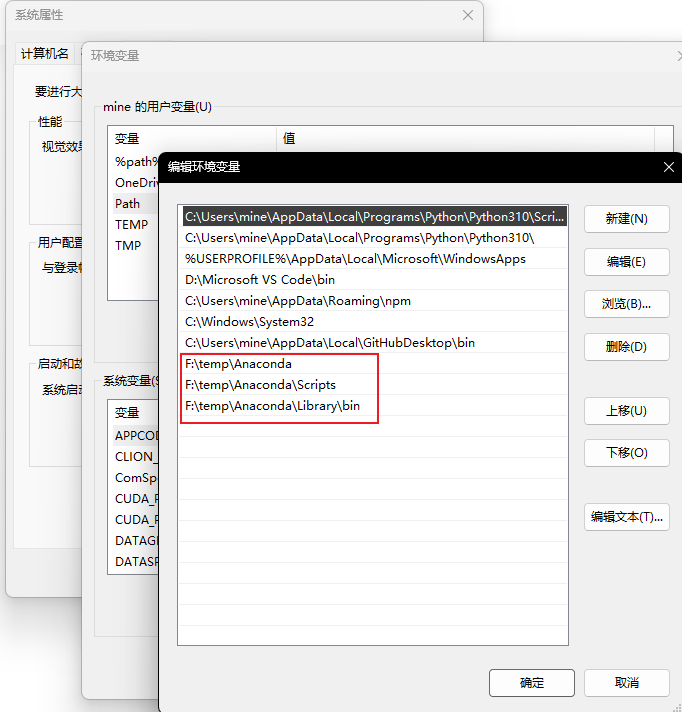
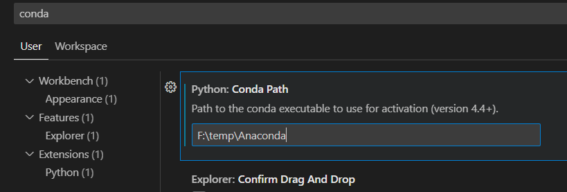
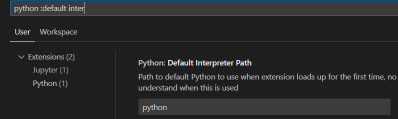
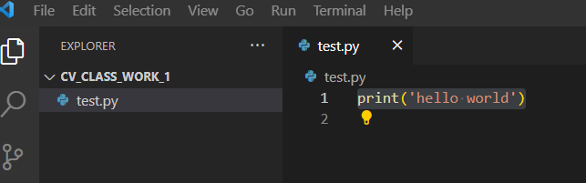
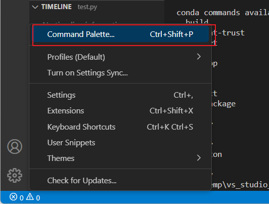
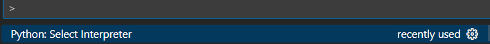
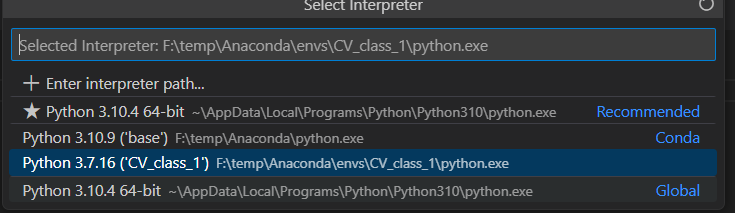

# anaconda环境搭建vscode

Owner: -QVQ-

vscode中安装如下扩展

配置环境变量path

vscode里面 设置-搜索python path然后复制地址进去

这里可以设置python默认路径         python :default inter

随便建一个文件 

左下角设置，选择解释器，设置环境，‘base’那一行默认都有，可以选这个

