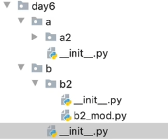
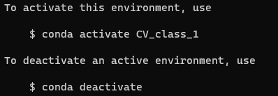
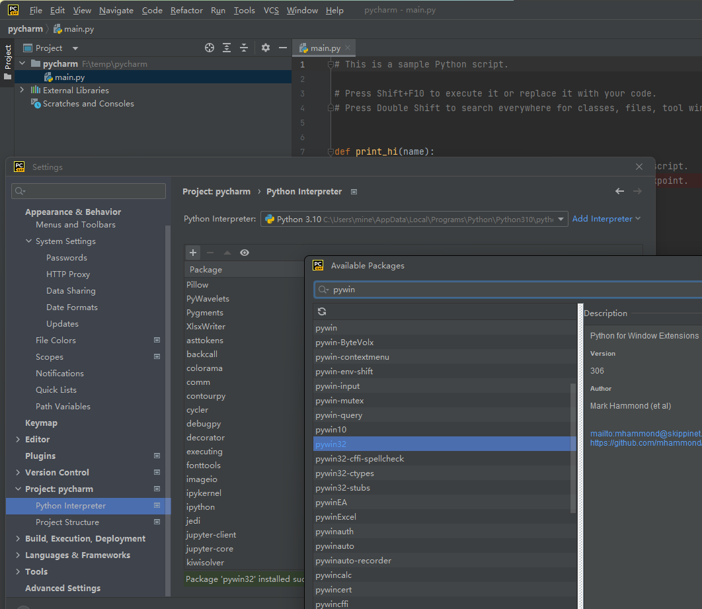

# python

Owner: -QVQ-

---

| 基础     | 注释S          | # 注释内容  """  第⼀⾏注释   第⼆⾏注释  第三⾏注释   """  '''  注释1   注释2   注释3   ''' | 快捷键： ctrl + /                                            |                                                              |
| -------- | -------------- | ------------------------------------------------------------ | ------------------------------------------------------------ | ------------------------------------------------------------ |
|          | 数据类型       | int  float  bool  str(字符串)  list(列表)  tuple（元组）  set（集合）  dict（字典） | d = '12345' print(type(d)) # -- 字符串  e = [10, 20, 30] print(type(e)) # -- 列表  f = (10, 20, 30) print(type(f)) # -- 元组  h = {10, 20, 30} print(type(h)) # -- 集合  g = {'name': 'TOM', 'age': 20} print(type(g)) # -- 字典 |                                                              |
|          | 常用函数       | type（变量名）                                               | 查看变量的类型                                               |                                                              |
|          |                | import random #导出random模块                                | random.randint(数字范围1，数字范围2)  #随机整数，取值为闭区间 |                                                              |
|          | 输出           | `print('文本')`   print输出完成后自带一个换行符  `print("jkk"   "kk")` 可以实现多行命令输出一行内容  `print('文本'*4)` #支持乘法   文本文本文本文本  `print(f'我的名字是{name}, 明年{age + 1}岁了')` #自动判别类型输出 | %s 字符串  %d 有符号的⼗进制整数  %f 浮点数  %c 字符  %u ⽆符号⼗进制整数  %o ⼋进制整数  %x ⼗六进制整数（⼩写ox）  %X ⼗六进制整数（⼤写OX）  %e 科学计数法（⼩写'e'）  %E 科学计数法（⼤写'E'）  %g %f和%e的简写  %G %f和%E的简写  %06d，表示输出的整数显示位数，不⾜以0补全，超出当前位数则原样输出  %.2f，表示⼩数点后显示的⼩数位数。 | print('hello Python')  age = 18 print(age)   # 我的名字是TOM，明年19岁了  `print('我的名字是%s，明年%d岁了' % (name, age + 1))`   # 我的名字是TOM，明年19岁了  `print(f'我的名字是{name}, 明年{age + 1}岁了')`      `print('内容', end=‘ ’)`#可以改变输出结束符，默认为换行符 |
|          | 转义字符       | \n ：换⾏。  \t ：制表符，⼀个tab键（4个空格）的距离。       |                                                              |                                                              |
|          | 输入           | `input`('文本')                                              | 在Python中， input 会把接收到的任意⽤户输⼊的数据都当做字符串处理。 |                                                              |
|          | 转化数据类型   | 转换后的作为返回值，变量本身不改变                           | eval(str ) 将字符串中的数据转成原本的类型  int(x [,base ]) 将x转换为⼀个整数  float(x ) 将x转换为⼀个浮点数  str(x ) 将对象 x 转换为字符串  repr(x ) 将对象 x 转换为表达式字符串  tuple(s ) 将序列 s 转换为⼀个元组  list(s ) 将序列 s 转换为⼀个列表  complex(real [,imag ]) 创建⼀个复数，real为实部，imag为虚部     chr(x ) 将⼀个整数转换为⼀个Unicode字符  ord(x ) 将⼀个字符转换为它的ASCII整数值  hex(x ) 将⼀个整数转换为⼀个⼗六进制字符串  oct(x ) 将⼀个整数转换为⼀个⼋进制字符串  bin(x ) 将⼀个整数转换为⼀个⼆进制字符串 |                                                              |
|          | 交换数据       | `a,b = 1,2a,b = b,a` #a=2,b=1                                |                                                              |                                                              |
|          | 帮助文档       | `help（关键字）`                                             | `def 函数名(参数):    """ 说明文档 """    代码    ...…`   `help(函数名)` #输出说明文档 |                                                              |
| 运算符   | 算数运算符     | `/ 除` 10 / 2 输出结果为 5.0  `// 整除` 9 // 4 输出结果为2  `** 指数` 2 ** 4 输出结果为 16，即 2 * 2 * 2 * 2 | /运算符不管是否整除得到的值都会是float型  //会得到int型  **根据输出的情况为int或float | 优先级：() ⾼于 ** ⾼于 * / // % ⾼于 + -                    |
|          | 赋值运算符     |                                                              | num1, float1, str1 = 10, 0.5, 'hello world'  a = b = 10  一条指令只要有错误，整条指令都不会执行 |                                                              |
|          | 逻辑运算符     | and  or  not                                                 | 2 or 0 #python为2（两个值为0（或float）则为0（或float），否则为第一个非0的数字），c为1  1 and 2 #python为2（有一个为0（或float）则为0（或float），否则为最后一个非0的数字），c为1 |                                                              |
| 条件判断 | 条件语句       | `if 条件1: ` 条件成⽴执⾏的代码1  条件成⽴执⾏的代码2 ……  `elif 条件2:` 条件2成⽴执⾏的代码1  条件2成⽴执⾏的代码2  ...... ……  `else：` 以上条件都不成立执行的代码 | if True:  print('条件成⽴执⾏的代码1')   print('条件成⽴执⾏的代码2')      # 下⽅的代码没有缩进到if语句块，所以和if条件⽆关  print('我是⽆论条件是否成⽴都要执⾏的代码') |                                                              |
|          | 三目运算符     | 条件成⽴执⾏的表达式 if 条件 else 条件不成⽴执⾏的表达式     | c = a if a >b else b  如果a>b，c为a，否则为b                 |                                                              |
| 循环     | 循环           | `while 条件: ` 条件成⽴重复执⾏的代码1  条件成⽴重复执⾏的代码2  ...... | #循环的计数器  i = 0  while i < 5:  print('媳妇⼉，我错了')   i += 1     print('任务结束') |                                                              |
|          |                | `while 条件: ` 条件成⽴重复执⾏的代码  `else:` 循环正常结束之后要执⾏的代码 | i = 1  while i <= 5:  print('媳妇⼉，我错了')   i += 1  else:  print('媳妇原谅我了，真开⼼，哈哈哈哈') | (continue 控制的属于正常结束  break控制的不属于)             |
|          |                | `for 临时变量 in 序列: ` 重复执⾏的代码1  重复执⾏的代码2  ...... | str1 = 'itheima'  for i in str1:  print(i)                   |                                                              |
|          |                | for 临时变量 in 序列:   重复执⾏的代码  ...  else:  循环正常结束之后要执⾏的代码 | str1 = 'itheima'  for i in str1:  print(i)  else:  print('循环正常结束之后执⾏的代码') |                                                              |
|          | 结合range函数  | `for 临时变量 in range(起始数字，结尾数字，步长)：` range生成一个列表包含起始数字到结尾数字，不包含结尾数字 | for z in range(1,5,1): print(z) 1 2 3 4                      |                                                              |
| 引用     | id(变量名)     | 输出这个变量的地址                                           |                                                              |                                                              |
|          | `assert`关键字 | 用于在程序中判断一个条件是否为`True`，如果不是，就会抛出`AssertionError`的异常。 |                                                              |                                                              |

# **数据结构**

可变数据类型：

列表【】

集合{}：集合中只能包含不可变的数据类型

字典{：}，只能包含不可变的数据类型

不可变数据类型：

元组（，）

字符串“”：用+增加内容，实际上是删掉原本的内容重新赋值，地址改变了

整型数字

浮点型

**数据结构：**

## 数据结构通用操作

| 数据结构通用的操作 | 删除             | Del 变量名1，变量名2，…… #删除这个变量               |                                                              |                                                              |
| ------------------ | ---------------- | ---------------------------------------------------- | ------------------------------------------------------------ | ------------------------------------------------------------ |
|                    | 统计数据的个数   | len(变量名)                                          | 字符串、元组、列表                                           |                                                              |
|                    | 合并             | +                                                    | 支持的：字符串、元组、列表                                   |                                                              |
|                    | 复制             | print('word' * 4) # ('word', 'word', 'word', 'word') | 支持的：字符串、元组、列表                                   |                                                              |
|                    | 判存在           | in     not in                                        | 支持的：字符串、元组、列表                                   |                                                              |
|                    | 判最大、最小     | max()     min()                                      | 均支持，str类型可比较数字、大小写字母 其它类型不能数字和字母比较 字典比较的是key值，输出key值 |                                                              |
|                    | 改变遍历起始位置 | `enumerate(可遍历对象, start=0)`                     | `list1 = ['a', 'b', 'c']for index, char in enumerate(list1, start=1):     print(f'{index} {char}')#1 a#2 b`  `#3 c` | `for i in enumerate(list1):     print(f'{index} {char}')#0 a#1 b#2 c` |
| 容器类型转换       | 转元组           | tuple()                                              | `list1 = [10, 20, 30, 40, 50, 20]s1 = {100, 200, 300, 400, 500}print(tuple(list1))print(tuple(s1))` | 字典的转换只转换key值  `tuple([1,2,3,[4,5,6]])#(1, 2, 3, [4, 5, 6])` |
|                    | 转列表           | list()                                               |                                                              |                                                              |
|                    | 转集合           | set()                                                | 可以快速完成列表去重 不能对嵌套的列表转换                    | `set([1,2,2,3])#(1,2,3)`                                     |

## 整型int

(不可变数据类型)每当值改变都是重新分配地址

```python
a=1
id(a) #2053733023984
a=2
id(a) #2053733024016
```

## 字符串

| 字符串 （不可变数据类型） | 赋值         | name1 = 'Tom' name2 = "Rose" a = ''' i am Tom, nice to meet you! ''' #三引号形式的字符串⽀持换⾏。 d = 'I\'m Tom' #需要输出引号要加\ | python字符串结构不会自动加上\n空字符                         |                                                              |      |      |
| ------------------------- | ------------ | ------------------------------------------------------------ | ------------------------------------------------------------ | ------------------------------------------------------------ | ---- | ---- |
|                           | 下标（索引） | 【】 通过下标快速找到对应的数据                              | name = "abcdef"   print(name[1]) print(name[0]) print(name[2]) |                                                              |      |      |
|                           | 切⽚         | 【：：】 切⽚是指对操作的对象截取其中⼀部分的操作。 字符串、列表、元组都⽀持切⽚操作。 | name = "abcdefg" print(name[2:5:1]) # cde print(name[2:5]) # cde print(name[:5]) # abcde print(name[1:]) # bcdefg print(name[:]) # abcdefg print(name[::2]) # aceg print(name[:-1]) # abcdef, 负1表示倒数第⼀个数据 print(name[-4:-1]) # def //负数从1开始算 print(name[::-1]) # gfedcba print(name[-50:2]) # ab//从最前面开始取两位 | 不包含结束位置下标对应的数据，但包含开始位置下标 正负整数均可； 步⻓是选取间隔，正负整数均可，默认步⻓为1。 |      |      |
|                           | 追加         | 方式一： "".join([str1, str2]) 方式二： str1 = str1 + str2 str1 += str2 str *= 2//str变成两个str | 注意当定义了一个str时，str（）就无法调用了                   |                                                              |      |      |
|                           | 中间部分插入 | str1 = 'sssss' list_str = list(str1) list_str.insert(1,'m') str1 = ''.join(list_str) str1从'sssss'变成'smssss' | 如果list_str为列表['s','t','a'] str1 = str(list_str) str1为['s','t','a']所有的字符串 str1[0]为[ str1[1]为' |                                                              |      |      |
|                           | 中间部分删除 | 方法一：已知位置删除 str1='This' list_str=list(str1) list_str.pop(1) list_str=''.join(list_str) print(list_str) //输出tis  方法二：已知元素删除 str1 = str2.replace('s', '')//删除掉s 方法三： import re str1 = 'python' re.sub('p', str1)//删除str1里的p |                                                              |                                                              |      |      |
|                           | 查找         | `.find` 字符串序列.find(⼦串, 开始位置下标, 结束位置下标)   检测某个⼦串是否包含在这个字符串中，如果在返回这个⼦串开始的位置下标，否则则返 回-1 | mystr = "hello world and itcast and itheima and Python"   print(mystr.find('and')) # 12 （包含空格，12为a的位置） print(mystr.find('and', 15, 30)) # 23 print(mystr.find('ands')) # -1 |                                                              |      |      |
|                           |              | 字符串序列.index(⼦串, 开始位置下标, 结束位置下标)    `index()：`检测某个⼦串是否包含在这个字符串中，如果在返回这个⼦串开始的位置下标，否则则 报异常 | mystr = "hello world and itcast and itheima and Python"   print(mystr.index('and')) # 12 print(mystr.index('and', 15, 30)) # 23 print(mystr.index('ands')) # 报错 |                                                              |      |      |
|                           |              | `rfind`()： 和find()功能相同，但查找⽅向为右侧开始           |                                                              |                                                              |      |      |
|                           |              | `rindex`()：和index()功能相同，但查找⽅向为右侧开始          |                                                              |                                                              |      |      |
|                           |              | `count`()：返回某个⼦串在字符串中出现的次数   字符串序列.count(⼦串, 开始位置下标, 结束位置下标) | mystr = "hello world and itcast and itheima and Python"   print(mystr.count('and')) # 3 print(mystr.count('ands')) # 0 print(mystr.count('and', 0, 20)) # 1 |                                                              |      |      |
|                           | 修改    替换 | 字符串序列.`replace`(旧⼦串, 新⼦串, 替换次数) 返回值为修改后的结果，字符串序列本身不改变 | mystr = "hello world and itcast and itheima and Python"   print(mystr.replace('and', 'he', 10)) # 结果：hello world he itcast he itheima he Python  print(mystr)# 结果：hello world and itcast and itheima and Python | 字符串类型的数据修改的时候 不能改变原有字符串，属于不能直接修改数据的类型即是不可变类型。 |      |      |
|                           | 分割         | 字符串序列.split(分割字符, num)  #num表示的是分割字符出现的次数，即将来返回数据个数为num+1个 | mystr = "hello world and itcast and itheima and Python"   print(mystr.split('and')) # 结果：['hello world ', ' itcast ', ' itheima ', ' Python'] print(mystr.split('and', 2)) # 结果：['hello world ', ' itcast ', ' itheima and Python'] | 如果分割字符是原有字符串中的⼦串，分割后则丢失该⼦串。       |      |      |
|                           | 组合         | 字符或⼦串.`join`(多字符串组成的序列)   将前者插入后者（如果是字符则每个字符间都插入，是list或元组则每个间隔插入并合成一个字符串） | `list1 = ['chuan', 'zhi', 'bo', 'ke']'_'.join(list1)`  # 结果：chuan_zhi_bo_ke   `t1 = ('aaa')  t2 = 'bbb'`   `t1.join(t2) ` # 结果：baaabaaab |                                                              |      |      |
|                           | 大小写转换   | `capitalize`()：返回当前字符串第⼀个字符转换成⼤写后的字符串。//后面位置出现大写字母会变成小写 | `mystr = "hello world and itcast and itheima and Python"mystr.capitalize()` # 结果：Hello world and itcast and itheima and python |                                                              |      |      |
|                           |              | `title`()：返回当前字符串每个单词⾸字⺟转换成⼤写后的字符串//后面位置出现大写字母会变成小写 | `mystr = "hello world and itcast and itheima and Python"mystr.title()`  #结果：Hello World And Itcast And Itheima And Python |                                                              |      |      |
|                           |              | `lower`()：将字符串中⼤写转⼩写                              |                                                              |                                                              |      |      |
|                           |              | `upper`()：将字符串中⼩写转⼤写                              |                                                              |                                                              |      |      |
|                           | 对齐         | `lstrip`()：删除字符串左侧空⽩字符。                         | mystr = "      hello world and itcast and itheima and Python" Print(mystr.lstrip())   #结果：Hello World And Itcast And Itheima And Python |                                                              |      |      |
|                           |              | `rstrip`()：删除字符串右侧空⽩字符。                         |                                                              |                                                              |      |      |
|                           |              | `ljust`()：返回⼀个原字符串左对⻬, 并使⽤指定字符(默认空格)填充⾄对应⻓度 的新字符串。 //原字符串包含的空格和，不会改变 | Mystr = "hello" Print(mystr.ljust(10, '.') Print(mystr.ljust(10, '.')   #结果："hello….." #结果: "hello   " |                                                              |      |      |
|                           |              | `rjust`()：返回⼀个原字符串右对⻬, 并使⽤指定字符(默认空格)填充⾄对应⻓度 的新字符串 |                                                              |                                                              |      |      |
|                           |              | `center`()：返回⼀个原字符串居中对⻬, 并使⽤指定字符(默认空格)填充⾄对应⻓度 的新字符串 | Mystr = "hello" Print(mystr.center(10, '.')   #结果："..hello…" #即默认多余的一个放在右边 |                                                              |      |      |
|                           | 判断         | `startswith`()： 字符串序列.startswith(⼦串, 开始位置下标, 结束位置下标)   以 **指定⼦串开头**则返回 True，否则返回 False。 如果设置开 始和结束位置下标，则在指定范围内检查 | mystr = "hello world and itcast and itheima and Python "   Print(mystr.startswith('hello'))  # 结果：True   print(mystr.startswith('hello', 5, 20))  # 结果False |                                                              |      |      |
|                           |              | `endswith`()： 字符串序列.endswith(⼦串, 开始位置下标, 结束位置下标)    以 **指定⼦串结尾**，则返回 True，否则 False。 如果设置开 始和结束位置下标，则在指定范围内检查。 | mystr = "hello world and itcast and itheima and Python"   print(mystr.endswith('Python')) #结果 True  print(mystr.endswith('python')) # 结果： False  print(mystr.endswith('Python', 2, 20)) # 结果：False |                                                              |      |      |
|                           |              | `isalpha`()：有**字符串且都是字⺟**(不区分大小写)则返回 True, 否则返回 False。 | Mystr = "" #结果： false Mystr = "er2fr" #结果： false       |                                                              |      |      |
|                           |              | `isalnum`()：有**字符且都是字⺟或数字**则 True,否则 False。  |                                                              |                                                              |      |      |
|                           |              | `isspace`()：只**包含空格**，True，否则 False。              |                                                              |                                                              |      |      |

## 列表

| 列表【】 | （可变数据类型） | 列表可以⼀次性存储多个数据，且可以为不同数据类型             |                                                              |                                                              |      |
| -------- | ---------------- | ------------------------------------------------------------ | ------------------------------------------------------------ | ------------------------------------------------------------ | ---- |
|          | 创建             |                                                              | **列表推导式:**  `list1 = [i for i in range(10)]` #[0, 1, 2, 3, 4, 5, 6, 7, 8, 9]  `list1 = [i for i in range(0, 10, 2)]`  `list1 = [i for i in range(10) if i % 2 == 0]` #两者等价生成[0, 2, 4, 6, 8]  **多个for循环实现列列表推导式:**  `list1 = [(i, j) for i in range(1, 3) for j in range(3)]` #生成[(1, 0), (1, 1), (1, 2), (2, 0), (2, 1), (2, 2)]  **生成一个10\*9大小的列表元素全为0   **`table_1 = [[0 for j in range(9)] for i in range(10)]`**  ** | `table_1 = [[0 for j in range(10)] for i in range(10)]`      |      |
|          | 查找             | `list`【下标】#类似数组                                      | name_list = ['Tom', 'Lily', 'Rose'] print(name_list[0]) # Tom print(name_list[1]) # Lily print(name_list[2]) # Rose |                                                              |      |
|          |                  | 列表序列.index(数据, 开始位置下标, 结束位置下标) #返回指定数据所在位置的下标，没找到则报错 | name_list = ['Tom', 'Lily', 'Rose']   print(name_list.index('Lily', 0, 2)) # 1 |                                                              |      |
|          |                  | `count`()：统计指定数据在当前列表中出现的次数。              | name_list = ['Tom', 'Lily', 'Rose']   print(name_list.count('Lily')) # 1 |                                                              |      |
|          |                  | `len`()：访问列表⻓度，即列表中数据的个数。                  | name_list = ['Tom', 'Lily', 'Rose']   print(len(name_list))  # 3 | 不算空字符‘\n’                                               |      |
|          | 判断             | 子串 in 字符串 #判断子串是否在字符串中出现                   | name_list = ['Tom', 'Lily', 'Rose']   # 结果：True  print('Lily' in name_list)   # 结果：False  print('Lilys' in name_list) |                                                              |      |
|          |                  | 子串 not in 字符串 #判断子串是否不在字符串中出现             |                                                              |                                                              |      |
|          | 增加             | 列表序列.`append(数据)`  #列表结尾追加数据。追加的内容原格式加入列表后 | `name_list = ['Tom', 'Lily', 'Rose']name_list.append('xiaoming')`   # 结果：['Tom', 'Lily', 'Rose', 'xiaoming']  `a=[1]b=[]b.append(a)`#b=[[1]] | 列表追加数据的时候可以直接修改原列表 列表可以嵌套列表  `name_list = ['Tom', 'Lily', 'Rose']name_list.append(['xiaoming', 'xiaohong'])`   # 结果：['Tom', 'Lily', 'Rose', ['xiaoming', 'xiaohong']] |      |
|          |                  | 列表序列`.extend(数据)`  #列表结尾追加数据。追加的内容会拆分一级后再逐一加入 | `name_list = ['Tom', 'Lily', 'Rose']name_list.extend('xiaoming') print(name_list)` # 结果：['Tom', 'Lily', 'Rose', 'x', 'i', 'a', 'o', 'm', 'i', 'n', 'g'] | name_list = ['Tom', 'Lily', 'Rose'] name_list.extend(['xiaoming', 'xiaohong'])   print(name_list) # 结果：['Tom', 'Lily', 'Rose', 'xiaoming', 'xiaohong'] |      |
|          |                  | 列表序列`.insert`(位置下标, 数据) #指定位置插入              | name_list = ['Tom', 'Lily', 'Rose'] name_list.insert(1, 'xiaoming')   # 结果：['Tom', 'xiaoming', 'Lily', 'Rose'] |                                                              |      |
|          | 删除             | `Del list名称[下标]会改变长度`                               | `name_list = ['Tom', 'Lily', 'Rose']del name_list[0]`   # 结果：['Lily', 'Rose'] |                                                              |      |
|          |                  | `列表序列.pop(下标) ` # 删除指定下标的数据(默认为最后⼀个)，并返回该数据 # 返回的值是其本身的数据类型，不一定是列表 | `name_list = ['Tom', 'Lily', 'Rose']del_name = name_list.pop(1)`   # 此时：del_name==‘Lily ’ name_list==['Tom', 'Rose'] |                                                              |      |
|          |                  | 列表序列`.remove`(数据) 移除列表中某个数据的第⼀个匹配项     | `name_list = ['Tom', 'Lily', 'Rose']name_list.remove('Rose')`   print(name_list)   # 结果：['Tom', 'Lily'] | 若没有元素则报错                                             |      |
|          |                  | `clear()`：清空列表                                          | name_list = ['Tom', 'Lily', 'Rose'] name_list.clear()   print(name_list)   # 结果： [] |                                                              |      |
|          | 修改             | 列表序列【下标】= 新值                                       | a = [1,2] a[1] = 3 #a=[1,3]                                  |                                                              |      |
|          | 逆置             | 列表序列`.reverse(）`                                        |                                                              |                                                              |      |
|          | 排序             | 列表序列`.sort(reverse=False)` reverse默认为False，升序 True为降序，注意必须大写 | 列表内都为字符串时，英文符号（逗号>句号）>中文符号>数字>大写字母>小写字母 列表内有字符串和数字时不能排序 |                                                              |      |
|          | 复制             | 变量名=列表 变量名= `列表.copy()`                            |                                                              |                                                              |      |
|          | 遍历             |                                                              | i=0 while i<len(列表名) 访问 i++   for I in 列表名 通过i访问 |                                                              |      |

## 字典

| 字典{：} | （可变类型） | 数据为键值对形式出现 各个键值对之间⽤用逗号隔开  `key：value` | # 有数据字典  `dict1 = {'name': 'Tom', 'age': 20, 'gender': '男'}`# 空字典  `dict2 = {}dict3 = dict()` |                        |
| -------- | ------------ | ------------------------------------------------------------ | ------------------------------------------------------------ | ---------------------- |
|          | 增           | 字典序列[key] = 值                                           | `dict1['name'] = 'Rose’` #如果key存在则修改这个key对应的值； #如果key不不存在则新增此键值对 |                        |
|          | 删           | `del 字典序列[key]`#删除字典指定的键值对,如果没有会报错    `字典序列.clear()`#清空字典 |                                                              |                        |
|          | 查           | 得到value值：  `字典序列[key]` #存在则返回对应的值。不存在则报错  `字典序列.get(key, 默认值)`#查找的key不存在则返回默认值，如果省略默认值则返回none  查询key值：  `key in 字典``key not in 字典` |                                                              |                        |
|          | 遍历         | `字典序列.keys()`#输出所有key值  `字典序列.values()`#输出所有值  `字典序列.items()`#输出所有内容（dict_items类型） |                                                              |                        |
|          | 遍历         | 遍历key：  `.keys()`                                         | `dict1 = {'name': 'Tom', 'age': 20, 'gender': '男'} for key in dict1.keys():`或者`for key in dict1.items():`#'name'   'age'  'gender' |                        |
|          |              | 遍历字典的value  `.values()`                                 | `dict1 = {'name': 'Tom', 'age': 20, 'gender': '男'}for value in dict1.values():     print(value)` |                        |
|          |              | 遍历字典的元素  `.items()`                                   | `dict1 = {'name': 'Tom', 'age': 20, 'gender': '男'}for item in dict1.items():`#{'name': 'Tom', 'age': 20, 'gender': '男'} | 这里的item会是元组类型 |
|          |              | 遍历字典的键值对                                             | `dict1 = {'name': 'Tom', 'age': 20, 'gender': '男'}for key, value in dict1.items():`#'name'  'Tom'  'age'  20  'gender'  '男' |                        |
|          | 字典推导式   | 生成  `{key值：value值 for i in range(起始值,目标值) if 条件}` | **直接生成：  **`dict1 = {i: i**2 for i in range(1, 5)}`  **由两个列表生成字典：  **`dict1 = {list1[i]: list2[i] for i in range(len(list1))}` |                        |
|          |              | 提取目标数据                                                 | `counts = {'MBP': 268, 'HP': 125, 'DELL': 201, 'Lenovo': 199, 'acer': 99}` # 需求：提取上述电脑数量大于等于200的字典数据  `count1 = {key: value for key, value in counts.items() if value >= 200}` # {'MBP': 268, 'DELL': 201} |                        |
|          | 拆包         |                                                              | `dict1 = {'name': 'TOM', 'age': 18}a, b = dict1` #a,b得到key值，再用dict1[a],dict1[b]去得到value值 |                        |

## 集合

| 集合{} | （可变数据类型） | 集合可以去掉重复数据；加入重复的数据将不执行任何操作 集合数据是无序的，故不支持下标 | 集合内只能包含不可变数据类型：元组，常量，字符串             |
| ------ | ---------------- | ------------------------------------------------------------ | ------------------------------------------------------------ |
|        | 创建集合         | s1 = {10, 20, 30, 40, 50} s3 = set('abcdefg') s4 = set() # set s5 = {}  # dict | 创建空集合只能使⽤用set()                                    |
|        | 增加             | `集合名.add(数据)`  #如果集合里本来就有数据，则不会加入    `集合名.update(数据)` #如果集合里本来就有数据，则不会加入并报错 | s1.add(1) s1.add('bb')   s1.update([100, 200]) s1.update('abc') s1.update( {ab} ) # s1.update(100) # 报错 |
|        | 删除             | `集合名.remove(数据)`#删除集合中的指定数据，如果不存在报错    `集合名.discard(数据)`#删除集合中的指定数据，不会报错    `集合名.pop(数据)`#随机删除集合中的某个数据，并返回这个数据 |                                                              |
|        | 查找             | 数据 in 集合名 数据 not in 集合名                            | print(10 in s1) print(10 not in s1)                          |
|        | 集合推导式       | `list1 = [1, 1, 2]`  `set1 = {i ** 2 for i in list1}` # {1, 4} |                                                              |

## 元组

| 元组tuple（） | （不可变数据类型） | t2 = (10,) #t2为元组 t2 = (10) #t2为int                      | 元组内的数据不能直接修改，但如果里面有列表，可以修改列表 |
| ------------- | ------------------ | ------------------------------------------------------------ | -------------------------------------------------------- |
|               | 查找               | `元组名.index(需要查找的数据)`#如果数据存在返回对应下标，否则报错 | 需要查找的数据可以是一个列表                             |
|               |                    | `元组名.count(需要统计的数据) `#统计某个数据在当前元组出现的次数 |                                                          |
|               | 拆包               | `tup = （1,2,3)a,b,c = tup` #此时a=1,b=2,c=3 #这里的abc个数必须和tup里元组的个数相同，不然报错 |                                                          |

## 函数语法

| 函数定义     | 定义                                          | `def 函数名(参数):'''说明文档的位置'''    代码1    ...…`  `   return ` 可以无返回值 #用help(函数名)将得到说明文档的信息 | 不存在重载:  `def print_line():def print_line(num):` 前者会被后者的定义覆盖 |                                         |
| ------------ | --------------------------------------------- | ------------------------------------------------------------ | ------------------------------------------------------------ | --------------------------------------- |
|              | 调用                                          | `函数名(参数)`                                               |                                                              |                                         |
|              | 参数                                          | `def user_info(name, age, gender):`  **关键字参数：**  `user_info('Rose', age=20, gender='⼥女女')`  **缺省参数：**  `def user_info(name, age, gender='男'):` 为参数提供默认值，调用函数时可不传该值，也可以传，定义时这个默认值必须在最后  **不定长参数**（用于不确定参数有多长时）： 定义： `def user_info(*args):`         args是元组的数据结构 调用： `user_info('TOM', 18)` 定义： `def user_info(**`**`kwargs):`****           **kwargs为字典** 调用： ****`user_info(name='TOM', age=18, id=110)`**** 无 *****的用法 |                                                              |                                         |
|              | 引用做参数                                    | 当不可变数据类型传入时，函数内的改变不会影响函数外的值 当可变数据类型传入（列表、集合），函数的值改变会影外部的改变，并且这个值的地址不会变 |                                                              |                                         |
|              | 返回值                                        | `return 1，2` return后跟多个数据则会生成元组类型返回         |                                                              |                                         |
|              | 使用全局变量                                  | `a = 100def test()：     global a     a = 200` 这样才能给全局变量赋值，如果不声明，就会生成局部变量 | `def test():    a = 200    global a    a = 300` `` 这样的语法无法通过 |                                         |
| lambda表达式 | 定义                                          | `lambda 参数列列表 ： 表达式` 适用于函数只有一个返回值，并且函数内的代码只有一行 | `fn = lambda a,b:a+bprint(fn(2,3))` #5 等用于如下代码  `print((lambda a, b: a + b)(3, 2))` | 如果是`print(fn)输出的是这个函数的地址` |
|              | 参数形式                                      | #无参  `(lambda: 100)()` #一个参数  `(lambda a: a)('hello world')`#默认参数  `(lambda a, b, c=100: a + b + c)(10, 20)`#可变参数*  `(lambda *args: args)(10, 20, 30)` #可变参数**  `(lambda **kwargs: kwargs)(name='python', age=20)` |                                                              |                                         |
|              | 带判断                                        | `(lambda a, b: a if a > b else b)(1000, 500)`                |                                                              |                                         |
|              | 列表数据按字典key的值排序 (类似c++谓词的使用) | `students = [      {'name': 'TOM', 'age': 20},      {'name': 'ROSE', 'age': 19},      {'name': 'Jack', 'age': 22}]` # 按name值升序排列  `students.sort(key=lambda x: x['name'])print(students)` # 按name值降序排列  `students.sort(key=lambda x: x['name'], reverse=True)print(students)` # 按age值升序排列  `students.sort(key=lambda x: x['age'])print(students)` |                                                              |                                         |
|              | 高阶函数                                      | 法一：  `def add_num(a, b):    return abs(a) + abs(b)result = add_num(-1, 2)print(result) # 3` 法二：  `def sum_num(a, b, f):     return f(a) + f(b)result = sum_num(-1, 2, abs)print(result) # 3` |                                                              |                                         |

# 文件操作

```python
    try:
        with open(oldFile, 'r+') as f:
            lines = f.readlines()
            f.seek(0)

            for line in lines:
                if re.search(matchMdLink, line, re.I):
                    print(line)
                    # f.write(line.rstrip('\n') + '.' + '\n')

    except Exception as e:
        print(f"Failed to read {oldFile}: {e}")
        os.remove(newFile)
        return

```

| 打开文件         | `open(name, mode)`                  | `name`：是要打开的⽬目标⽂文件名的字符串(可以包含⽂文件所在的具体路路径)。  `mode`：设置打开⽂文件的模式(访问模式)：只读、写⼊入、追加等。 | `f = open('test.txt', 'w')` | mode参数:  [https://www.notion.so/python-5a574f467610447688ac30da8b0c5b88?pvs=4#724fc31c54c74dd29a05c19b27514e1c](https://www.notion.so/python-5a574f467610447688ac30da8b0c5b88?pvs=21) |
| ---------------- | ----------------------------------- | ------------------------------------------------------------ | --------------------------- | ------------------------------------------------------------ |
| 写入             | `对象对象.write('内容')`            |                                                              | `f.write('hello world')`    |                                                              |
| 关闭             | `文件对象.close()`                  |                                                              | f.close()                   |                                                              |
| 读               | `文件对象.read(num)`                | num为读入的字节数，如果没有则读取全部                        |                             |                                                              |
|                  | `readlines()`                       | 按行的⽅式读取整个文件返回一个列表                           |                             |                                                              |
|                  | `readline()`                        | 一次读一行                                                   |                             |                                                              |
| 移动文件指针     | `文件对象.seek(偏移量量, 起始位置)` | `起始位置`： 0：⽂文件开头 1：当前位置 2：⽂文件结尾         |                             |                                                              |
| 以下需引入os模块 |                                     |                                                              |                             |                                                              |
| 文件重命名       | `os.rename(目标⽂件名, 新文件名)`   |                                                              |                             |                                                              |
| 删除文件         | `os.remove(目标文件名)`             |                                                              |                             |                                                              |
| 删除文件夹       | `os.rmdir(文件夹名字)`              |                                                              |                             |                                                              |
| 获取当前目录     | `os.getcwd()`                       |                                                              |                             |                                                              |
| 改变默认目录     | `os.chdir(目录)`                    |                                                              |                             |                                                              |
| 获取目录列表     | `os.listdir(目录)`                  |                                                              |                             |                                                              |

# 面向对象-基础

| 定义类           | `class 类名():    代码    ...…` |                                                  | `class Washer():     def wash(self):          print('我会洗⾐衣服')` |
| ---------------- | ------------------------------- | ------------------------------------------------ | ------------------------------------------------------------ |
| 创建类           | `对象名 = 类名()`               |                                                  | `# 创建对象haier1 = Washer()`                                |
| 类内调用类自己   | self参数 等同c++的this指针      | 貌似类内函数第一个参数都得有self，且不起功能作用 |                                                              |
| 类内调用对象属性 | `self.属性名`                   |                                                  |                                                              |
| 类外添加属性     | `对象名.属性名 = 值`            |                                                  | `haier1.width = 500haier1.height = 800`                      |
| 魔法方法         | __xx__（）的函数为魔法方法      |                                                  |                                                              |
| 初始化对象       | `__``**init**``__()`            | 类似构造函数                                     | `class Washer():     def __``**init**``__(self, width, height):        self.width = width        self.height = heighthaier1 = Washer(10, 20)` |
| 默认输出         | `__str__()`                     | 输出这个实类时调用的函数                         | `class Washer():     def ``**init**``(self, width, height):          self.width = width          self.height = height     def ``**str**``(self):          return '这是海海尔洗⾐衣机的说明书'haier1 = Washer(10, 20)` |
| 释放对象的调用   | `__del__()`                     | 类似析构函数                                     |                                                              |
|                  |                                 |                                                  |                                                              |

# 面向对象-继承

| 定义               | `class 类名(object):      代码`                              | 所有类默认继承object类                                       | `# ⽗父类Aclass A(object):     def ``**init**``(self):          self.num = 1     def info_print(self):          print(self.num)# ⼦子类Bclass B(A):     pass` |
| ------------------ | ------------------------------------------------------------ | ------------------------------------------------------------ | ------------------------------------------------------------ |
| 多继承             | `class 类名(类1, 类2):`                                      | 当⼀一个类有多个⽗父类的时候，默认使⽤用第⼀一个⽗父类的同名属性和⽅方法 |                                                              |
| 多态               | `super().父类函数()` 适用于单继承                            | 子类重写父类的函数 如果子类也想要保留父类的函数，则 法一：需要重新定义 | `class Master(object):    def __init__(self):        pass    def make_cake(self):        print(f'111111')class School(object):    def __init__(self):        pass    def make_cake(self):        print(f'2222222222')class Prentice(School, Master):    def __init__(self):        pass    def make_cake(self):        self.__init__()        print(f'33333') `#父类有make_cake函数，子类也想用，则重新定义一个函数，先初始化父类，再调用父类的同名函数  `    def make_master_cake(self):#输出1111111        Master.__init__(self)        Master.make_cake(self)    def make_school_cake(self):#输出222222        School.__init__(self)        School.make_cake(self)` |
|                    |                                                              | 法二：super能调到上一层级的函数 如果要孙类要调用父类，需要在子类中有子类调用父类的接口 | 前置代码相同，`def make_School_cake(self):#输出222222     super().__init__(self)     super().make_cake(self)` |
| 定义私有属性和方法 | 在属性名和⽅方法名 前⾯面 加上两个下划线 __。                |                                                              |                                                              |
| 修改私有属性和方法 | 约定定义函数名get_xx ⽤用来获取私有属性， 定义set_xx ⽤用来修改私有属性值。 |                                                              | `class A():# 获取私有属性   def get_money(self):      return self.__money# 修改私有属性   def set_money(self):      self.__money = 500` |
| 类属性和实例属性   | `class Dog(object):        def ``**init**``(self):                self.age = 5        tooth = 10` age为 **实例属性**，不能通过类访问  `Dog.age`#报错 tooth为 **类属性**，可以通过类访问  `Dog.tooth`#true c++不行 | 类属性只能通过类对象修改，不不能通过实例例对象修改，如果通过实例例对象修改类属性，表示的是创建了一个实例例属性。 | `class Dog(object):    tooth = 10wangcai = Dog()xiaohei = Dog()Dog.tooth = 12` #此时wangcai、xiaohei、Dog均被修改   `wangcai.tooth = 20` #相当于wangcai创建了一个tooth的实例，只有他自己的值变为20，其他类依然使用父类的tooth参数 |
| 静态方法           | `@staticmethod` 适用于不需要参数传递（实例属性类属性都不需要）的函数 可以减少不必要的内存占用 | 静态方法既不需要传递类对象也不需要传递实例对象 （形参没有self/cls）。 静态方法实例对象、类对象均可访问 | `class Dog(object):     @staticmethod     def info_print():          print('这是⼀一个狗类，⽤用于创建狗实例例....')wangcai = Dog()# 静态⽅方法既可以使⽤用对象访问⼜又可以使⽤用类访问wangcai.info_print()Dog.info_print()` |

# 异常

| 异常捕获         | `try:       可能发⽣生错误的代码except 异常类型:       如果出现异常执⾏行行的代码`  `else :       如果没有异常要执行的代码`  `finally:       无论有没有异常都要执行的` | 异常类型和错误不一致，则无法捕获。 2. 一般try下方只放一行代码 | 例如：尝试以r 模式打开⽂文件，如果⽂文件不不存在，则以w ⽅方式打开 | `try:     f = open('test.txt', 'r')except Exception as result:     f = open('test.txt', 'w')else:     print('没有异常，真开⼼心')finally:     f.close()` |
| ---------------- | ------------------------------------------------------------ | ------------------------------------------------------------ | ------------------------------------------------------------ | ------------------------------------------------------------ |
| 多个异常         | `try:       可能发⽣生错误的代码except （异常类型1，异常类型2）:       如果出现异常执⾏行行的代码` |                                                              |                                                              |                                                              |
| 捕获异常描述信息 | `try:    print(num)except Exception  as result:     print(result)` | Exception是所有程序异常类的⽗父类。                          |                                                              |                                                              |
| 异常的传递       |                                                              |                                                              | 循环读取内容，检测到用户意外终止程序，则except 捕获异常 并提示用户。 | `import timetry:     f = open('test.txt')     try:          while True:               content = f.readline()               if len(content) == 0:                    break               time.sleep(2)               print(content)     except:# 如果在读取⽂文件的过程中，产⽣生了了异常，那么就会捕获到# 比如按下了了 ctrl+c          print('意外终⽌止了了读取数据')     finally:          f.close()          print('关闭⽂文件')except:     print("没有这个文件")` |
| 自定义异常       | `raise 异常类对象`                                           | 抛出自定义异常                                               |                                                              | # 自定义异常类，继承Exception`class ShortInputError(Exception):     def __``**init__**``(self, length, min_len):          self.length = length          self.min_len = min_len`# 设置抛出异常的描述信息`     def __str__(self):          return f'你输⼊的长度是{self.length}, 不能少于{self.min_len}个字符'def main():     try:          con = input('请输⼊密码：')          if len(con) < 3:               raise ShortInputError(len(con), 3)     except Exception as result:          print(result)     else:          print('密码已经输⼊完成')` |

# 模块

| 导入模块     | `import 模块名1, 模块名2…`                                   |                                                              |                                                            |
| ------------ | ------------------------------------------------------------ | ------------------------------------------------------------ | ---------------------------------------------------------- |
|              | `from 模块名 import 功能1, 功能2, 功能3…`                    |                                                              |                                                            |
|              | `from 模块名 import *`                                       |                                                              |                                                            |
|              | `import 模块名 as 别名`                                      |                                                              |                                                            |
|              | `from 模块名 import 功能名 as 别名`                          |                                                              |                                                            |
| 调用模块     | `模块名.功能名()`                                            | 如果使⽤用from .. import .. 或from .. import * 导入多个模块的时候，且模块内有同名功能。 当调用这个同名功能的时候，调用到的是后面导入的模块的功能 |                                                            |
| 定义模块     | 新建⼀个Python文件，命名为my_module1.py                      |                                                              |                                                            |
| 测试模块     | 在py文件中添加一些测试信息.                                  | `def testA(a, b):     print(a + b)`# 只在当前文件中调用该函数，其他导入的文件内不符合该条件，则不执行testA函数调用`if __``**name__**`` == '``**__main__**``':     testA(1, 1)` |                                                            |
| 模块定位     | python解析器对模块位置的搜索顺序： 1. 当前目录 2. 如果不在当前目录，Python则搜索在shell变量PYTHONPATH下的每个目录。 3. 如果都找不到，Python会察看默认路径。UNIX下，默认路径一般为/usr/local/lib/python | `sys.path` 得到所有搜索路径                                  | 自己的文件名不要和已有模块名重复，否则导致模块功能无法使用 |
| 模块范围限定 | `__``**all__**`` = ['**'，……]`                               | 使用from xxx import * 导入时， 只能导入这个列表中的元素。 不在列表的函数可以单独使用from xxx import 导入 新python并不会报错 |                                                            |

# 包

包将有联系的模块组织在一起

创建：在这个文件夹下创建一个名字为__init__.py文件，那么这个文件夹就称之为包。

调用：要么通过os包改变路径到自己创建的这个包处，要么从现有的环境变量中去层层调用到这个包的位置（os.getcwd）

`import 包名1.包名2. ……   .模块名`

例如：
如图在b2文件夹内要调用a2包内的模块b2_mod

day6文件夹在全局变量中（一定有最高的工作目录是全局变量），则
`from day6.b.b2 import b2_mod`


可与`__all__ = []` 配合，控制允许导入的模块列表。

# 常用函数

|               | `abs()`                  | 对数字求绝对值计算                                 |                                                              |
| ------------- | ------------------------ | -------------------------------------------------- | ------------------------------------------------------------ |
|               | `map(func,lst)`          | 对lst里的每个元素执行func计算                      | `list1 = [1, 2, 3, 4, 5]def func(x):     return x ** 2result = map(func, list1)` #此时result为map类型需要转换  `list(result)) # [1, 4, 9, 16, 25]` |
| `import `模块 | `reduce(func(x,y)，lst)` | 对lst里的每个元素之间作func运算 func必须有两个参数 | `import functoolslist1 = [1, 2, 3, 4, 5]def func(a, b):        return a + bresult = functools.reduce(func, list1)print(result) # 15` |
|               | filter(func, lst)        | 用func函数过滤掉lst里的元素                        | `list1 = [1, 2, 3, 4, 5, 6, 7, 8, 9, 10]def func(x):     return x % 2 == 0result = filter(func, list1)`#此时result为filter类型需要转换`print(list(result)) # [2, 4, 6, 8, 10]` |

# 其他

cmd调用，python .py   执行这个python脚本

cmd调用，python，生成一个.py文件，通过import调用其他py库

# 虚拟环境

多个项目开发时，所有模块都安装使得python臃肿。用虚拟环境，在不同的环境下安装对应的模块，迁移时也把整个环境迁移过去即可

anaconda下载
[Index of /](https://repo.anaconda.com/archive/)

- **4，python，**这个就是anaconda的base环境，即当打开anaconda prompt命令行时显示的base。
- **3，Script，**这个就是base环境python的专用Script目录，这个目录一般会被添加到环境变量中，建议不要添加到环境变量中，除非你很懂环境变量。即在安装anaconda的时候不要勾选添加到环境变量，如果只用base环境的，不使用多版本python的时候，勾上添加环境变量还是很方便的。**这个Script文件夹下存放这个一个重要的东西pip.exe，**就是如果想给base环境的python安装什么第三方包，**首先要做的事情就是先在命令行中切换到这个目录下，然后进行pip安装。**
- **2，Lib，**这个文件夹中同样也有很多文件夹，其中最重要的一个是**site-packages，**这个就是刚刚上面script文件夹中pip给base环境安装的所有的第三方包都在这个文件夹里了。
- **1，env，**如果没有创建过虚拟环境是没有这个文件夹的。也就说这个文件夹是专门用于存放使用anaconda prompt创建的所有虚拟环境的。
- **为conda添加国内（清华）镜像源：**

`conda config **--**add channels https:**//**mirrors**.**tuna**.**tsinghua**.**edu**.**cn**/**anaconda**/**pkgs**/**free**/;**conda config **--**add channels https:**//**mirrors**.**tuna**.**tsinghua**.**edu**.**cn**/**anaconda**/**pkgs**/**main**/;**conda config **--**set show_channel_urls yes`

- **为pip添加国内（清华/阿里）镜像源：**

`pip install -i https://pypi.tuna.tsinghua.edu.cn/simple pip -U #先升级pip：
pip config set global.index-url https://pypi.tuna.tsinghua.edu.cn/simple #再添加镜像源
pip config set global.index-url https://mirrors.aliyun.com/pypi/simple #添加阿里云源`

## 创建虚拟环境

`conda create **-**n xxxx python**=**3.6`#xxxx为自定义的虚拟环境名字


安装完后复制命令提示行里的命令激活

\Anaconda\envs\CV_class_1

安装的第三方包放在Lib/site-packages下

| **conda** | **验证conda版本**                | `conda --version`                                            |      |
| --------- | -------------------------------- | ------------------------------------------------------------ | ---- |
|           | 更新版本                         | `conda update conda`                                         |      |
|           | 帮助信息                         | `conda -h`                                                   |      |
| 环境操作  | 切换虚拟环境                     | `activate 虚拟环境名字`                                      |      |
|           | 创建虚拟环境                     | `conda create --n <env_name> <package_names>`                |      |
|           | **显示已创建环境**               | `conda info --envs`                                          |      |
|           | 复制环境                         | `conda create --name <new_env_name> --clone <copied_env_name>` |      |
|           | 删除环境                         | `conda remove --name <env_name> --all`                       |      |
| 包操作    | 精确**查找可供安装的包版本**     | `conda search --full-name <package_full_name>`               |      |
|           | 模糊**查找可供安装的包版本**     | `conda search <text>`                                        |      |
|           | **获取当前环境中已安装的包信息** | `conda list`                                                 |      |
|           | **在当前环境中安装包**           | `conda install <package_name>`                               |      |
|           | **卸载当前环境中的包**           | `conda remove <package_name>`                                |      |
|           | **更新所有包**                   | `conda update --all`                                         |      |
|           | **更新指定包**                   | `conda update <package_name>`                                |      |

# 魔法方法

| __file__ | 显示当前文件的路径 |
| -------- | ------------------ |
| __name__ | 显示当前函数       |
|          |                    |

# 在vs code中用python

[anaconda环境搭建vscode ](python/anaconda环境搭建vscode.md)

| Explorer:Focus on Outline View | 能显示py文件中的所有变量 |
| ------------------------------ | ------------------------ |
| Python:Start REPL              | 开启控制台，实时测试语法 |
| Python:Select Interpreter      | 修改默认编辑器，切换环境 |
|                                |                          |

- `from matplotlib import *`命令报错`Import "matplotlib" could not be resolved from source`

  python  3.10.4版本中，用`pip install matplotlib`和`conda install matplotlib`命令 似乎并不能在目录 中生成matplotlib的模块，可能名字变了

  解决：在github上找到了`matplotlib` 代码仓，其中提供了下载指令

  `python.exe  -m pip install -U matplotlib`

  注意 anaconda自定义的环境时，要用对应路径下的 python.exe执行

```
r 以只读⽅方式打开⽂文件。⽂文件的指针将会放在⽂文件的开头。这是默认模式。
rb 以⼆二进制格式打开⼀一个⽂文件⽤用于只读。⽂文件指针将会放在⽂文件的开头。这是默认模式。
r+ 打开⼀一个⽂文件⽤用于读写。⽂文件指针将会放在⽂文件的开头。
rb+ 以⼆二进制格式打开⼀一个⽂文件⽤用于读写。⽂文件指针将会放在⽂文件的开头。
w
打开⼀一个⽂文件只⽤用于写⼊入。如果该⽂文件已存在则打开⽂文件，并从开头开始编辑，即原有内
容会被删除。如果该⽂文件不不存在，创建新⽂文件。
wb
以⼆二进制格式打开⼀一个⽂文件只⽤用于写⼊入。如果该⽂文件已存在则打开⽂文件，并从开头开始编
辑，即原有内容会被删除。如果该⽂文件不不存在，创建新⽂文件。
w+
打开⼀一个⽂文件⽤用于读写。如果该⽂文件已存在则打开⽂文件，并从开头开始编辑，即原有内容
会被删除。如果该⽂文件不不存在，创建新⽂文件。
wb+
以⼆二进制格式打开⼀一个⽂文件⽤用于读写。如果该⽂文件已存在则打开⽂文件，并从开头开始编
辑，即原有内容会被删除。如果该⽂文件不不存在，创建新⽂文件。
a
打开⼀一个⽂文件⽤用于追加。如果该⽂文件已存在，⽂文件指针将会放在⽂文件的结尾。也就是说，
新的内容将会被写⼊入到已有内容之后。如果该⽂文件不不存在，创建新⽂文件进⾏行行写⼊入。
ab
以⼆二进制格式打开⼀一个⽂文件⽤用于追加。如果该⽂文件已存在，⽂文件指针将会放在⽂文件的结
尾。也就是说，新的内容将会被写⼊入到已有内容之后。如果该⽂文件不不存在，创建新⽂文件进
⾏行行写⼊入。
a+
打开⼀一个⽂文件⽤用于读写。如果该⽂文件已存在，⽂文件指针将会放在⽂文件的结尾。⽂文件打开时
会是追加模式。如果该⽂文件不不存在，创建新⽂文件⽤用于读写。
ab+
以⼆二进制格式打开⼀一个⽂文件⽤用于追加。如果该⽂文件已存在，⽂文件指针将会放在⽂文件的结
尾。如果该⽂文件不不存在，创建新⽂文件⽤用于读写。
```

# pycharm中使用python

## 导入新的模块




