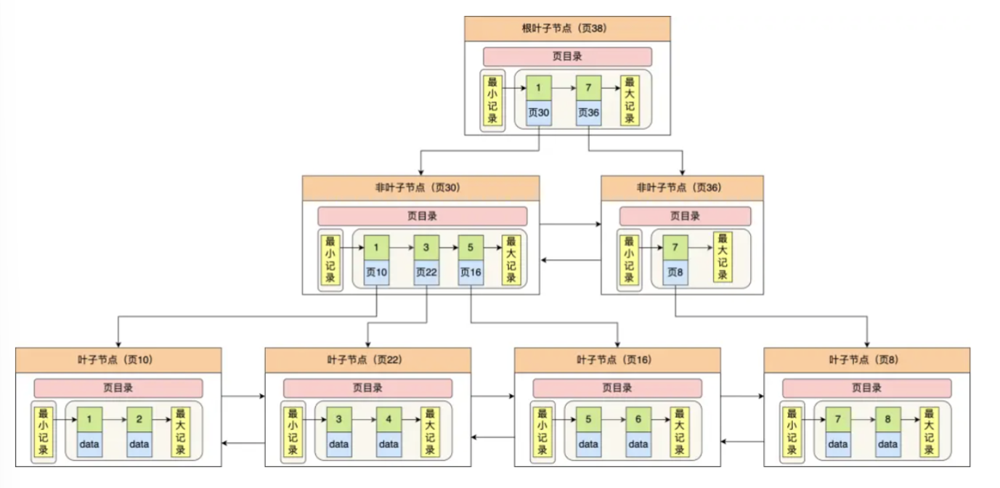
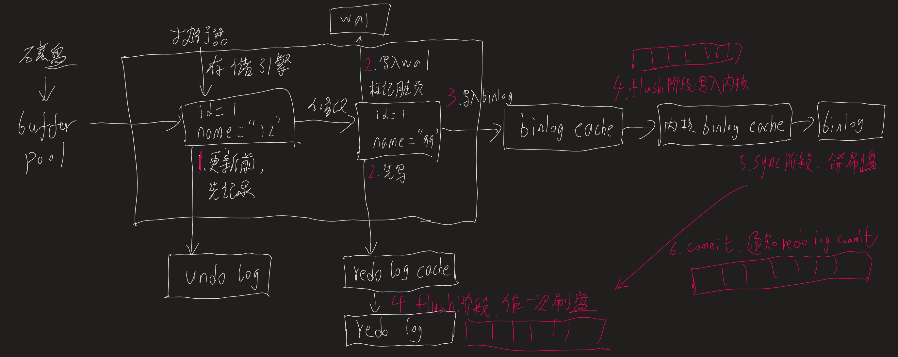

# 存储结构

段、区、页、行整体结构


**页结构**


每插入一条记录都是追加写入页中，记录之间的逻辑顺序通过指针来体现，因此对于逻辑上主键相邻的记录，实际可能不相邻甚至在不同页

**为什么用分组的方式组织行记录：**

缓解页分裂次数和移动次数：不用分组，每插入一条数据都要判断是否需要页分裂，采用分组，则每组最后一条记录才会引发页分裂

**行格式（compact格式）：**

变长字段长度


变长字段长度：对于变长字段列顺序逆序存放长度，使得双指针能从中间向两边读，提高缓存命中率

NULL值列表：对于允许存在NULL值的列，每个列对于一个二进制位

记录头信息：删除标记、下一条记录的位置、当前记录的类型（普通类型，非叶子节点、最小记录，最大记录）

行大小为2^16-1(64kb)，行溢出（超过一页大小了）的数据放在溢出页，保留20字节存储指向溢出页的地址

**单表能放多少行**

单表大小由：

B+树的高度为3

能有多少个叶子节点：15KB可用，有三层高度，1280 * 1280 *（叶子节点能放几个不确定，如果一行1KB，那就是）15≈2000W行数据

叶子节点能容纳的数据行数：16KB约15KB可用，索引项由4B的页号+8B主键构成共12B，即可存放约1280个索引项

# mysql的一次查询流程

一次查询：

1. 连接器：通过TCP建立连接
2. 查询缓存：KV形式保存（K为查询语句，V为结果）
3. 解析器：词法分析（提取关键字）、语法分析（构建语法树）
4. 预处理：查询表和字段是否存在，扩展*
5. 优化器：根据查询成本确定查询策略
6. 执行器：调用存储引擎API交互，一次获取一个记录


主键查询：

1. 调用存储引擎的接口定位到第一条记录，将完整记录返回给server层
2. server层判断是否符合条件，符合则发给客户端
3. 进行下一次查询

带索引下推的查询：

1. 调用存储引擎的接口定位到第一条记录
2. 储存引擎判断是否符合索引条件，符合则回表给server层
3. server层判断其他查询条件是否成立，成立则返给客户端
4. 进行下一次查询

`select * from t_user  where age > 20 and reward = 100000;`

区别在于将`reward = 100000`这一部分放到server层还是储存引擎层，放在引擎层判断再返给客户端，减少了不必要的回表，放到server层，每次符合age>20的数据都要回表，后在server层判断再回给客户端


## B+、B-、B*树

# 索引分类

索引属于页的一种，因此和页的结构类似，注意区别是用户记录存储索引记录，数据页存的是数据

单列索引、组合索引（联合索引）、

普通索引、唯一索引、主键索引（聚簇索引）、前缀索引

主键索引（聚簇索引）、二级索引（辅助索引）

索引合并

**主键索引（聚簇索引）**

- 如果有主键，使用主键作为聚簇索引的索引键
- 没有主键，选择第一个不包含NULL值的唯一列为聚簇索引的索引键
- 上面两个都没有则自动生成一个隐式自增id`row_id`列作为聚簇索引的索引键

**二级索引（辅助索引）**

通过二级索引查找到主键值，再通过主键索引找到叶子节点，这个过程叫**回表**

如果查询的数据不用回表，通过索引的叶子节点就能查到，则为**覆盖索引**

通常优先遍历二级索引，因为成本更低，聚簇索引更大

**组合索引的查找：**

采用最左匹配原则，因此字段顺序很重要

`select * from t_table where a > 1 and b = 2;`//a>1用上了组合索引，b=2没用上

`select * from t_table where a >= 1 and b = 2;`//a=1,b=2用到了组合索引，a>1用上了组合索引，b=2没用上

对于联合索引的范围查找，后面字段没找到采用索引下推，在联合索引里作判断

**索引的大小：**

int类型为4字节，可以为空+1位

变长字节，固定2字节+实际大小（30的话是30*4=120）

**索引失效：**

- 如果**索引的区分度**很小，即优化器发现某个值在表中的百分比很高（30%），则会忽略索引，进行全表扫描

- 使用左或左右**模糊匹配**，like %xx或like %xx%

- 查询条件**对索引做了计算**，where id+1=10 ，优化成where id= 10-1

- **隐式类型转换**：总是优先将字符转为数字，因此值为数字，查询项为字符 好于值为字符，查询项为数字

- 联合索引没有按照**最左匹配原则**, or前的是索引列，or后的不是，则索引失效

`select * from table where id ="xx"+1, name="%af";`

**索引优化： **

1. 对于语句`select * from order where status=1 order by create_time asc`

​	建立status和create_time**联合索引**，这样查找status后的数据就是按照create_time排好序的

2. 通常用**自增主键**，每次插入为追加操作，不用移动数据（避免页分裂）

3. **索引设为非空**，索引存在null使优化器更难优化

4. 可以查看索引的执行计划，查看type字段，其中**全表扫描和全索引扫描应该避免**，using filesort（查询语句包含group by且无法用索引完成排序，需要额外排序，降低效率），

​	using temporary（用**临时表保存中间结果**，常见order by或group by字段对查询结果处理了）

​	using index表示用了索引覆盖效率高

**为什么用B+树作为索引的数据结构**

- 对比B树

B树中间节点也存放了数据，在相同的磁盘I/O下，B+树能查询更多的节点

B+树是双链表连接，支持范围的顺序查找

- 对比 二叉树

二叉树比起B+树有更深的高度，意味着更多的磁盘IO次数

- 对比哈希表

哈希表适合等值查询，不适合范围查询

**索引使用场景**

适用字段有限制，经常用于where、group by 和order by字段

不适用经常变更的字段（零钱），出现次数很多，表整体数据少

**count查询效率**

count(1)=count(*)>count(主键字段)>count（字段）

为什么通过遍历的方式计数：mvcc机制使得当前时刻有多少记录是不确定的

# 事务

**概念：**

- 原子性：通过undo log回滚日志
- 隔离性：MVCC或锁
- 永久性：redo log重做日志
- 一致性：任意时刻数据库都是有效的——持久性+原子性+隔离性保证

**隔离的问题：**

- 脏读：读到另个事务没有提交的数据
- 不可重复读：一个事务内两次读到的不一样
- 幻读：多次范围查询，查询结果数量不一样

**隔离级别：**

- 读未提交：
- 读提交：解决脏读，每次读时生成一个快照
- 可重复读：解决脏读、不可重复读，事务一开始就生成一个快照
- 串行化：解决脏读、不可重复读、幻读

**快照read view：**creator_trx_id 事务id、m_ids未提交事务id列表、min_trx_id 创未提交事务的最小事务ID、max_trx_id下一个事务ID


**对幻读的处理：**

对于快照读，不会有幻读，对于当前读，用临键锁解决幻读

**哪些情况还会发生幻读：**

当前事务开始后其他事务提交一个值，当前事务快照读读不到，但用update更新数据，或者用for update当前读，都会读到这个值

如果主键自增，不指定主键，则同一时间的两个事务对于两条一样的数据先查询是否存在再插入这是实现不了功能的，会出现幻读

要避免这种情况，在开启事务后马上执行for update这类当前读的语句上锁

# 锁


## 全局锁

通常用于全库的备份，开启后对数据的修改和表结构的修改都会阻塞

MVCC机制下可以不需要全局锁

## 表级锁

### 表锁(S E)

对当前表的所有操作都会阻塞

### 元数据锁MDL( S E)

CRUD（增删改查）上MDL读锁，表结构的变更上写锁

事务持续期间一直持有

### 意向锁（S E)

对记录上共享锁或独占锁之前，都要先加意向共享锁或意向独占锁

意向锁之和表锁冲突，不和其他锁包括自己冲突

用于快速判断表里是否有数据，加表锁时可以通过判断有没意向锁快速判断当前表是否可修改，如果没有意向锁就需要一个个记录遍历查询是否有独占锁

### AUTO-INC锁

对于自增的字段数据库赋值时，

方式一：上锁给一个递增的值后释放锁，不需要等整个语句执行完或事务提交才释放锁，效率高，但会出现主从不一致

方式二：上锁给一个递增的值，整个语句执行完后才释放锁，效率低

## 行级锁

### 记录锁S E

只对一条记录上锁

```cpp
begin; 
select * from t_test where id = 1 for update;
```

事务提交后自动释放锁

### 间隙锁（SX无区别）

锁定一个范围（不会对记录上锁），启动事务范围查询时会创建间隙锁

用于在可重复读隔离级别解决幻读问题，在查询一个范围的结果时，范围内不能插入数据，但可修改数据

间隙锁相互兼容

### 插入意向锁

特殊的间隙锁，锁的是点，表明这个地方不能有插入

一条语句被其他事务的间隙锁阻塞，那么插入操作会阻塞并生成一个插入意向锁等待

### 临建锁

锁定范围+记录，范围内不可修改和插入，对、

相同范围的临建锁互斥

## 行级锁的加锁过程

加锁的对象是索引，基本单位是临建锁（可能退化），对二级索引的加锁，会自动对主键索引也上锁，对一般的记录是加在主键索引上

一般的插入都是隐式锁，只在特殊情况转为显示锁

**对唯一索引做等值查询**

- 如果记录存在，则退化为记录锁
- 不存在，则退化为第一条大于该记录的间隙锁

**唯一索引范围查询**

**非唯一索引等值查询：**

- 如果记录存在：符合条件的二级索引上临键锁，对应主键上间隙锁，第一个不符合条件的二级索引上间隙锁
- 记录不存在：第一个不符合条件的二级索引上间隙锁，不对主键索引上锁

对于数据21，22，39，查询25，此时，对于22和39在一些情况下可以插入，取决于主键id大小在22和39的左边还是右边

**非唯一索引范围查询fg：**全部为临键锁，对于边缘情况的插入依然同上

## 死锁情况

事务A上间隙锁，事务B上间隙锁，事务A上插入意向锁阻塞，事务B再上插入意向锁阻塞，两个插入意向锁死锁

避免死锁：1. 设置事务等待锁的超时时间，2. 开启主动死锁检测，主动回滚死锁的某一事务 3. 业务角度避免不会出现重复数据

# 日志

- undo log回滚日志： 存储引擎层生成，用于**事务回滚和MVCC**，保证原子性。通常时逻辑日志，记录每行记录操作
- redo log重做日志：存储引擎层生成，用于硬故障的恢复。记录数据页的物理页修改，恢复到最后一次提交的位置
- binlog归档日志：server层生成，用于数据备份和主从复制

## undo log回滚日志

位于回滚段中，由多个连续的回滚区组成，新的事务写入以追加写入undo log区。

事务开启后，每次执行都会将更新前的数据保存到回滚体制

一个undo log就是一条记录，对同一记录的多次操作串成一个链表，即版本链

## redo log物理日志

执行一条语句时，先将数据页从磁盘加载到缓存池，更新数据页产生脏页，以追加写将脏页写入redo log文件，同时写入os。（这个过程由一条语句完成，而不是事务结束才完成）

每执行一个事务产生一条undo log和redo log，undo log的修改需要记录对应的redo log，为了通过undo log回退时，也回退undo log的内容

提交事务前发生崩溃，通过undo log回滚到事务开始前，提交事务后崩溃，但还没写入磁盘，则通过redo log恢复

## redo log的刷盘时机

- mysql关闭、
- redo log buffer中的记录写入量大于内存空间的一半、
- 每隔1s、
- 每次事务的提交

redo log是以循环写的方式，双指针指向落盘的位置和待写入的位置，如果指针相遇则阻塞，不执行更新操作

## binlog

记录数据表结构和数据修改的日志，用于备份恢复、主从复制。

事务提交时先写入binlog文件再提交

**bin log和redo log**

1. 开发：先有bin log，由于其没有crash-safe能力，所以存储引擎增加了redo log。
2. 层级上：bin log server层实现，所有存储引擎可用，redo log是innodb存储引擎，
3. 写入：binlog是追加写，写满一个文件创建文件继续写，redolog是循环写
4. redo log是物理日志，记录某页做了什么修改
5. 数据：binlog存放的是最终结果
6. 功能：整个数据库被删了，redolog是边写边擦，不可用，可以用binlog恢复

**结构上：**3种数据格式

- STATEMENT: 记录的是操作，可能出现主从不一致
- ROW：记录最终修改的数据结果
- MIXED：根据情况选择上面两种模式

**binlog实现主从复制：**

1. 写入binlog：主库收到客户端提交事务的请求后，写入binlog日志，再提交事务，更新本地存储数据，返回客户端响应
2. 同步binlog：从库创建线程接收binlog日志，写到暂存日志中
3. 回放binlog：从库创建线程用于回放binlog线程，读暂存日志，更新存储引擎中的数据

主从库可以实现写主库，读从库，读写并发

一个主库跟2-3个从库，从库多了，主库对每个从库都要创建线程来处理复制请求

 **主从复制模型：**

- 同步复制：所有从库复制成功才返回提交结果，实际不会使用
- 异步复制（默认）：主库提交后，后台同步到从库。主库死机数据就会丢失
- 半同步复制：主库等待一部分的数据复制成功就返回

**binlog刷盘时机：**事务执行时写入binlog cache，事务提交时写入内核的page cache，适当的时候落盘

## 一次写入各日志的执行过程

对于update语句

1. 开启事务，先记录相应的undo log，写入buffer pool
2. 执行器调用接口获取记录，判断记录更新前后数据是否一致，不一致再传给innodb层操作
3. 更新内存记录产生脏页写入WAL，写入redo log缓存，定期落盘
4. 更新语句执行完成，记录语句对应的binlog到binlog cache，事务提交时将所有binlog刷新到硬盘
5. 触发两阶段提交

## 日志不采用两阶段提交会出现主从数据不一致

情景1：

1. redo log刷入磁盘后，mysql宕机，binlog还没写入，
2. 此时重启后通过redo log恢复到事务执行后，
3. 但binlog没有记录这条，主从架构中，binlog复制到从库，从而出现主从不一致

情景2：

2. binlog刷入磁盘，mysql宕机了，redo log没有写入
2. 重启后，通过redo log恢复，没有这条记录
2. 主从架构中，binlog会复制到从库，在从库恢复数据

## 两阶段提交

事务没提交时，redolog会持久化到磁盘，binlog不会

属于分布式事务一致性协议

- prepare阶段：将事务ID写入redolog，将redolog对应的事务状态设置为prepare，将redo log持久化到磁盘
- commit阶段：将事务ID写入到binlog，持久化到磁盘后，将redolog状态设置为commit

恢复过程：

mysql重启后按顺序扫描redo log文件，遇到处于prepare状态的redo log，那事务ID去binlog查看是否存在

如果存在则说明完成了刷盘，提交事务，不存在则丢弃

因此状态设置为commit这个过程丢失并不影响

## 组提交下的两阶段提交优化

一般的两阶段提交的问题：

磁盘IO次数高：两阶段涉及到每次事务提交都有redolog和binlog两次刷盘。

锁竞争激烈：多事务下，需要加锁来保证提交的原子性

**改进：**

prepare阶段不变，写入redolog，并设置为prepare

commit阶段分为三个过程：

- flush阶段：leader对同组的redo log做一次刷盘，多个事务按序将binlog从cache写入文件，不刷盘（写入操作系统的page cache）
- sync阶段：等待一定时间或等待事务数量达到一个值，将多个binlog刷盘操作合并成一个刷盘
- commit阶段：通知redo log作commit

每个阶段对应一个队列并用锁保护，第一个进入队列的事务会成为leader领导所有事务


# buffer pool

位于innodb内，读取数据如果在buffer pool就直接读取，不在则读后台。修改数据则修改后设置为脏页，适当时机刷入磁盘

默认大小为128MB，通常可以设置为物理内存的60-80%（这里是逻辑页大小，实际有页读写了才分配物理空间）

- 对**空闲页**采用空闲链表管理
- 干净页
- 脏页：flush链表管理脏页，用于快速找出脏页，在适当时机写入磁盘

这个适当时机是指：

- redo log日志满了
- buffer pool满了淘汰脏页
- mysql认为空闲，定期刷入脏页
- mysql关闭

## 提高缓存命中率

- 预读失效：加载的相邻页没有被访问

  - 解决：划分young区域、old区域，默认比例63：37。

    ​			预读的页加入old，真正访问的页加入young区域

- buffer pool污染：一个sql语句扫描了大量数据，使得大量热数据被淘汰

  - 解决：记录第一次加入old区域的时间，后续访问时间超过1s时才移动到young区域头部（即必须满足被访问和在old区域超过1s才会插入到young区域）

- young区域节点频繁访问移动到头部

  - 解决：young前1/4的区域不会移动到链表头部

