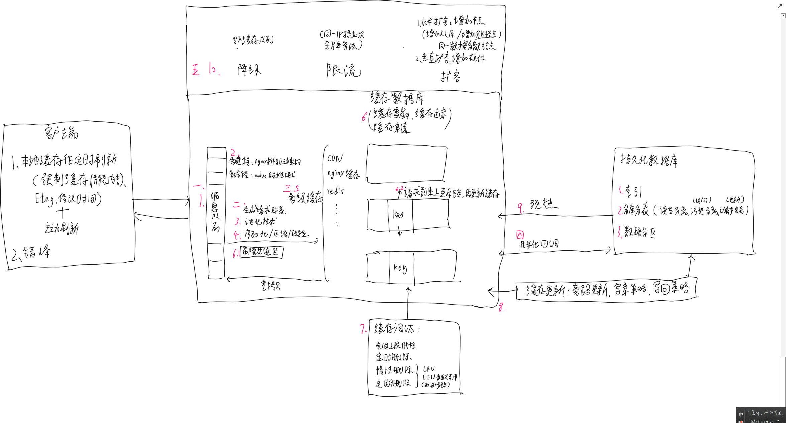
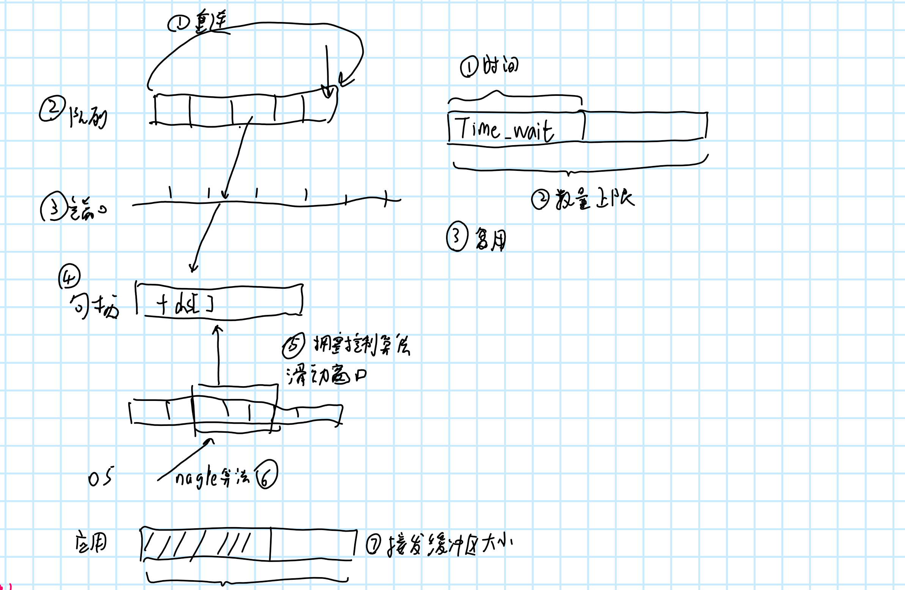

# 主体流程

启动流程：

- 初始化核心模块的create_conf,生成配置结构

- 解析命令行参数、配置文件
- 核心模块的init_conf,初始化 →>继而调用各子模块的init_conf方法
- 创建文件资源，开启 socket 监听
- 初始 master进程
- 所有模块的init_module
- 启动master, worker进程
- 调所有模块的init_process 方法

[http模块例子]("C:\Users\typora\面试\ngx_http_mytest_module.c")

进程循环：

检查各类信号的标识位，并做处理。worker进程是每次循环都会检查信号和执行事件循环，master进程是只有某个信号触发了才会执行一遍循环检查信号

worker进程执行`ngx_process_events_and_timers`

# 事件处理模块

## 事件驱动架构：

事件分发器会由多个worker进程随机调用，事件收集器独占进程处理事件

- 异步架构：将阻塞的事件分解为两个阶段，第一阶段非阻塞的send发送，第二阶段查看结果

- 同步拆分变异步：对于不能异步的，拆份执行时间（将10MB划分成1000份，每次读写10kb发送）
- 用定时器代替循环检查
- 如果必须要阻塞，由一个单独的进程阻塞，阻塞完毕后通知分发器

事件包括：网络事件和定时器事件

**事件初始化：**

ngx_event_core_module模块的init_process函数注册连接事件处理函数

**事件循环ngx_epoll_process_events：**

- 通过缓存数组拿到时间
- 通过epoll拿到事件并遍历每一个事件
- 通过指针的最后一位判断事件是否过期，
- 移入对应的读写post队列or立即处理

post队列：连接队列、普通读写队列


连接总数=min(worker进程数量*worker_connections（配置文件指定，默认1024），系统文件描述符）

```c
void ngx_process_events_and_timers(ngx_cycle_t *cycle) {
	if(启用了负载均衡){
        if(ngx_accept_disabled<总连接数的7/8){//连接够用
            //抢负载均衡锁
            if(){//抢到了
                flags;//设置标志位
                timer = 0.5s;//下面的ngx_epoll_process_events函数使用监听套接字0.5s
            }else{//没抢到
                timer = -1;//或者最近的定时器时间
                //将监听套接字移出epoll监听，下次调epoll_wait不处理连接事件
            }
        }else{//如果连接不够用了，将负载均衡阔值-1
            ngx_accept_disabled--；
        }
    }
    
    ngx_epoll_process_events(cycle, timer, flags);//通过epoll拿到读写事件
    ngx_event_process_posted(cycle, &ngx_posted_accept_events); //处理连接事件
    if(mutex){}//如果抢到了锁，处理完连接事件后就释放
    
    //处理定时器事件，判断进程对应的红黑树中是否有定时器超时
    if (delta) ngx_event_expire_timers(); 
    
  	//处理post队列里的普通读写事件
    ngx_event_process_posted(cycle, &ngx_posted_events);
    //如果有xudp，处理xudp事件
    ngx_event_process_posted(cycle, &ngx_posted_commit);  
}
```

其他：

- nginx实现全局负责均衡锁是通过共享内存实现了
- 这个过程中，可以控制**epoll是立即返回**，还是等下一个计时器的事件返回，能影响定时器的精度
- 可以控制epoll**一次处理多少事件**，用于提前分配空间
- 可以控制**延后处理事件**还是立即处理：延后处理可以避免频繁的上下文切换，提高整体性能

## 连接队列处理

```c
ngx_event_accept(){
    accept();//得到连接套接字
    ngx_accept_disabled=；//修改负载均衡阔值
    while(1){
        //从连接池里获取一个连接对象并分配资源
        c = ngx_get_connection(s, ev->log);
        /*加入epoll*/
        //初始化连接
        ngx_http_init_connection();//见下面
        if(multi_accept)；//如果开启了，则尽可能的一次连接更多的
    }
}
```

## 文件异步IO

linux内核提供了异步io接口，有如下特点：

- **一定会走磁盘**即使内存里有数据，因此使不使用异步io要看情况 

- linux内核只能**异步读**，**不能异步写**（linux写操作本身就走的缓存延迟写）

初始化时将异步io的文件描述符加入到epoll

事件循环函数调文件异步IO的回调函数，其中，读出数据，加入到读post队列，下次处理post队列时会执行相关的回调处理函数

# http框架


事件架构更关注tcp层的传输，贴近底层细节，http更关注http层的传输，更贴近业务

主要有**四部分工作：**

- 集成事件驱动模块，处理读写事件和定时器事件
- 在不同阶段调度不同http模块
- 将请求分解为子请求（事件驱动提高了性能但提高了开发难度，因此分解请求降低难度）
- 提供基本的工具接口，接发包体等

## 建立连接：

生成一个连接对象

```c
void ngx_http_init_connection(ngx_connection_t *c){
    /*……*/
    rev->handler = ngx_http_wait_request_handler;//设置可读事件的句柄
    if(rev->ready){//如果这个连接的套接字上已经有数据了，则调用读事件句柄开始执行
        rev->handler(rev);
        return;
    }
    ngx_add_timer(，，);//设置定时器，如果这么多秒还没消息就关闭连接（调用ngx_http_wait_request_handler在里面执行）
    ngx_handle_read_event(rev, 0, NGX_FUNC_LINE);//将读事件添加到epoll中
} 
```

## 当读事件到来时

第一次到来时生成一个请求对象

```c
//第一次读请求到来时，走这个函数
static void ngx_http_wait_request_handler(ngx_event_t *rev){
    if (rev->timedout) {
		//1. 判断超时，则关闭连接
    }
    //2. 创建请求管理结构体，管理请求的生命周期
    c->data = ngx_http_create_request(c);
    
    //3. 修改后续读请求过来时处理函数，并执行
    rev->handler = ngx_http_process_request_line;
    ngx_http_process_request_line(rev);
}
//第二次请求到来，走这个函数
//循环读取内容，直到确定收到了全部的请求头，修改并执行处理句柄为读消息头
static void ngx_http_process_request_line(ngx_event_t *rev){
   for(;;){
       //读取请求行，包括{方法、URI 、http版本}，存入request结构体
		ngx_http_parse_request_line();  
   }
}

```

## 处理请求头：

```c
void ngx_http_process_request_headers(ngx_event_t *rev){
    for(;;){
        if(){
            //如果请求头过大，可能要扩容
        }
        //读取其他请求头，以键值对的方式存入headers链表中
        rc = ngx_http_parse_header_line(r, r->header_in, cscf->underscores_in_headers);
        if(解析完了){
			//调用各个http模块处理请求
            ngx_http_process_request(r);
        }
    }
}
```

处理请求：

```c
//第一次处理走这个函数
void ngx_http_process_request(ngx_http_request_t *r){
    //1.下一次请求走ngx_http_request_handler
    c->read->handler = ngx_http_request_handler;
    c->write->handler = ngx_http_request_handler;
    //2. 设置当前读事件的句柄：此时有读请求过来时，将把监听套接字移出epoll
    //作用是在水平触发模式下为避免一直触发事件，暂时阻塞读事件
    r->read_event_handler = ngx_http_block_reading; //此后对于读请求先走ngx_http_request_handler，再走ngx_http_block_reading
    //3. 执行11个阶段
    ngx_http_handler(r); 
    //4. 执行post请求，通常是对子请求作处理
    ngx_http_run_posted_requests(c);
} 
//非第一次走这个函数
void ngx_http_request_handler(ngx_event_t *ev){
    //写优先
    //如果可写，则继续执行11个阶段
    if(ev->write){
        r->write_event_handler(r); //在前面设置成了ngx_http_core_run_phases
    }else{
        r->read_event_handler(r);//可读事件句柄被上面切换成了阻塞读事件
    }
    //无论这个请求是第一次还是不是，都要处理一次post请求
    ngx_http_run_posted_requests(c);
}

```

执行11个请求阶段：

```c
void ngx_http_handler(ngx_http_request_t *r){
    //用于判断是否需要重定向
    if(!r->internal){
        r->phase_handler = 0;//如果不需要重定向，从第一个阶段开始执行
    }else{
        r->phase_handler = cmcf->phase_engine.server_rewrite_index;//从NGX_HTTP_SERVER_REWRITE_PHASE阶段开始执行
    }
    //修改并执行写事件句柄
    r->write_event_handler = ngx_http_core_run_phases;
    ngx_http_core_run_phases(r);
}

void ngx_http_core_run_phases(ngx_http_request_t *r){//依次执行每个阶段的check函数
    while(ph[r->phase_handler].checker){
        rc = ph[r->phase_handler].checker(r, &ph[r->phase_handler]);
        if(rc == NGX_OK)return;//返回NGX_OK时会立即把控制权交还给epoll，当有事件被触发才继续执行
    }
}
```

对于每一个阶段的checker方法：

```c
ngx_int_t ngx_http_core_access_phase(ngx_http_request_t *r, ngx_http_phase_handler_t *ph){
     if(r != r->main){
        //如果是子请求，已经有权限了，跳过这个阶段
        return NGX_AGAIN;
    }
    //重点：调用模块提供的句柄
    rc = ph->handler(r);
	//如果执行完了，转向下一个模块或阶段处理
    if(rc == NGX_DECLINED){
        r->phase_handler++;
        return NGX_AGAIN;
    }
    //如果没执行完，移交控制权给epoll，等到下次再运行
    if(rc == NGX_AGAIN || rc == NGX_DONE){
        return NGX_OK;
	}
    
    /*根据配置里的设置决定访问权限……*/
    
    //返回错误或者http开头的返回码，则结束请求
    ngx_http_finalize_request(r,rc);
    return NGX_OK; 
}
```

## 当写请求到来时

```c
static ngx_int_t ngx_http_do_read_client_request_body(ngx_http_request_t *r){
    for(;;){
        n = c->recv(c, rb->buf->last, size);//循环接收数据
    }
    //如果数据不全
    if(!c->read->ready){
            //添加读事件到定时器
            ngx_add_timer(c->read, clcf->client_body_timeout, NGX_FUNC_LINE);
			//将读事件添加到epoll，重新开始监听
            ngx_handle_read_event(c->read, 0, NGX_FUNC_LINE);
            return NGX_AGAIN;
    }
    //如果接收到了完整的包体
    ngx_del_timer(c->read, NGX_FUNC_LINE);//删除读事件定时器
    ngx_http_write_request_body(r);//将缓冲区剩余内容写入临时文件
    //重新设置后续读事件的处理方法，即将读事件的套接字移除给，避免被打断
    r->read_event_handler = ngx_http_block_reading;
    rb->post_handler(r); //调回调
}
```

## 发送包体

```c
//http请求处理模块内，业务根据需求调用，
//构造请求的响应行头部并发送
ngx_int_t ngx_http_send_header(ngx_http_request_t *r){
    return ngx_http_top_header_filter(r);//依次调用每个过滤模块的函数方法
}
```

最后一个头部过滤模块会负责打包和发送头部

发送包体类似

# nginx性能优化


网卡、磁盘、cpu、内存

## cpu

增大cpu的有效时长：

- 提高cpu**缓存**命中率：
  - cpu亲和
  - numa架构，查看命中率，禁止访问远端
  - 优化对象数据结构
  
- 减少**进程切换**：
  - 主动切换：
    - 业务**逻辑阻塞**的API
    
    - 执行**慢速的硬件**读写操作
    
      ——异步or事件驱动架构
    
  - 被动切换：
    - 其他进程：减少不相干进程，提高当前进程优先级
    - 时间片用完：提高时间片的大小
    - cpu亲和
    - 合理设置线程/进程数量
    - 使用协程

worker进程间负载均衡：

- 解决惊群问题：负载均衡锁

卸载cpu：qat技术

## 网络

### 整体优化

- 多队列网卡对多核CPU优化

- tcp：

  - **连接**：重试次数、端口范围、已连接/半连接队列长度
  - 内存：os、用户、进程、nginx**句柄**上限
  - 吞吐量优先，启用**nagle算法**，低延时优先，禁用
  - **窗口大小**：bbr
  - **关闭连接**：复用TIME_WAIT，让客户端发起关闭


- http层：

  - **握手**：qat加速、使用session缓存、使用会话票证tickets复用之前的连接

    、长连接

  - 传输：升级协议，使用quic等更快速的传输方案

  - 包体：压缩包体，提升网络传输效率

  - 丢弃：xudp、dpdk

- 应用层

  - 消息队列
  - 连接复用
  - 定期资源清理、监控
  - 异步编程、
  - 事件驱动架构
  - 负载均衡锁

  

### 向远端请求大量数据

| 方向       | 问题                         | 解决                                   | 描述                                                     |
| ---------- | ---------------------------- | -------------------------------------- | -------------------------------------------------------- |
| 请求、回复 | 请求超时、丢失               | 每个请求发出时注册一个定时器           | 定时器超时后，记录错误                                   |
|            | 避免重复发请求               | 请求上下文记录当前是否在一个请求周期内 |                                                          |
|            | 回复重复                     | 回复计数                               | 发出的请求和收到的回复一致后，结束这一轮请求，执行更新   |
|            | 网络不好导致大量重传         | 数据分块，每次请求一块，收到后再组装   | http头记录总长，每收到一部分累加总长，全部到期后拼接交付 |
| 接收包     | 内存不足                     | 申请内存失败，记录本轮请求错误         | 请求结束时，有错误则不执行更新                           |
|            | 请求和回复不一致，或字段错误 | 同上，记录错误                         |                                                          |
|            | 速度太慢                     | 压缩+解压                              |                                                          |
|            | 大量回复同时到达             | 以随机时间发出每个请求                 |                                                          |
| 交付       | 更新交付数据的时机           | 请求上下文记录发出和收到的请求数量     | 数量一致，并且没有错误时，执行更新                       |

### 如何向远端更新本地数据

| 方向         | 问题                                             | 解决                                                         | 描述                                                         |
| ------------ | ------------------------------------------------ | ------------------------------------------------------------ | ------------------------------------------------------------ |
| 判断更新     | 如何比较是否增删                                 | 提炼唯一字段作为key，用链表或红黑树维护索引<br />遍历一遍，没有遍历到的删除掉 | 哈希表不利于整体便利一遍，数据小用链表，大也许可以用哈希     |
|              | 描述字段的更新                                   | 状态机每解析一个字段比较修改一次                             |                                                              |
|              | 数据的更新                                       | 每解析到关键描述字段有变化，则发起一个更新请求               | md5、key、版本号<br />同时创建对应的描述结构体，收到回复时直接填入指针 |
| 接收         | 回复的数据有误                                   | 停止解析，不更新                                             | 下次更新时会恢复这个数据/<br />或者维持一个更新链表，更新完后加入使用链表里 |
| 交付         | 如何交付                                         | 每次更新时，开启一个请求周期，当收到全部回复时，增加版本号，应用每次比对版本号判断更新 |                                                              |
| 对远端服务器 | 请求过多，对远端服务器有压力                     | 维持服务器ip表，轮训发送请求                                 |                                                              |
|              | 本地服务器频繁宕机，频繁请求，对远端服务器有压力 | 本地持久化一份，每次从持久化里恢复一部分                     | 持久化需要md5校验                                            |

### 如何设计程序更新缓存 

| 方向 | 问题                                 | 解决                                                         | 描述                                                         |
| ---- | ------------------------------------ | ------------------------------------------------------------ | ------------------------------------------------------------ |
|      | 阻塞更新（网络/IO）太慢，影响业务    | 后台异步执行更新，更新完后切换给前台使用                     | 双缓存架构<br />如果是后台进程就用共享内存通信，如果是后台线程就用原子变量指向数据地址<br /> |
|      | 旧的缓存什么时候释放                 | 需要有计数器，新的请求读到新的缓存，旧的请求全部结束后，计数器清0，释放旧的缓存 |                                                              |
|      | 旧的缓存还没释放，新的更新指令又到了 | 新的更新指令里判断备用缓存的计数器不为0则放弃本次更新        |                                                              |

### 内存如何和磁盘比较并更新数据？


## 磁盘

读：

- 零拷贝

- 异步读写，wal+追加日志
- 同步读：对于大文件的io绕过磁盘缓存直接读，避免缓存拷贝/预读+更好的利用预读
- 对一些数据预读并缓存

写：

- 日志:
  - 减少日志：关闭/压缩access_log、增大error_log级别
  - 重定向写入：将日志写入syslog服务器，而不是磁盘
  - 缓存写：先追加写，缓存起来适当时候统一写
- 启用代理缓存：用户请求无需每次都到业务服务端，部分请求可以直接返回结果

## 内存

开发：

- 栈>堆
- 局部>全局
- 避免拷贝
- 精简数据

内存分配：

- tcmalloc替代ptmalloc
- 池化技术：资源复用，减少系统调用
- 专门的线程做内存释放
- 对于大数据启用大页

读写：

- 提高缓存命中率、内存分层

- 选择合适的算法和数据结构

内存不够：

- 检查内存泄漏	

- 业务优化：细化变量生命周期，减少重复的数据


- 部分数据持久化
- 调整内存和磁盘的交换大小和频率
