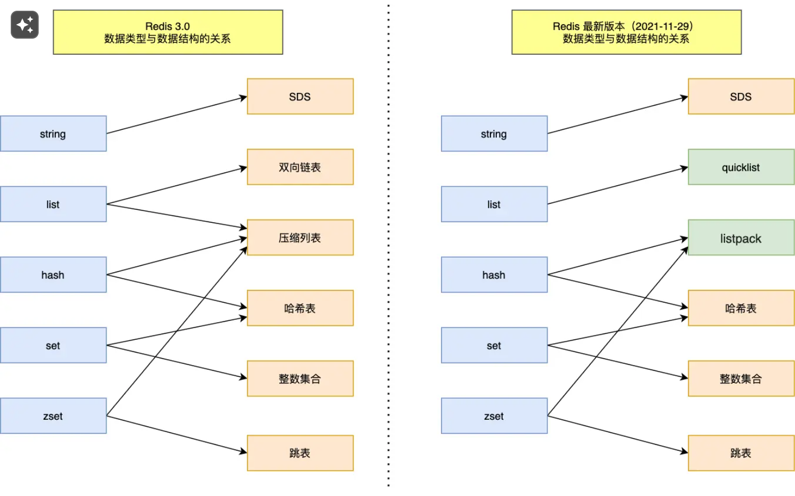
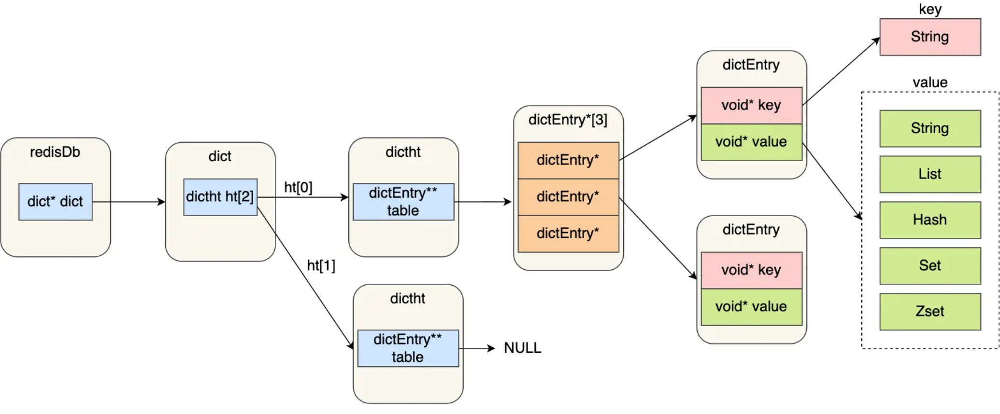
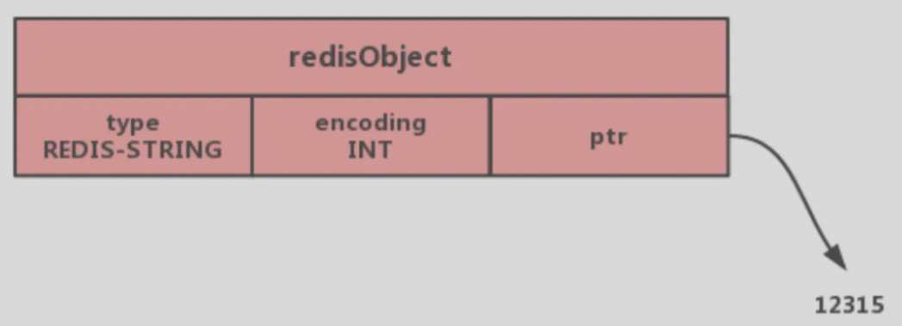
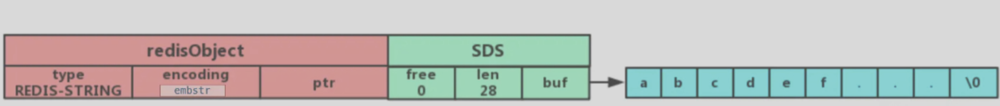
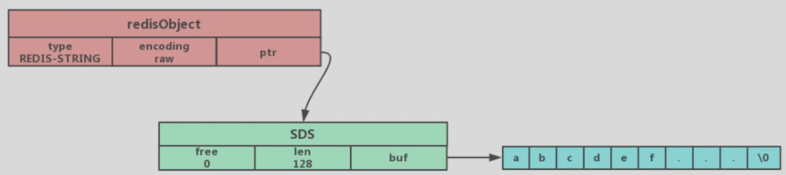
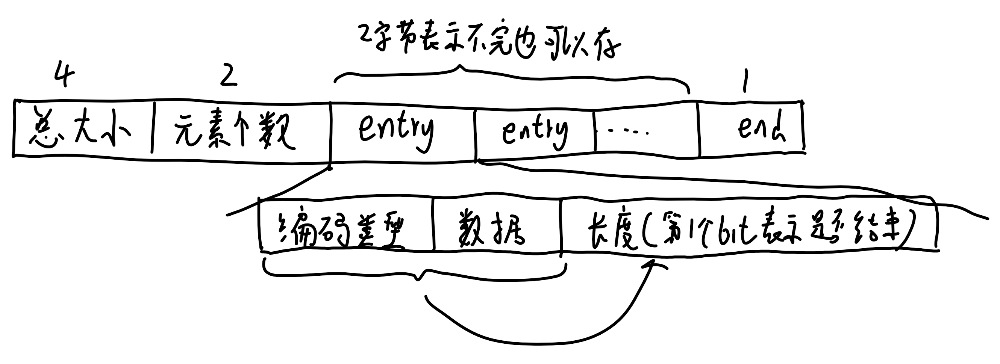
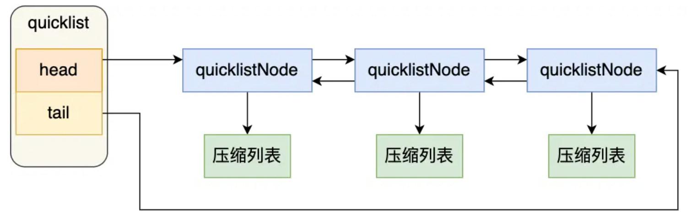
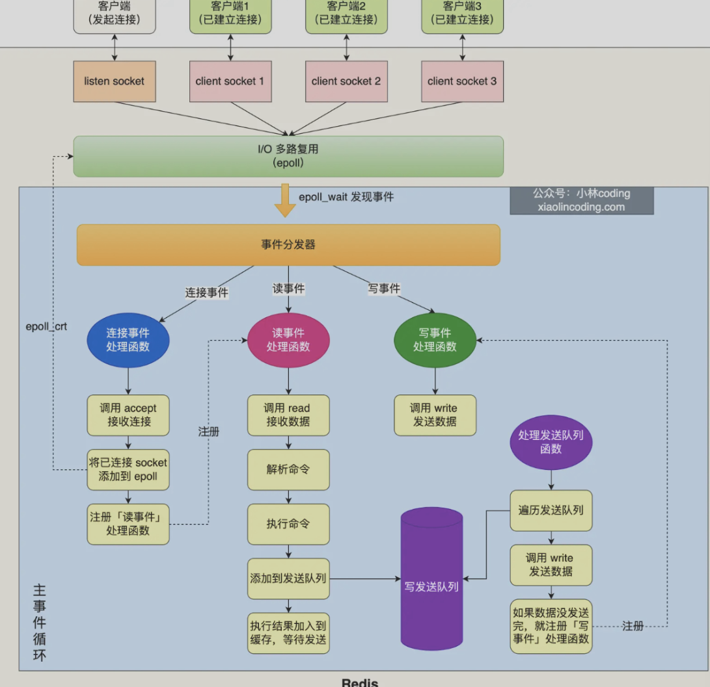
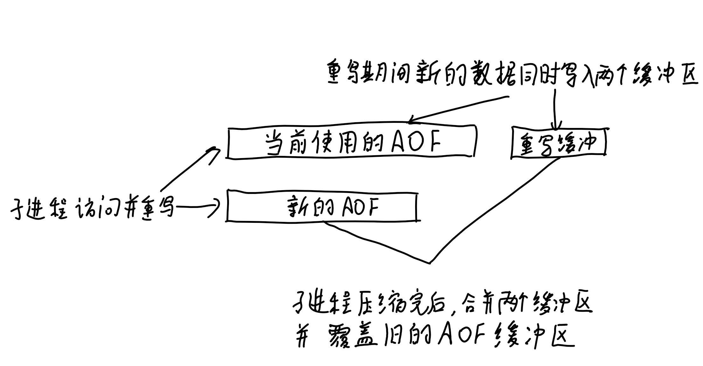
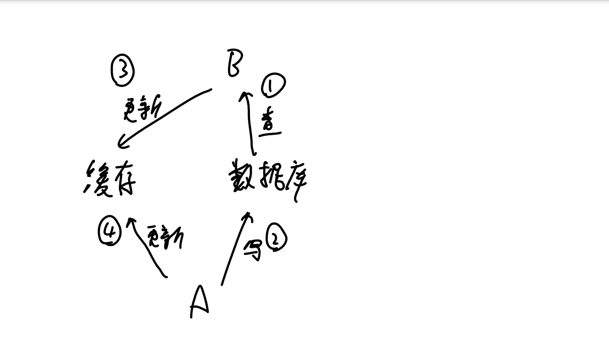

# 简介

**redis和etcd**

redis有更好的查询性能，支持更多的数据结构
etcd更为可靠安全，故障转移和持续数据可用，数据均持久化

etcd是分布式数据库，强一致。redis是主从复制，最终一致

**redis和memcached**

共同点：
两者都是基于内存的数据库，作为缓存使用，有极高的性能
都有过期策略

区别：

- 简单的键值存储用memcached更高效，redis支持更多**数据类型**，memcached是kv数据类型
- **redis有**持久化功能，memcached没有
- **高可用**的场景下，redis支持集群模式，memcached没有原生的集群模式
- redis支持发布订阅模型、lua脚本、事务等功能，memcached不支持
- **精细缓存管理**适用redis，redis能设置更复杂的过期和失效策略

## redis 的瓶颈

- 内存限制，决定了缓存的数据量
- 网络带宽
- 单线程模式
- cpu限制，高并发的查询下，可能成为瓶颈
- 慢查询

# 物理数据结构



所有对象都用redisObject结构体保存，存放

```c
struct redisObject{
    unsigned type:4;//对象的类型
    unsigned encoding:4;//具体的编码方式，embstr、sds
	/*……*/
    void *ptr;//指向对象实际的数据结构，8字节
}//总共16字节
```



## 哈希表

这里的redisDb就是redisObject，其中ptr指向dict

dict里两套哈希表，长期使用导致一个冲突的哈希桶有太多值，需要rehash来定期维护哈希表

```c
//存放两个哈希表交替使用
typedef struct dict{
    ……
   	//两个哈希表交替使用
    dictht ht[2];
}dict;

//哈希桶
typedef struct dictht {
    //哈希表数组
	dictEntry **table;//一个数组，每个元素指向哈希表节点的指针
    /*……*/
} dictht;

//哈希键值对
typedef struct dictEntry {
    //键
    void *key;
    //值
    union {
        void *val;
        uint64_t u64;
        int64_t s64;
        double d;
    } v;
    //指向下一个哈希表节点，形成链表
    struct dictEntry *next;//即用拉链法解决冲突
} dictEntry;
```

## int类型

当保存的对象是整数值并可以被long类型识别时

直接存到ptr里


## 字符串

**c语言字符串的缺陷**

- 不会获取字符串长度
- 只能放文本数据，不能放二进制数据（\0不能有）
- 相关操作函数是不安全、不高效

### SDS方式-存放string类型

```c
//sdshdr8
struct __arrtibute__ ((__packed__)) sdshdr8{
    uint8_t len;//实际使用的字符串长度，1字节
    uint8_t alloc;//分配的内存大小，1字节，
    unsigned char flags;//表示是sdshdr几，1字节，实际只用了3位，
    char buf[44];//指向实值，44字节
}//共47字节，
```

sds分成多种，sdshdr5、sdshdr8、sdshdr16、sdshdr32、dsdhdr64用于存储不同长度的字符串

采用SDS结构的编码方式有两种embstr和raw

### embstr

存放<=44字节的字符串


### raw类型


- embstr一次性分配了一块内存存放object和sds，raw要分配两次。分配释放快，查询快
- embstr长度增加时需要重新分配sds空间
- 扩容策略：小于1MB，翻倍扩容。超过1MB，依次增加1MB

## listpack/压缩列表

- 用连续的内存空间保存数据，用不同的编码方式保存不同长度的数据，能重复利用内存
- 不可修改，只能新增删除，且增删需要重新分配空间
- 顺序遍历，因此只有少量的数据时才是高效的


## quicklist紧凑链表

直接使用压缩链表，对于元素数量增加或元素变大会造成性能下降。因此使用双向链表+压缩列表


即，整体是个双向链表，每个链表节点存放一个压缩链表，当这个节点的压缩链表满了，才生成下一个链表节点

# 用户数据结构

## string

底层是SDS简单动态字符串

应用：

- 缓存对象
- 常规计数
- 分布式锁，单线程的redis，命令为原子的
- 共享session信息

## list

底层为quicklist

应用：消息队列

**对于重复消息：**每个消息加上全局ID，同时记录处理过的消息

**保证消息可靠：**即消费取出时消费者故障，从list取出同时插入另一个list备份

不支持多消费者读同一消息

## hash

底层

- 元素<512个，用listpack
- 其他情况用hash表

应用：

- 缓存对象，（对象id，属性，值）

> string+Json也可以存储对象，一般对象中频繁变化的属性可以抽出来用hash储存，便于修改

## set

set只能存储非重复元素，无序存储

底层实现：

- 小数据，整数集合
- 其他情况哈希表

应用：需要去重，统计交并集

- 点赞
- 共同关注
- 抽奖

## zset

比起set多了排序属性

底层实现：

- 小数据，使用listpack压缩列表
- 大数据用跳表

应用：

- 排行榜
- 电话、姓名排序

## bitmap

大量使用二值统计的数据

底层：使用string类型作为数据结构

应用：

- 签到

# redis线程模型

- 主线程：接收客户端请求->解析请求->数据读写->发送给客户端
- bio_close_file线程：处理关闭文件
- bio_aof_fsync线程：负责AOF刷盘
- bio_lazy_free线程：来释放redis内存
- 三个处理网络I/O的线程


**redis为什么使用单线程：**

- redis的性能瓶颈不是cpu而是内存和网络IO
- 单线程开发更加容易，没有多线程的竞争

**redis为什么快**

- 内存操作+追加读写
- 高效的内存数据结构
- 单线程模型避免了竞争

# 持久化

**AOF日志格式：**

- 日志以追加的形式写入文件
- 先执行，后写日志（可能数据丢失）

AOF三种写回策略：

- 每次都同步AOF到磁盘
- 写入缓冲区，每1s同步到磁盘
- 由os决定

AOF重写机制：

AOF过大时会导致恢复的很慢，因此需要压缩

后台子进程完成，用子进程以只读方式访问父进程数据，不需要上锁，读取的数据记录到新的AOF


**RDB快照：**对于故障恢复，AOF的恢复方式较慢，RDB记录某一瞬间的内存数据，恢复时直接读入内存，效率更高

可以快照记录模式：

- 主线程生成，会阻塞线程
- 创建子进程隔断时间生成RDB（依托写时复制技术，可以边记录边修改数据）

**混合持久化**

新的数据先写入AOF，后台进程隔段时间生成RDB快照


整体性能较好，恢复速度快

但可读性变差，且不兼容过去的redis版本

# redis集群

## 主从复制

主服务器进行读写操作，写操作写入主服务器后就返回客户端结果，异步同步给从服务器，从服务器只读

同步的方式：

- 第一次全量复制。为避免全量复制的节点太多影响主服务器，允许部分从服务器升级为经理角色，执行全量复制
- 主从服务器维持长连接，后面的同步通过命令传播
- 网络断开重连后，增量复制

**应对主从不一致：**

- 让主从节点在同一机房，确保网络状况良好
- 外部程序监控主从节点的复制进度，某个从节点进度差值大于预期，则停止对这个从节点的读

**应对数据丢失：**

**问题：**主节点写入并返回，但还**没同步给从节点后宕机**，此时主节点的写入数据丢失

**解决：**异步复制时，所有从节点写入延迟过高，主节点会拒绝任何请求，此时客户端的数据可以降级写入本地缓存和磁盘，或写入消息队列中

**问题：主节点和全部从节点失联**，但仍接收客户端请求，哨兵选举出了新的主节点，当主节点恢复时，得知自己降级为从节点，从新的主节点那里得到数据，从而丢失写入的数据

**解决：**主节点发现从节点下线数量太多或网络延迟太大，会禁止写入

## 哨兵模式

对于主从模式，如果主节点宕机了，需要能选举出新的主节点

**主节点宕机**：哨兵集群（至少三个）通过心跳感知主节点状态，当一个哨兵判断主节点主观下线后，向其他哨兵发起投票，判断是否客观下线

**选举哨兵leader**：哨兵集群认为主节点下线后，发起投票的哨兵会成为候选人，向其他哨兵发起当选leader投票，已经投票的哨兵不会再次投票，因此一定会选举出leader哨兵

**哨兵leader选举主节点：**

1. 过滤网络不好的节点：主从节点一定时间内断连次数过高
2. 依次对比：优先级-日志数量-ID号

**哨兵leader通知主节点当选：**

1. 以1s的频率向当选从节点发送当选命令
2. 向所有从节点发送新主节点
3. 通过发布订阅模式通知客户端主节点更换
4. 当旧主节点上线时通知其成为从节点

**哨兵集群如何组织：**

通过redis的发布/订阅机制，哨兵将自己的IP地址和端口信息发布到主节点的频道上，建立连接

哨兵每10s一次从主节点那获取所有从节点的信息后，和从节点建立连接

## 切片集群模式

对于超大的数据，使用集群模式将数据分布在不同的服务器上

## 集群中数据不一致问题

read from master：只从主节点读

lua脚本/分布式事务：保证多个操作的一致性

外部协调：zookeeper、etcd提供强一致性的锁和协调机制

# 过期删除策略

对于一些key设置了过期时间，使用`惰性删除+定期删除`的删除策略

定时删除：（redis没有）每个数据都定时一个删除任务

**惰性删除：**每次数据库访问key时，检查是否过期，过期删除（性能好，但没有及时删除，有内存浪费）

**定期删除：**定时检查一定数量的key执行删除

1. 随机抽20个key检查并执行过期删除
2. 过期的数量超过1/4，则重复步骤1，否则停止
3. 循环上限不超过25ms

持久化为RDB文件或通过RDB文件加载时，会对每个键作过期检查

持久化AOF文件，删除操作会追加一条删除命令写入

从库通过主库发出的del命令执行删除

# 内存淘汰策略

提供8种内存淘汰策略

1. 不淘汰，内存满了不提供服务
2. 在设置了过期时间的数据中进行淘汰：任意、ttl（更早过期）、lru、lfu
3. 在所有数据范围内进行淘汰：任意、lru、lfu

LRU机制：随机取5个值，淘汰最久没用的

（不用维护链表）

LFU（ Least Frequently Used）机制：记录每个数据的访问时间和访问频次logc

1. 访问key时，先根据距离上次访问时间的时长，衰减logc（越久衰减越多）
2. 再按一定概率增加logc（越大增加越少）

# redis缓存

作为缓存数据库，业务先访问缓存数据库再访问数据库

## 缓存雪崩

问题：大量缓存同时过期，导致大量用户请求直接访问后台数据库

解决：

- 打散缓存失效时间
- 互斥锁：一个请求发现数据不在redis里，就加互斥锁，构建缓存后释放锁。没抢到锁的请求返回NULL或默认值
- 缓存不过期，通过后台服务更新缓存数据。（（定时检查或访问时通知）感知到缓存被淘汰了，后台线程重新加载缓存）

问题：redis宕机,导致大量用户请求直接访问后台数据库

解决：

- 熔断或限流
- 构建redis集群

## 缓存击穿

问题：热点数据过期了，大量请求访问热点数据未命中缓存从而访问后台数据库

同缓存雪崩

## 缓存穿透

问题：大量的请求访问的数据既不在缓存也不在数据库

- 黑客攻击
- 业务误删除数据

解决：

- 限制非法请求
- 对一些数据设置空值，从缓存中读到空值
- 布隆过滤器快速判断数据是否存在

布隆过滤器：对数据通过多个hash函数计算并映射到位图上。存在误判没数据为有数据的可能，但能得到部分数据不存在的信息，从而降低缓存穿透的概率

## 缓存更新

### Cache Aside（旁路缓存）策略

写：先写数据库，再删除缓存

读：先查缓存，再查询数据库并更新缓存

如果交换数据库和缓存的查询/写入顺序会增大数据不一致的概率（一次读写操作被外部分成了几部分，每部分的执行顺序不确定，因此会有不一致的问题）


大多时候②的写会很慢，因此③总能在④前执行，从而降低了数据不一致的概率

如果要彻底解决：

- 分布式锁，一次一个线程更新
- 缓存上租约，不一致的缓存会很快过期

适用读多写少

### Read/Write Through(读穿/写穿)策略

读写经过缓存，缓存组件更新数据库

读写操作被缓存组件确定了顺序，以缓存数据为准，所以不会出现不一致

> 实际开发中，常用的分布式缓存组件都不支持和数据库交换，因此使用较少。etcd是这么做的，适用自己开发的组件

### Write Back（写回）策略

对于写只更新缓存，后台异步批量更新数据库

- 适用读少写多，例如os的文件系统
- 不是强一致性的，断电会数据丢失

# 其他

**如何处理大key **

问题：

- 单线程处理大key会阻塞客户端
- 网卡阻塞，消息丢失
- 阻塞服务器处理线程
- 分片集群模式下内存分布不均

通过工具能找到大key，但会占用较多cpu资源

删除大key：

- 分批次删除

​	如果一次删除全部大key，涉及内存释放，易阻塞

​	一次删除一个字段

- 异步删除

**redis管道**：能一次处理多个redis命令，整合后一并发送给服务端

**redis实现分布式锁：**

**加锁：**

```c
SET lock_key unique_value NX PX 10000 
```

如果不存在这个key， 对这个key写入自己客户端的id，设置租约10s

**解锁：**比较这个key的值是自己客户端的id，则删除这个key

优点：性能高效、避免单点故障、开发方便

缺点：租约时间不好设置、主从复制使得分布式锁不可靠

**红锁：**

部署多个主redis节点，客户端依次向多个主redis写入加锁，


