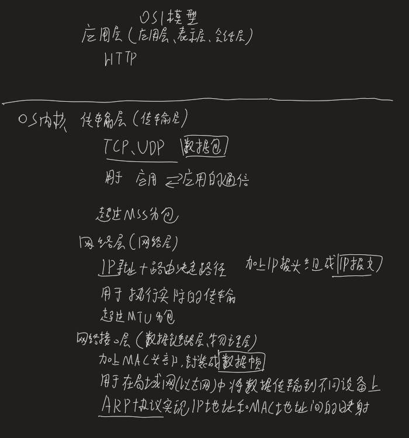

最大报文存活时间:MST

传输层包最大：  MSS

网络层报文最大：  MTU

# 键入网址到网页显示

一、解析URL

协议+服务器名称+路径

二、生成HTTP请求信息

请求行/状态行+消息头+消息体

三、域名解析
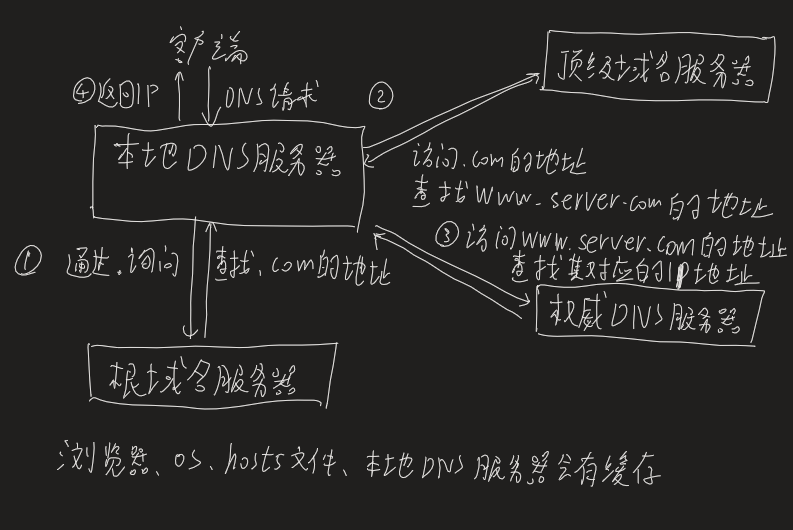

四、获取IP后通过socket库来委托协议栈工作

协议栈封装TCP（UDP）、IP、ICMP、ARP协议

# 网络编程

## 什么是大小端
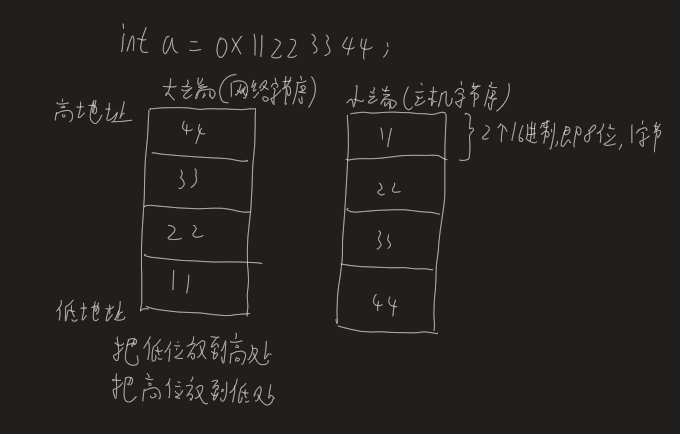

@判断当前系统是大端还是小端

```cpp
int check_sys(){
    int a=1;
    return *(char*)&a;//将32位的int转为字符串类型，此时字符串长度为4
}//查看高位是不是1,如果是1则表示当前系统是小端（字符串的第一个元素是低地址，即将低位放在了低地址）
```

## 服务端和客户端建立连接
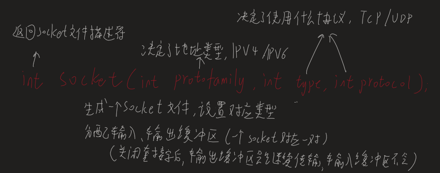
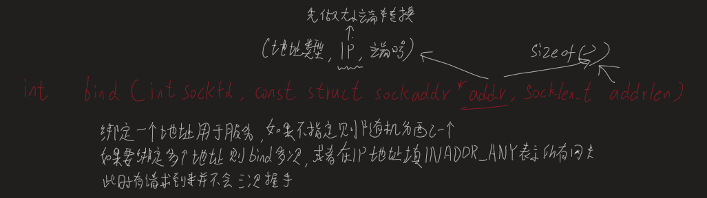


半连接队列是哈希表（为了对到来的握手快速查找到对应的信息）全连接队列是链表，每次只操作队头队尾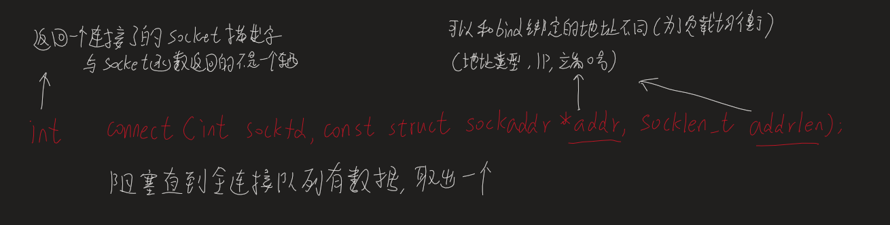
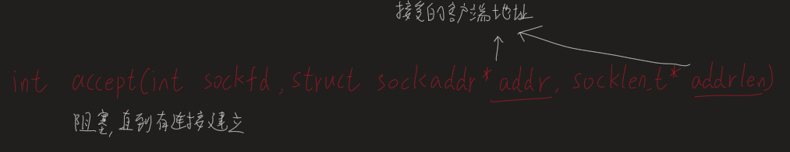

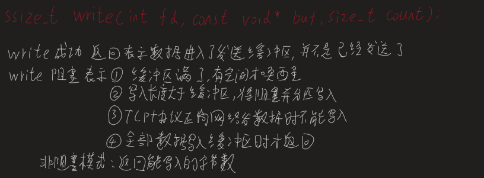
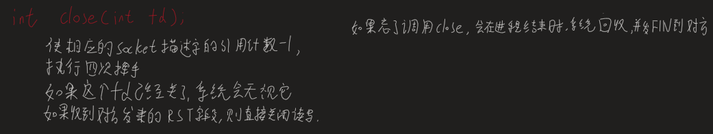

### 对于读写时的连接异常处理

内核通过socket的read/write将双方的连接异常通知到应用层

对于收到对方发来的RST，无论读写都会立即停止

对于读：

- 进程收到FIN，则调用read函数将数据清空，如果正阻塞在read函数上（即缓冲区为空），则唤醒进程，read调用立即返回EOF

- 如果对面操作系统崩溃了，无法收到FIN，那么就会一直阻塞。如果是先write再read的，则之前的write收不到ACK，多次重传后，阻塞的read调用会返回错误

  （当对面不可达时，如果做了一次write，而不是轮询或阻塞在read上，那么在重传的周期内能检测出错误）

对于写：

- 依然可以write（收到FIN只意味着对方不会再发 消息），如果对方发了FIN开始四次挥手，此时对方收到write的数据会回ACK但并不会交付给上层应用。
- 如果这边是用循环读写的方式，需要这边调用close函数，才会开始第三次挥手，如果迟迟不调用close，对方因收不到第三次挥手而终止，此时write函数发过去会收到RST，我方收到RST后，执行的读写函数都会返回错误。（socket对对方连接的中止感知能力有限）

### socket编程和TCP的建立断开关系、连接异常的发生
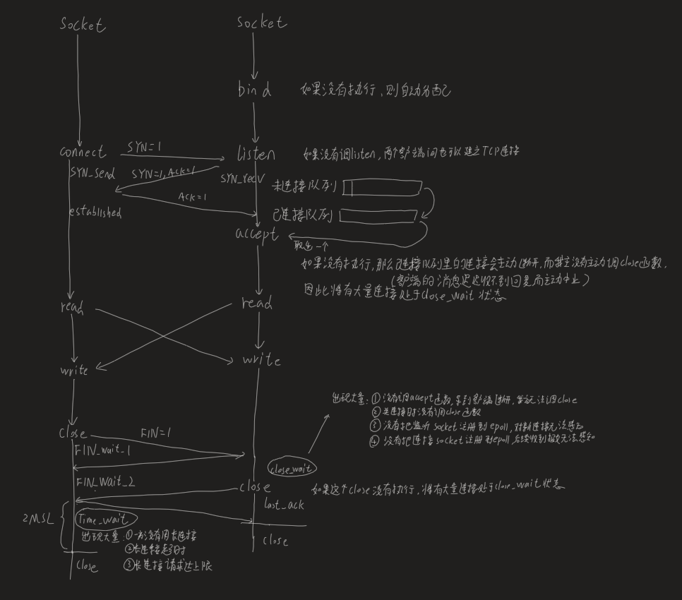

### 套接字底层实现：

是一个整数，分为监听套接字（listen函数将一个主动套接字转为监听套接字，一个服务器通常只创建一个监听套接字）、连接套接字（accept函数返回一个连接的套接字）
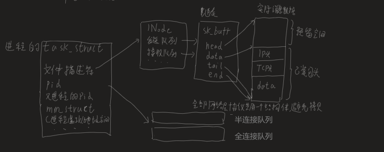

## 高并发网络模型

@ 服务器的承载能力的限制

受文件描述符上限、系统内存上限的限制

### 多进程模型

主进程负责监听，完成的连接分配子进程来处理请求

依托写时复制技术可以共享资源，对于100个客户端可以，但每创建一个进程占据系统资源，且进程切换开销大，1W个客户端不行

### 多线程模型

用线程池共享连接队列，需要对队列上锁，对于1W个连接依然扛不住

### IO多路复用select/poll 

适用于一千以上的并发，只有边缘触发模式

#### 为什么有更高的效率
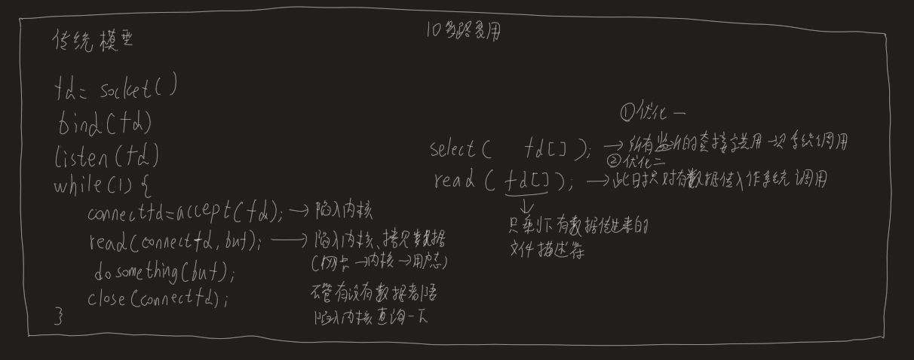

#### 原理
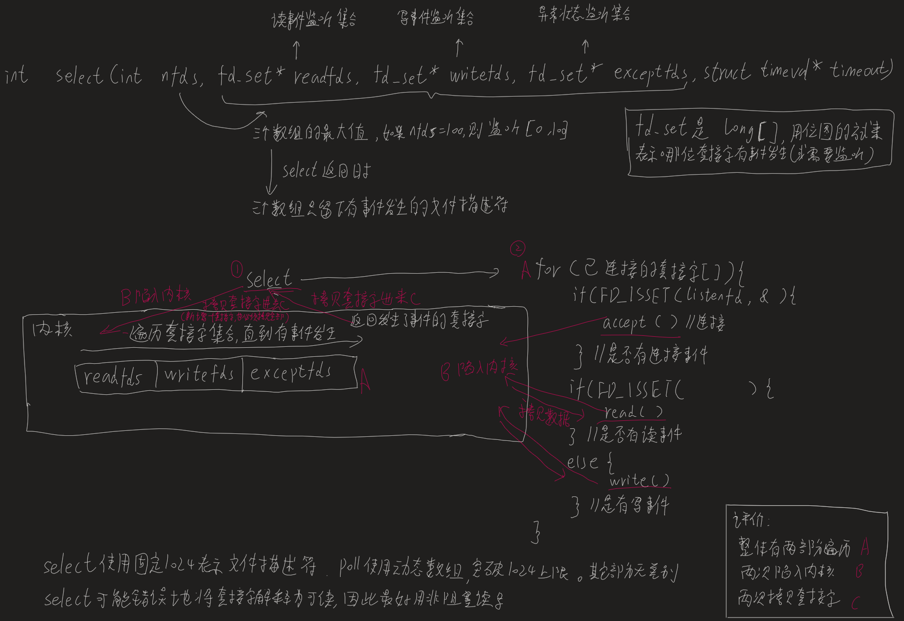

### IO多路复用epoll

适用于1万以上的并发

#### 原理和优势：
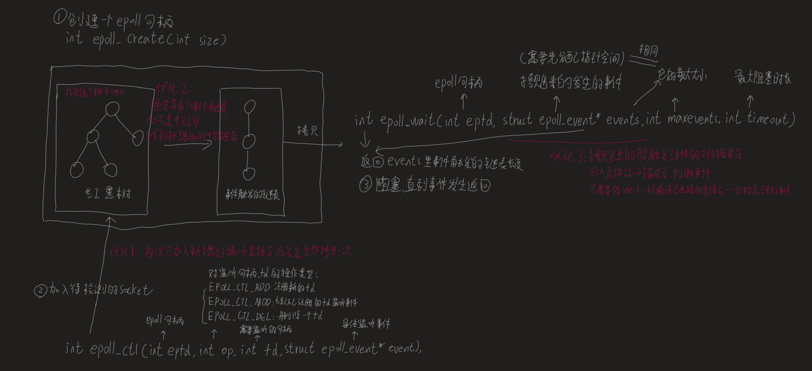

#### 水平触发和边缘触发

水平触发（默认）：对于可读事件，只要缓冲区还有内容就不断苏醒。可以采用轮询读取

边缘触发：对于可读事件，只唤醒一次，应用层需要将数据读完，没读完的数据不会触发唤醒

边缘触发效率更高，但有丢失数据的风险，且边缘触发需要将数据全部读完，才能进入下一个epoll_wait循环，如果数据很大读取花了很多时间，对于新的请求到来得不到及时处理从而对客户端来说感觉服务端延迟高

### C10K问题

对于2GB内存，千兆网卡，能否并发1W请求？（client 10,000问题）

epoll几乎不受句柄数增加的影响

### reactor模式

reactor是非阻塞同步网络模式，感知的是就绪的可读性事件

proactor是异步网络模式，感知的是已完成的读写事件

IO多路复用使得可以对大量的连接并发处理，但其是面向过程的方式，reactor模式对IO多路复用作了封装，提高开发效率

组成：

- reactor负责监听和分发事件（连接事件、读写事件）
- 处理资源池负责处理事件

#### 单reactor单进程/线程
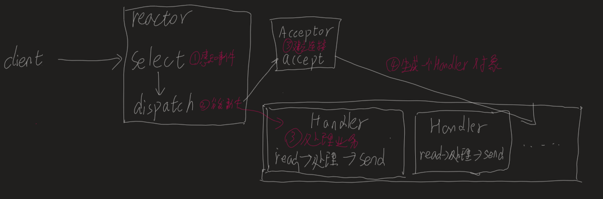

通常c语言用单进程方案

特点:

- 单进程无法充分利用多核CPU性能，
- handler在业务处理时无法处理其他连接事件
- 只适用于业务处理很快的场景，不适用计算密集型场景（redis6.0之前适用的是这种方案）

#### 单reactor多线程
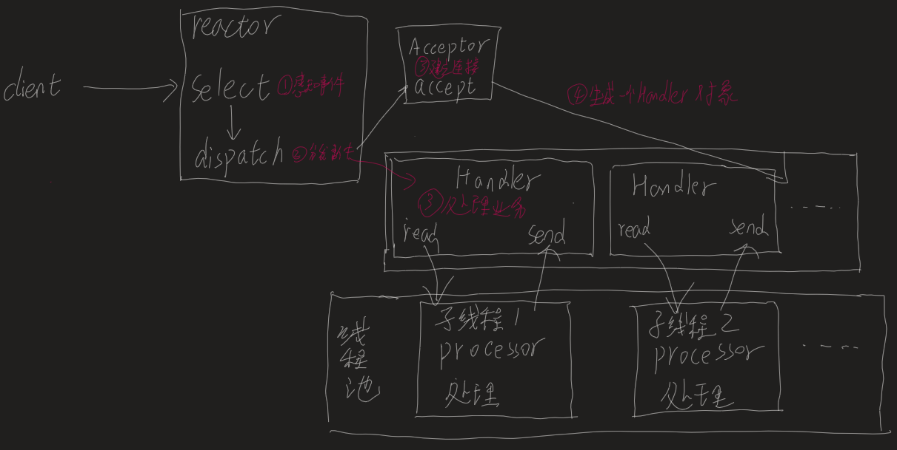

特点：

- 能充分利用多核的CPU，但多线程会竞争资源
- reator多进程涉及到进程通信，因此实现麻烦，没有实际应用
- 应该reactor对象承担所有事件的监听，高并发时有性能瓶颈

#### 多reactor多线程/进程
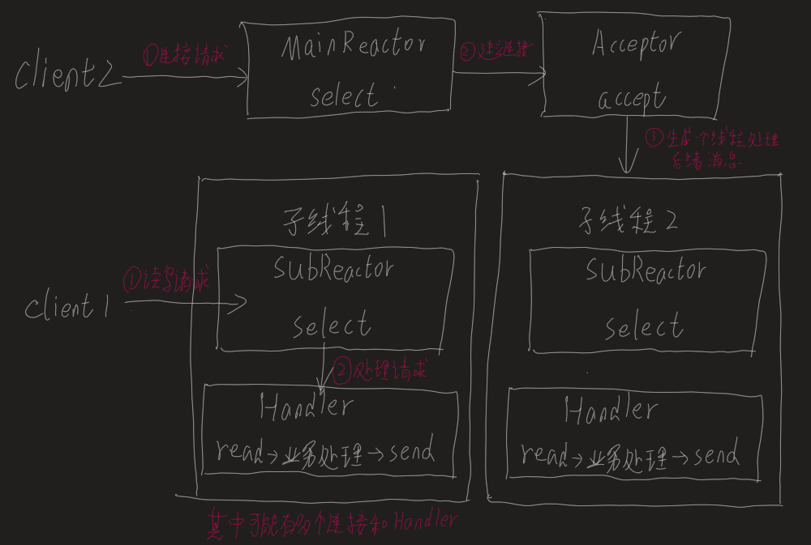

特点：

- 实际上实现比单reactor多线程容易，因为主线程和子线程分工明确、交互简单，子线程不需要返回数据，直接发给客户端。

memcache、moduo采用了多reactor多线程方案

nginx采用了多reactor多进程方案

### proactor模式
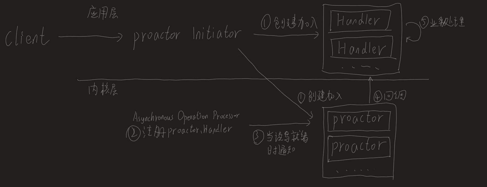

> aio_read（异步IO）之后，就立即返回，内核异步完成将数据从内核空间拷贝到用户空间

linux下的异步IO不完善，aio系列函数是在用户空间模拟的异步，且不支持socket，因此Linux的高性能网络程序使用reactor方案

window里异步编程接口完善，windows里可以用proactor方案

## 一致性哈希

**问题：**多台服务器构成集群提供服务，对不同节点分配客户端请求，从而涉及到负载均衡问题

**最简单的实现：**引入中间的负载均衡层，将外界的请求附加权重轮流转发给内部集群。这要求每个节点存储的数据都是强一致性的，对于数据分片的分布式系统不行（为提高系统容量将数据水平切分到不同节点存储。）

对于数据分片的分布式系统简单使用哈希算法带来的问题：当节点数据发生变化，数据和节点的映射改变了，必须要做数据迁移

## 一致性哈希算法

对固定数字2^32进行取模运算，得到的结果组成哈希环

第一步：根据存储节点的IP地址进行哈希映射

第二步：对数据进行存储和访问时，对数据进行哈希映射

**对指定key的读写：**对数据做哈希计算，映射结果往顺时针方向找到最近的第一个节点

**节点的增加和减少：**只有一个节点的数据需要迁移

**问题：**

- 一致性哈希算法并不能保证节点在哈希环上分布均匀。
- 进行容灾和扩容时，环上相连节点收到过大影响，会引发雪崩式的连锁反应

**虚拟节点**

将虚拟节点映射到哈希环上，并将虚拟节点映射到实际节点，应保证虚拟节点在实际节点上尽可能分散。当一个实际节点被移除时，多个虚拟节点移除到不同的真实节点，从而平摊了压力

nginx的一致性哈希算法，权重为1的节点有160个虚拟节点，硬件更好的节点虚拟机节点更多

# TCP协议

## TCP和UDP的区别

​		①TCP需要连接②TCP一对一、UDP一对多③首部开销④有序分片⑤拥塞控制⑥传输方式⑦可靠性
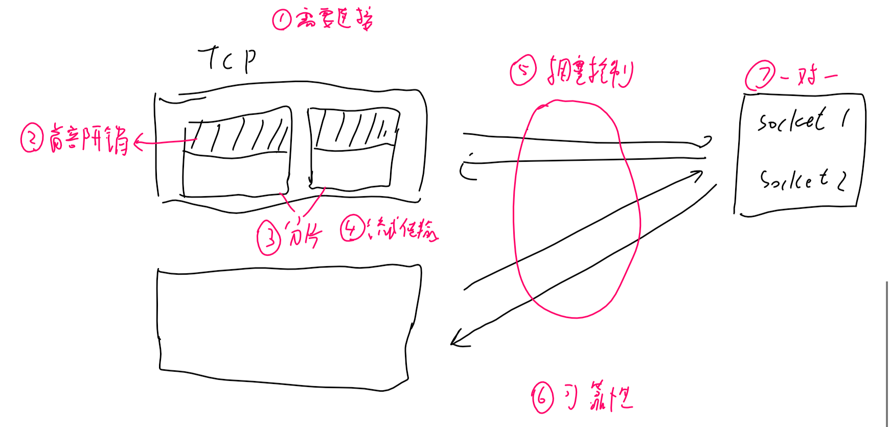

TCP、UDP有包长度字段吗？      TCP没有（通过IP总长度减去IP和TCP首部字段得到），UDP有

TCP和UDP可以用同一个端口吗？     可以，他们属于不同软件模块

## 组成
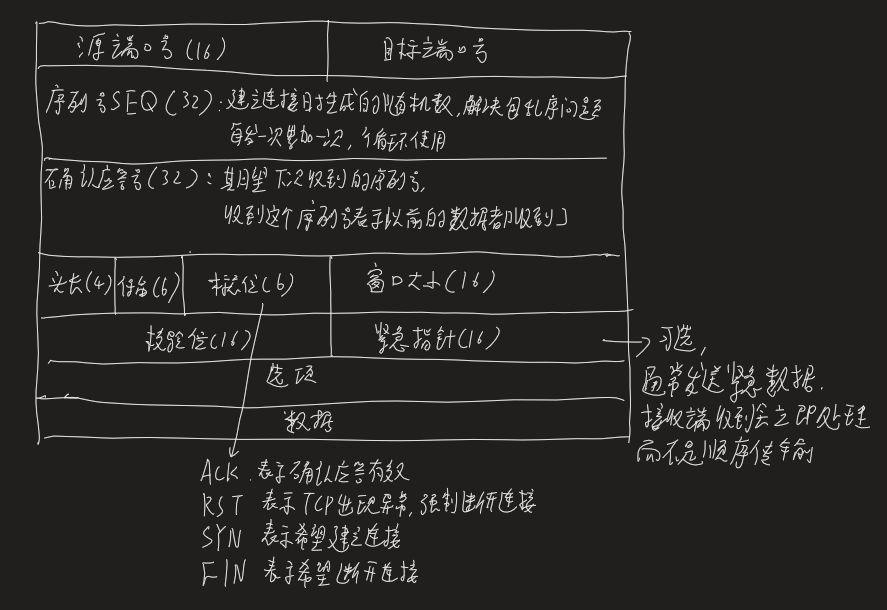

## TCP连接

@如何唯一确定一个TCP的连接？

TCP四元组：IP层头部包含的源地址和目标地址+TCP头部包含的源端口和目标端口

@一个服务器的最大监听端口，TCP连接数？

TCP连接数=客户端IP数*客户端端口数。还受到文件描述符限制（系统级、用户级、进程级），内存限制

@ TCP的快速建立

第一次建立时服务器产生加密cookie给客户端，下次请求只需带上cookie就可以跳过三次握手

### 三次握手
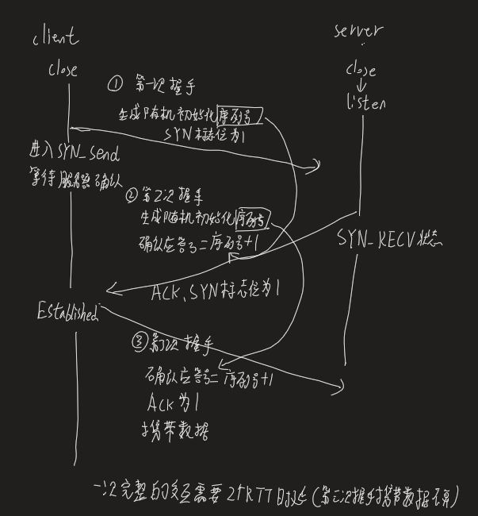

### 为什么不是两次、四次

**一、避免历史连接造成的混乱**

对于如下场景：

客户端发送SYN和服务端建立连接的过程中，此时客户端宕机了，重启后以新的序列号发送SYN

1. 对于三次握手
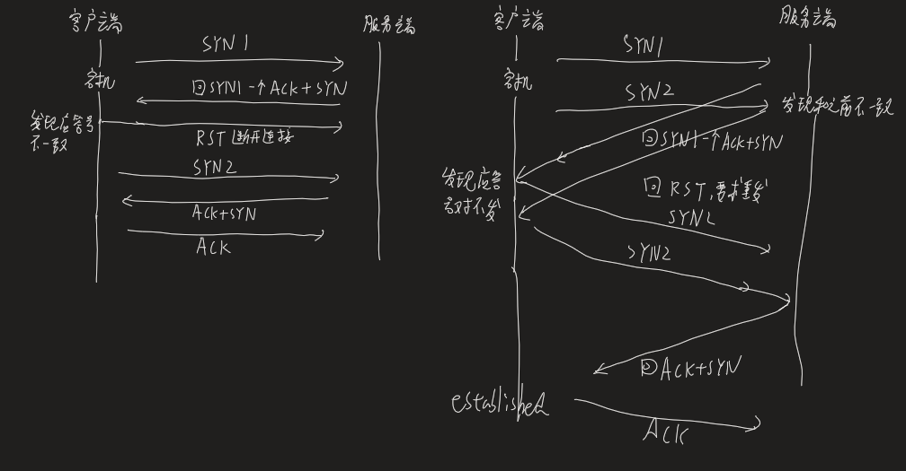

2. 对于两次握手

   如果服务端只要收到客户端的SYN请求就建立连接，那么没有中间状态来阻止历史连接，导致服务端建立了一个历史连接造成资源浪费，必须要等到客户端发来一个RST次啊能释放这个连接

3. 对于四次握手

三次握手实现了功能，没有必要再来第四次握手了

**二、三次握手才能同步双方的初始序列号**

初始序列号次啊能实现去除重复的数据包，保证包的顺序，发送一次接受一次就能保证双方的初始序列号能同步

第二步的服务端回复客户端和发出初始序列号合成了一步，因此不需要四次握手

**三、三次握手才能避免资源浪费**

多个客户端发来的SYN请求服务端都要建立连接，服务端的ACK报文如果没有发到客户端，那么客户端会一直重发SYN，服务端因此建立多个无效连接

### 如果每次握手的包丢失了

@如果第一次握手丢失了

客户端因收不到回复而重传，内核中最大重传次数写死为5，（通常为1，2，4，8，16，32）

@如果第二次握手丢失了

服务器进入SYN_RCVD状态，客户端收不到回复而重传，服务端收不到回应会超时重传2次（共3次）

@如果第三次握手丢失了

服务端收不到报文会触发超时重传，客户端不会超时重传，只对服务端发来的多次SYN+ACK都回复ACK。

### 如何初始序列号ISN

ISN=M（计时器）+ H （四元组随机生成），循环一次要4.55h

@为什么每次TCP建立的初始化序列号不一样

1. 防止历史报文被下个相同的四元组接受
2. 防止黑客伪造相同序列号的TCP报文

### TCP层为什么要设置MSS，IP层已经分片了

MTU：IP层网络报文的大小，通常为1500，

如果不使用MSS，那IP层对于超过MTU大小的数据就分片，而IP层没有超时重传，如果一个IP分片丢失，接收方的IP无法组成完整的TCP报文交付到TCP，使得TCP触发超时重传整个报文的所有分片。

通常设置MSS的大小小于，MTU除去IP和TCP头部，能容纳的实际数据大小

## TCP连接的终止

### 四次挥手
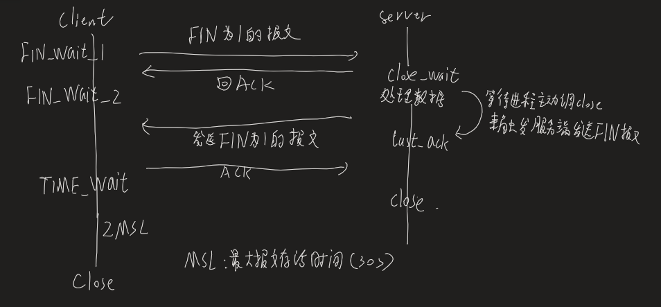

### 每次挥手的丢失

@第一次丢失

超时重传，最多三次，时间2倍叠加

@第二次丢失

客户端超时重传，对于ACK的消息不会主动重传

@第三次丢失

客户端一段时间没有收到第三次挥手就会断开连接，服务端如果一直收不到ACK就会重发

@第四次丢失

服务端会收不到ACK而触发超时重传，如果客户端又收到了第三次挥手的报文，则回重回ACK，并重置定时器

### Time_wait的意义和优化

**意义：**

1. 服务端在关闭连接以前发送的数据因网络问题在四次挥手后才到达，而客户端会回复RST，服务端收到RST将其解释为错误，这对可靠的TCP协议来说不安全

   等待2个MSL是为了数据一来一回需要2倍的时间

2. 防止历史连接的数据需要被后面相同的四元组的连接接收到了（序列号会循环绕回初始值），确保新连接产生的数据是新建立的连接产生（开启了TCP的时间戳则不存在这个问题）

@为什么不是4或8MSL的市场

对于丢包率1%的网络连续丢包两次概率很低，忽略他更有性价比

@TIME_WAIT过多

TIME_WAIT占用了端口，过多的TIME_WAIT回导致端口资源浪费

**优化：**

1.  Linux下可设置，复用处于TIME_WAIT的socket为新的连接所用
2.  服务端步主动断开连接，让客户端去主动断开，承受TIME_WAIT
3.  Linux下可设置，当系统处于TIME_WAIT的连接数超过一个值，将后面的TIME_WAIT连接状态重置

### 服务器出现大量TIME_WAIT

1. HTTP没有使用长连接：大多web服务器，不管是服务器还是客户端哪一方禁用了长连接服务，都由服务端主动关闭连接
2. HTTP长连接超时，（客户端发完请求后，在计时器内没有发起新的请求，计时器超时触发断开）
3. HTTP长连接请求达上限

### 服务器出现大量CLOSE_WAIT状态

服务器的程序没有调用close函数关闭连接，通常是服务端代码错误

1. 没有将socket注册到epoll，对新的连接服务端无法获取
2. 对新连接没有调accpet获取该连接的socket导致客户端主动断开，而服务端无法对这些socket调close
3. 没有把已经连接的socket注册到epoll，导致后续收到报文无法感知这个事件
4. 关闭连接时，服务端没有调用close函数

## 为什么TCP是面向字节流的协议

@什么是面向字节流，面向报文

UDP面向报文的协议，一个UDP包就是完整的消息

TCP是面向字节流，将数据分片，一个TCP报文可能对应多个用户消息

**毡包问题：**两个消息的部分内容可能分到同一个TCP报文里，接收方如果不知道消息的边界就无法读取有效的消息，这个问题由应用层解决

**解决粘包问题**：固定长度、特殊字符作为边界（HTTP）、自定义消息结构

## 保活机制

建立了TCP连接后，一段时间没有活动将发送探测报文，多次探测报文没有相应，内核将通知给上层

linux的保活机制检测时间较长，可以在应用层用心跳机制

## TCP底层实现

### 网络拥塞

发送窗口的值=min(拥塞窗口cwnd，接收窗口)，拥塞窗口会根据对方的接收能力动态调整

- 慢启动

  刚开始发送时，将初始的cwnd置1个MSS，然后2倍增长

- 拥塞避免

  到慢启动阔值时+1线性增长

- 拥塞发生

  超时重传机制下：直接恢复到慢启动，慢启动阔值变为cwnd的一半

  快速重传机制下：慢启动阔值变为cwnd值的一半，然后走快速恢复

- 快速恢复

  仅限快重传机制下

  将拥塞窗口值设为原来的一半+3，用于快速重发丢失的三个数据，如果再收到重复的ACK则再+1

  收到新数据的ACK后，将拥塞窗口置为最开始出现丢失时的拥塞窗口大小的一半

### 更好的拥塞控制算法

RRT

丢包并不代表网络拥塞，可能是主动丢弃或网络硬件异常或被高优先级的流量抢占

通过发送和接收时间来动态计算接收窗口

### ARO超时重传

分UNA和ACK两种响应模型，根据情况使用一个

- 超时重传

​	超时重传时间取决于最大往返时间RTT，采样计算出来，每次超时重传，下次超时时间翻倍	

- 快速重传

​	收到三个重复的确认就立即重传，收到一个确认则表示之前的数据都收到了

### 对于丢包的发送

回退N帧：重传这一帧以后的所有帧

选择重传：需要双方开启**SACK字段**，可以将已收到的数据信息发送给对方，从而只传丢失了的数据

维持一个滑动窗口，每到达一个帧检测他的序号是否落在窗口内，落在窗口内切没有接收过则回ACK，等前面的帧都到达了则一起交付上层并移动窗口。发送端每个发送缓冲都有一个超时计时器   

**D-SACK字段：**如果开启，当收到重复的包时，可以回复发送方，这个包被重复接收了。

这样做可以

- 让发送方确认发送的**网络状况**，是**发出的包丢失**还是接收的ACK丢失
- 让发送方知道是否发送的包被网络延时了
- 让发送方知道是否**网络中把包复制了**

### 连续发送大量数据

发送方和接收方各自维持一个滑动窗口（大小不一定相同），允许发送方发送多个分组而不用等待确认，

**发送窗口**：用两个指针分别指向已发送但还未确认的数据，和未发送但还在窗口范围内的数据。如果发送窗口被占满则会阻塞，无法继续发送数据。

每收到一个ACK则检测他的序号是否落在窗口内，落在窗口内且没有接收过则回ACK，等前面的帧都到达了则一起交付上层并移动窗口

@窗口大小由哪方决定

通常由接收方决定，发送方窗口通常小于接收方

### 流量控制

发送方根据接收方的能力动态控制发送的数据量

接收方收到发来的数据后，应用程序会读取缓冲区的数据，接收方调整新的窗口大小为缓冲区大小-未读取的数据的大小，并通知发送方，发送方调整窗口大小

当窗口大小为0时则阻止消息发送，此时启动超时计时器，超时后发送方会发送探测报文，探测报文如果没回复可能中断连接，如果回复了则重启计时器。探测间隔约30s

**@如果OS要减少缓冲大小**

如果同时收缩窗口和缓存，会导致①接收方窗口缩小的请求还没到达，发送方发来一个大于接收方缓存的数据，从而无法正常接收。②发送方已经发送了大量数据，接收方还没收到，这时收到了缩小缓冲区的请求，可用窗口大小就变成了负数

通常先收缩窗口，过段时间再收缩缓冲区

**@如何解决糊涂窗口综合征**

Nagle算法

如果接收方窗口很小只有几个字节，则此时发送数据不经济，因此

对于接收方：窗口大小小于一定值时阻止对方发送消息过来

对于发送方：（可用窗口大小>=MSS） && （可发送数据大小 >=MSS） ||  （之前发送数据的ACK都收到了），才发送

……

###  校验机制

> udp的校验机制可选，tcp必须

由四元组确定一个12字节的伪首部，加入到报文里

对报文段做检验和

tcp的校验并不能保证数据一定不改变（对数据累加的方式计算的，如果数据位置变了无感知）。因此应用层还需要数据校验，例如md5


## 如何基于UDP实现TCP

TCP的问题：

- 建立连接慢
- 对头阻塞问题
- 网络迁移需要重新连接
- 升级TCP工作困难


# IP

IPv4地址有32位，每8位一组，以网卡配置

## IP地址的分类

A、B、C类地址分为主机号和网络号，C类主机号为2^8-2位，全1表示所有主机用于广播，全0表示指定网络

D类用于广播，E类未使用

### 广播地址的作用

**本地广播**：向同一个以太网内的所有设备发送消息，广播地址就是主机号全为1，例如对于网络地址为192.168.0.0/24，广播地址为192.168.0.255

**直接广播**：向特定子网内的所有设备发送消息，比如发送方192.168.0.0/24向接收方192.168.1.255/24发送包，则会发送到这个网络号下的所有主机号上（有安全问题，通常设置为不转发）

### 多播地址的作用（组播）

属于D类地址，能将数据在同一组内的多个接收方之间共享，常用于音视频的传输，直播等

**@IP分类的优缺**

简单明了

同一网络下没有地址层次不能细分

C类地址能包含的主机数量太少，B类太多，不符合实际使用

### 无分类地址CIDR

只有网络号和主机号两部分，用子网掩码来表示两部分界限，例10.100.122.2/24表示前24位是网络号，剩余8位为主机号

### 子网划分

用子网掩码，将主机号里的一部分作为子网，从而将原本的网络号+主机号变成了网络号+子网+主机号

### 公有IP和私有IP地址

个人用户使用私有IP地址，允许组织内部分配管理，不同公有IP下的私有IP地址可以重复

公有IP由ICANN组织统一分配保持唯一

## 路由转发

路由有路由控制表，记录网络地址与下一步发送至路由器的地址
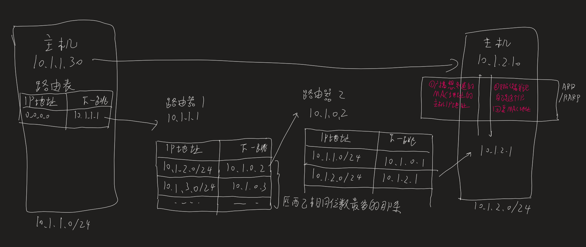

## IP地址结构

TTL可以设置小些，用于控制发送的范围
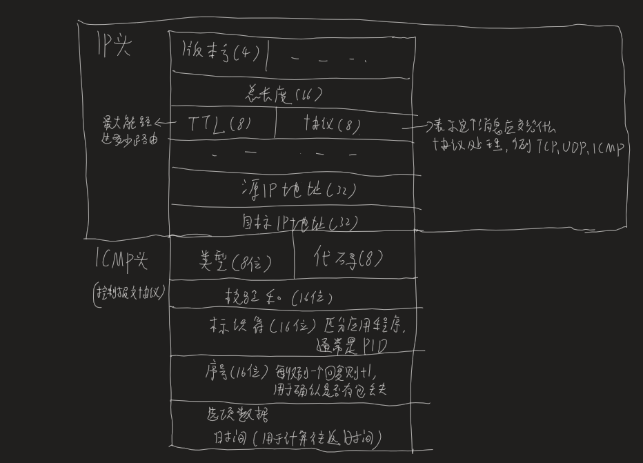

### ICMP协议

类型字段表示错误类型，代码字段包含错误信息

- 目标不可达

  网络不可达、主机不可达（没有这个主机的信息或主机没联网）、协议不可达（对端防火墙禁止访问）、端口不可达（对端没有监听这个端口）

- 原点抑制

  路由器向低速网络发送数据时，发送队列的缓存变为0而无法发送。主机可以增大IP包的传输间隔。这可能产生网络不公平，因而不用

- 重定向消息

  使用了不是最优路径发送，会回复最合适的路由信息和源数据

- 超时消息

  TTL字段为0，被网络抛弃时会给发送端发一个超时消息。这是为了防止路由转发中出现循环

 ### ping的工作原理

基于ICMP协议，

1. ping命令执行，先构建一个ICMP回送请求消息数据包，包含类型、序号（区分连续的ping）、发送时间等发送过去
2. 对方主机构建一个ICMP回送响应消息数据包

ping和TCP都是用socket函数实现，只是发送数据的报头不同，一个是TCP头，一个是ICMP头

## IP分片和重组

不同数据链路的MTU不同，以太网是1500，大于MTU时会被分片，重组由目标主机完成，路由器不参与

## IPv6与IPv4区别

- IPv6有128位，以16位一组，用：隔开，IPv4为32位，8位一组
- 自动分配IP地址，即插即用
- 包头固定40字节，去掉包头校验和，简化了首部结构，提高了传输性能
- 提高了安全性
- 与IPv4不兼容，普及慢

## ARP协议/RARP

路由转发后，到达局域网，通过ARP协议求的下一跳的MAC地址

**具体实现：**

ARP请求：主机通过广播发送想知道的MAC地址的主机IP地址

ARP回应：同个链路的所有设备收到ARP请求时，查看是否和自己IP一致，相同则回复携带MAC地址

OS通常会缓冲一段时间

**RARP：**

需要架设RARP服务器：

- 新加入的设备发送MAC地址请求IP
- RARP服务器收到后返回MAC地址对应的IP地址给设备
- 设备设置自己的IP

## DHCP

个人电脑通过DHCP动态获取IP地址，从而不需要配IP
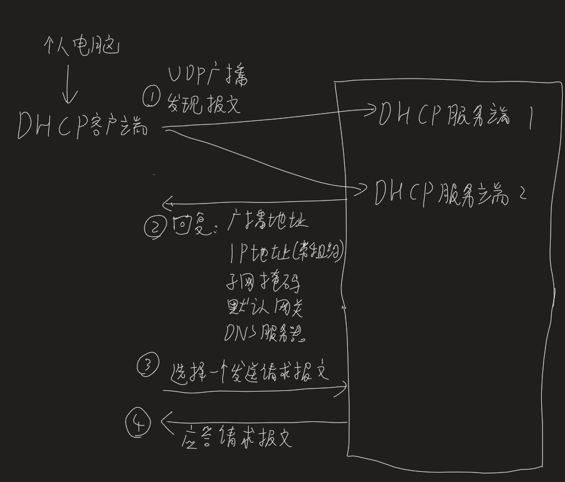

DHCP地址快过期时会向服务器发送请求报文，延长租用时长

不同局域网下则需要使用DHCP中继代理，可以由一个DHCP统一分配管理IP地址

## NAT网络地址转换

将同一共有网络下的私有IP映射成共有IP的不同端口号， 路由器用NAPT表记录他们的映射关系

当连接断开时，删除这条记录

- 外部无法主动和NAT内部服务器建立连接，NAPT转化表里没有转换记录
- 转换表的生成和维护产生性能开销
- 通信时NAT路由器重启，则TCP连接重置

NAT穿透技术允许应用程序主动建立共有IP地址的端口映射，并对外通信

## 如何实现组播IGMP组管理协议

工作在主机最后一跳之间，主机发送IGMP报文加入组播时，路由器记录IGMP路由表，路由器后续就会转发组播包到对应的主机，
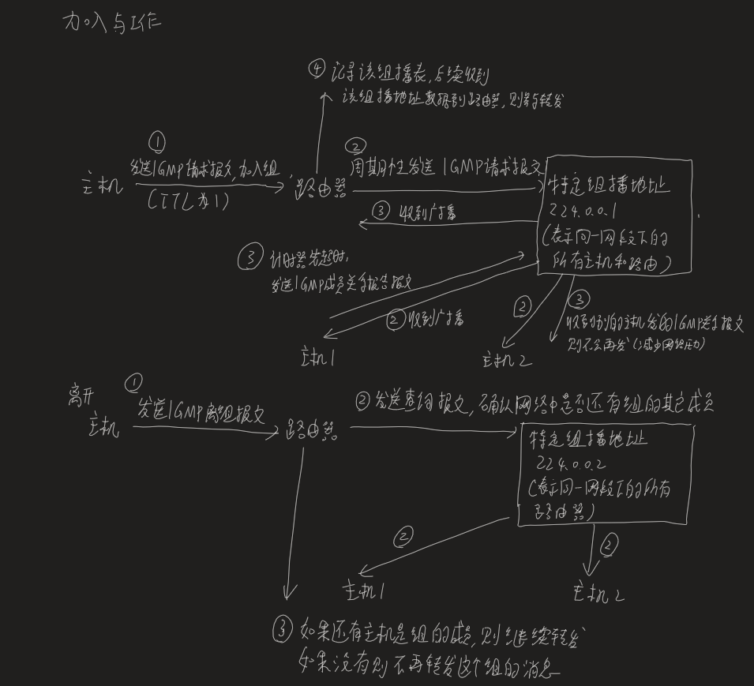

## 网络工具

### traceroute命令——差错报文类型

功能一：确定经过哪些路由

`traceroute 192.168.1.100`

依次设置TTL为1，2，3……从而确定到达目的会经过哪些路由器

功能二：确定路径的MTU

禁止报文分片，每次收到ICMP差错报文就减少包的大小，从而确定MTU值

### 为什么断网还能ping通127.0.0.1

ping的执行，从应用层到传输层，到网络层时，在路由表中查询目的IP地址，是外网IP就从真网卡发出，是回环地址就选择本地网卡（假网卡，一个链表挂着发给本地的消息，产生软中断，中断处理线程传递给上层应用）

ping回环地址和ping本地地址是一样的

# KCP

- 牺牲10%-20%的带宽，换取平均延迟
- 底层通常用UDP

与TCP区别：设置正常模式和快速模式

- 传递及时性高的小数据时忽略退半避让
- 缩短超时重传RTO时间（从2倍的RTO变为1.5倍的RTO，通过发送时间戳计算往返时延RTT，进而计算RTO
- 快速重传，从三次缩减到两次
- 超时重传（UNA重传时需要全部重传，变为选择重传）
- 
- 非延迟ACK（连续ARQ延迟返送ACK能充分利用宽带，但有较大往返时延RTT）
- ACK+UNA响应模型，（既有单独的ACK，且每个包也有收到哪些包的关键字）

# QUIC协议

改进点：
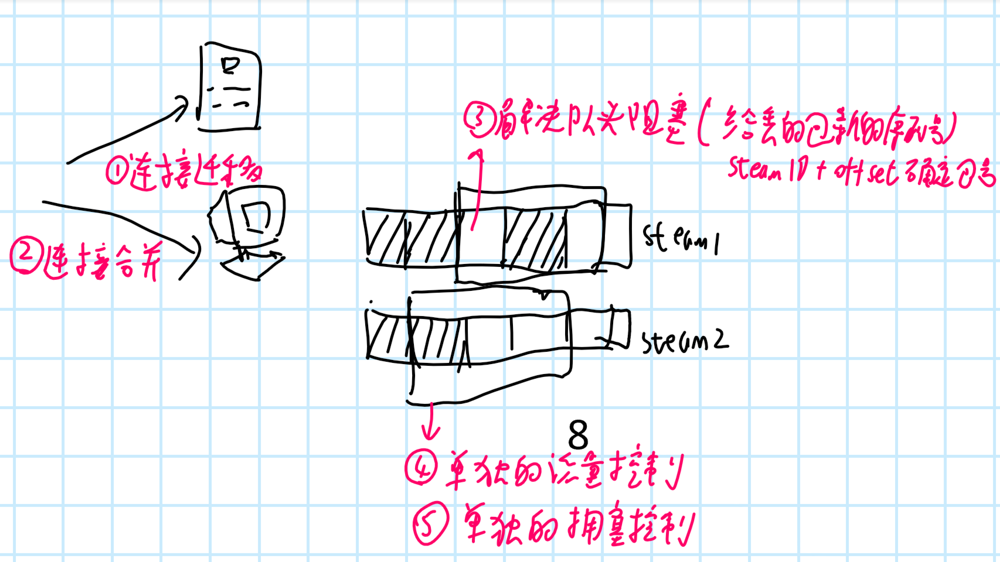

- 实现**连接迁移**，使用四元组连接生成连接ID，后续通信用连接ID通信
- 与HTTP**连接合并**
- 丢包重新生成包ID，解决**滑动窗口队头阻塞**和**精确计算RTT**
- **每个stream**有独立的滑动窗口，之间互不干扰，单独做流量控制
- 对拥塞控制不需要内核支持，对不同应用设置**不同的拥塞控制算法**

# HTTP

## 报文格式
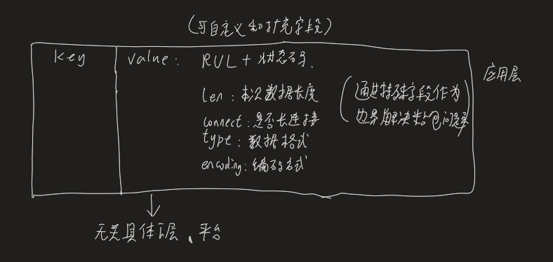

## RFC规范：

GET获取指定资源

- 安全且幂等，多次请求结果相同且不会破坏服务器资源
- 参数位置在URL中
- 长度有限，只支持ASCII

POST根据请求对指定资源做出处理

- 不安全和幂等
- 数据在报文body中
- 格式任意，无大小限制

## HTTP相关技术

### cookie和session

`cookie`在服务器端记录信息确定⽤户身份，`Session`在服务器端记录信息确定⽤户身份，都⽤于管理⽤户的状态和身份
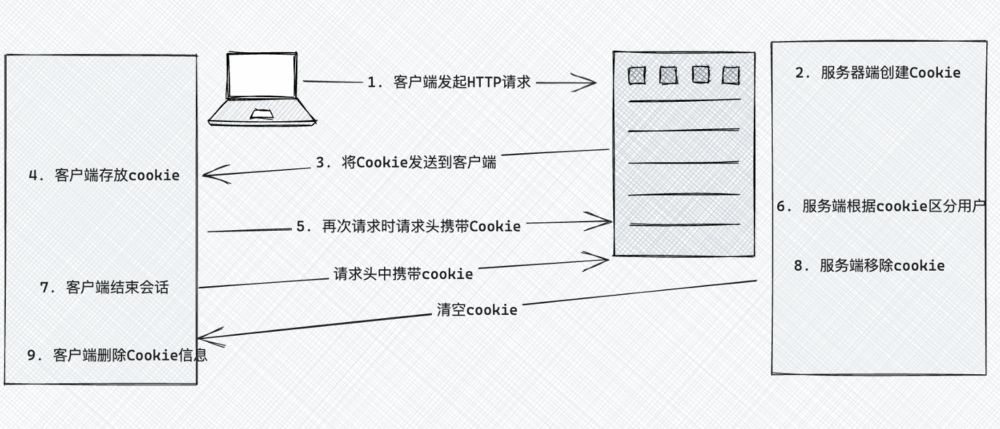

## HTTP缓存

**强制缓存：**服务器发来的数据携带有效期，在有效期内，浏览器不需要询问服务器直接从本地缓存读数据

**协商缓存 - 基于时间：**请求这个数据时发现资源过期了，则再次发起请求时带上过期时间，服务器和本地数据的修改时间对比，如果没改过则告诉浏览器走本地缓存，如果改过则回浏览器新数据

**协商缓存 - 基于标识：**浏览器发送Etag标识（类似数据的版本号），服务器对比看Etag是否一致，不一致则返回新资源，一致则告诉浏览器走缓存
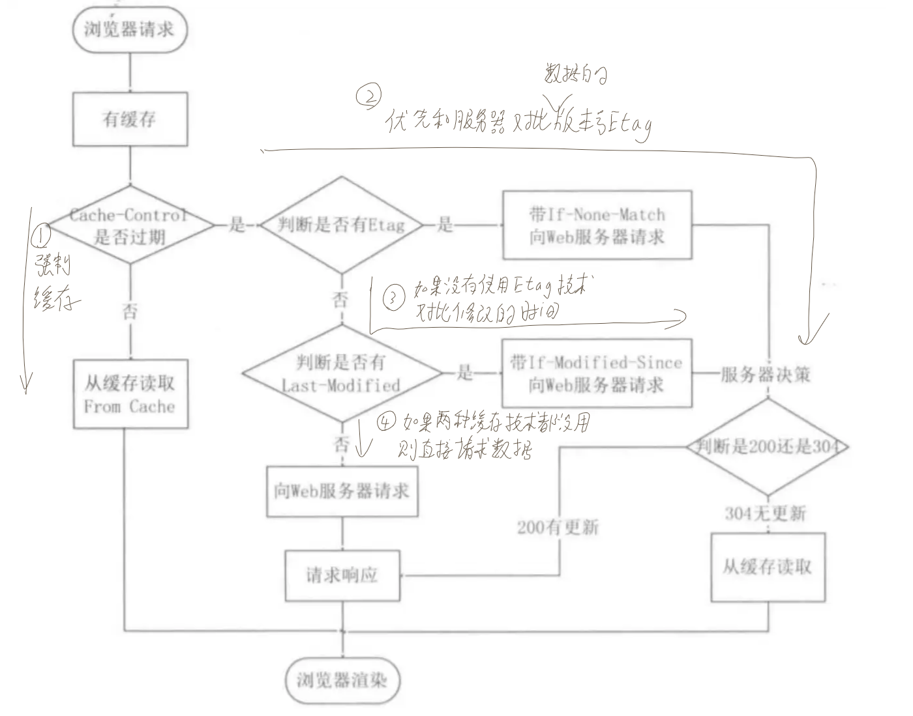

## HTTP1.1

- 无状态：对于有关联性的操作只能在报文中加入cookie信息来实现，本身不记录状态
- 不安全：明文传输数据，不验证双方身份、不验证报文完整
- 性能：长连接+管道网络传输，可同时传输多个请求，但服务端处理只能顺序处理（解决了请求队列的阻塞，没有解决响应队列的阻塞）

## HTTPS

 在Http和 TCP之间加入了SSL/TLS协议，解决安全问题

### 信息加密 - 混合加密

**问题**：明文传输信息，导致信息可能被窃取

**解决**：加密

通信前用**非对称加密**（计算慢但能解决密钥交换），通信中用**对称加密**（计算快但无法做到安全的密钥交换）

### 校验机制 - 摘要算法+数字签名

**问题**：数据可能被篡改，比如植入广告

**解决**：用摘要算法来验证数据的完整性+非对称加密确保内容不会被替换

摘要算法：为每个数据生成独一无二的指纹用于校验，即发送方发出计算的内容的哈希值，接收方收到后也计算出指纹，和发来的指纹作对比

非对称加密：服务端持有私钥，并向客户端颁发公钥。对内容的哈希值加密，客户端收到消息用公钥解密对比哈希值即可

**秘钥协商算法：**

通过非对称加密得到会话秘钥

每次会话秘钥是不同的，无需持久化

### 身份证书 - 数字证书

**问题：**可能访问假的网站

**解决：**服务器将公钥注册到CA得到数字证书，响应客户端时携带数字证书，客户端使用CA公钥验证数字证书从而认得到服务器公钥
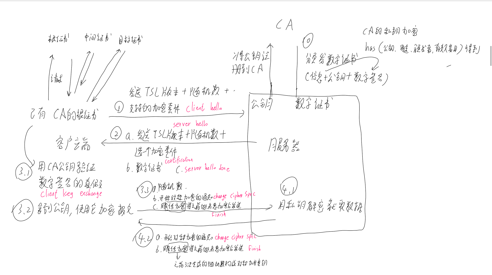

### HTTPS消息如何生成（应用数据如何保证完整性）

握手协议（四次握手协商加密算法和密钥）+记录协议

消息分片+压缩+消息认证码mac+加密+加上包头（类型、版本、长度）

之前的秘钥协商会得到多个秘钥，秘钥1对消息计算得出mac码追加到消息体后(可以保证数据不被篡改)，秘钥二对整个消息加密（保证消息不被窃听）
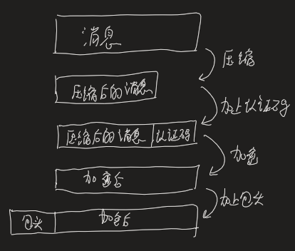

### HTTPS一定安全可靠吗

通常是的

**中间人服务器**

用户点击接受了中间人服务器的证书、或者电脑中病毒植入了中间人的证书

**抓包工具**

抓包工具是提前安装了根证书，被浏览器信任

作为中间人，想明文代理客户端和服务端，中间人必须有对应域名的私钥（才能读取客户端的请求数据，在握手时客户端会生成随机数后续服务端发的消息和随机数有关，因此服务端的消息也没法明文读取）

## HTTP/1.1比起HTTP/1.0

改进

- 使用**长连接**的方式改善了HTTP/1.0短连接造成的性能开销
- 支持**管道网络传输**，第一个请求发出后不必等其回来，可以发第二个请求出去，减少整体响应时间

缺点

- 请求/响应**头部未经压缩**就发送，首部信息越多延迟越大，只能压缩body
- 发送冗长的首部，**每次发送相同的首部**造成浪费
- **服务器按请求顺序响应**，会造成队头阻塞
- **没有请求优先级**控制
- **只能C/S架构**，请求只能从客户端开始，服务器被动响应

## HTTP/2

- 头部压缩：多个请求有相同的头会消除重复部分（客户端和服务端维护头信息表，重复的字段只发索引号就行）
- 二进制格式：压缩数据
- 并发传输：（如果一个请求迟迟得不到回应没法发下个请求）允许多个stream复用一条TCP连接，不同请求用不同的StreamID来区分，可以乱序发送，且服务端可以主动推送客户端

缺点：

- TCP的存在限制了收到的包是完整连续的，后一个包和前一个包不是一个流的，但TCP不会提前交付后一个包

## HTTP/3

底层换成QUIC协议，从而

- 无上面提到的队头阻塞
- 更快的连接：TCP的三次握手和TLS的握手合并
- 连接迁移：TCP通过四元组确定连接的，如果网络切换了，需要重新建立连接，QUIC通过连接ID来标记两个端点从而保证连接迁移


