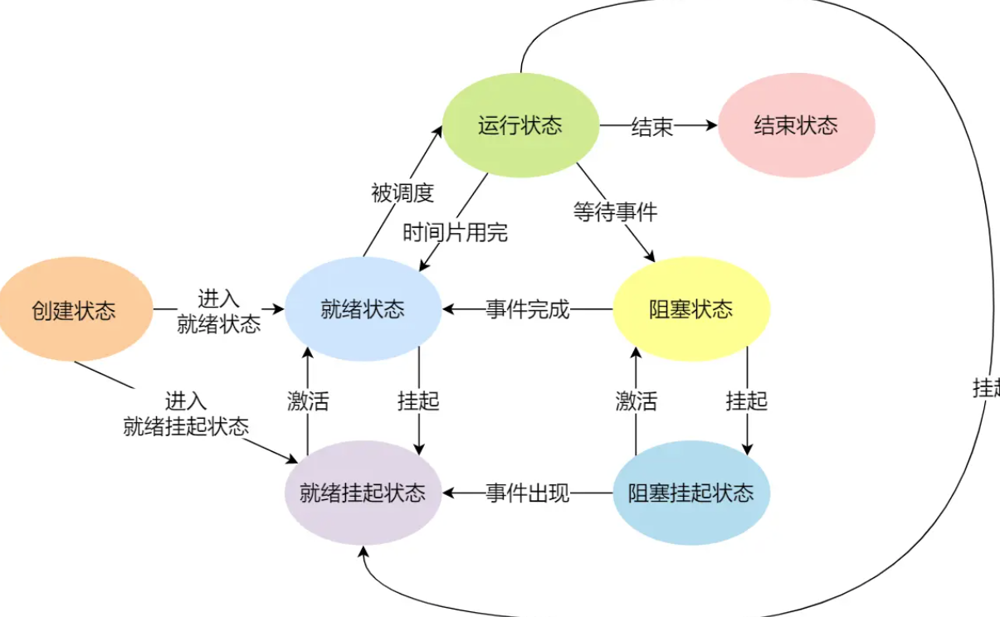
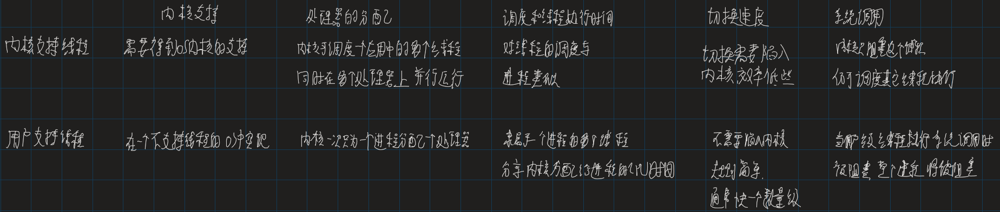
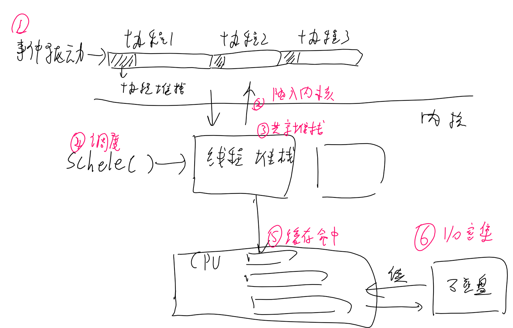
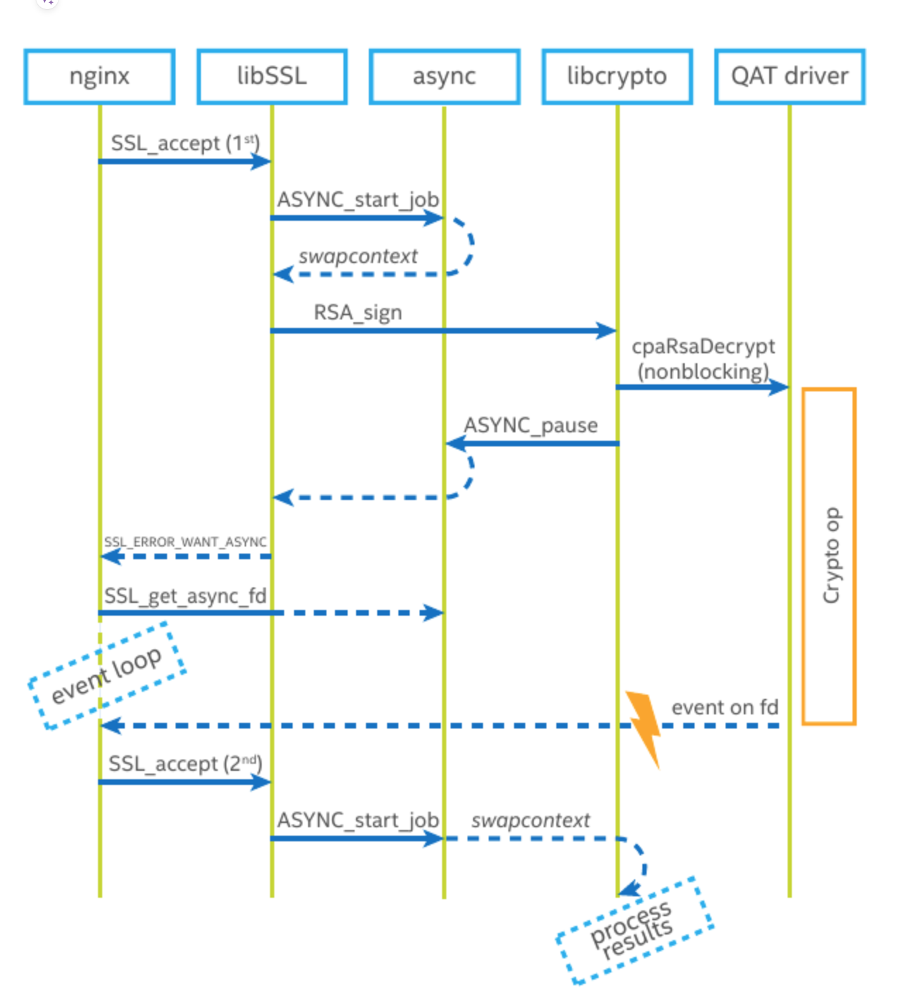
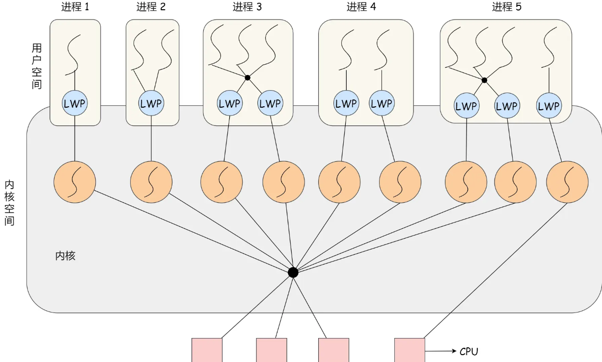
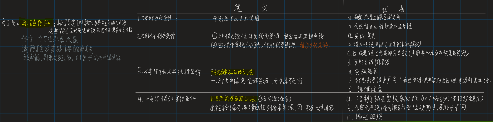

# 基本概念

## 进程

进程状态：就绪、阻塞、运行、创建、结束、阻塞挂起、就绪挂起



PCB包含：进程描述信息、进程控制管理信息、资源分配清单、CPU运行信息

对进程状态的切换，就是将对应的PCB移入对应的链表

### **创建进程：**

引起的创建进程事件：用户登录、作业调度、提供服务、应用请求

- 通过clone调用拷贝当前进程并创建一个子进程，填入信息
- 分配运行所需的资源
- 插入就绪队列，等待调度

### **终止进程：**

引起终止的事件：正常结束、异常结束（越界、等待超时、算术运算出错）、外界干预（用户和os主动杀死进程，父进程请求，父进程终止）

- 调用do_exit(), 通过终止进程的标识符找到PCB
- 若在执行则终止，并重定位子进程（给他找一个父进程）
- 返还资源给系统和进程
- 将其PCB从队列移除

### **阻塞进程：**

- 通过进程标识号找到对应的PCB
- 如果其为运行状态，则保存上下文，停止运行
- 修改其状态，插入到阻塞队列中

### **唤醒进程：**

- 在阻塞队列中找到PCB
- 修改其状态，从阻塞队列移出插入就绪队列

### **进程切换的步骤：**

- 保存当前进程上下文，
- 更新其PCB，将PCB移入适当的队列
- 选择其他进程执行，更新和修改其PCB的状态
- 恢复其进程的上下文环境

（进程上下文包括，CPU寄存器和程序计数器（记录指令位置））

### **进程切换发生的场景：**

- 缺少资源：时间片到期、请求资源或资源不足时（例如内存不足）
- 主动阻塞：主动睡眠或挂起
- 被迫阻塞：更高优先级的进程加入、发生硬件中断

## 线程

同一个进程内线程共享代码段、数据段、系统资源

### **线程和进程的区别：**

目的：

- 线程是CPU**调度**的单位，进程**资源**的分配单位，

成本：

- 线程本身只有独立的寄存器和栈

运行：

- 线程**切换**、创建、终止的开销小，进程切换开销大
- 如果如果**线程崩溃**了，导致所属进程都崩溃了（c++)

开发：

- 进程之间**通信**需通过系统，开销大，效率低，同进程的线程通信可直接读写，方便且快捷，但也存在资源互斥的问题

### **内核线程和用户线程的区别：**


### 线程、进程、协程切换

都有的，程序计数器、堆栈指针，通用寄存器（上下文）、浮点寄存器、状态寄存器


**协程切换：**

目的：

1. 协程适用于大量**I/O密集任务**，涉及资源的等待。线程适用**cpu密集**任务

原理：

1. 系统：**没有调度程序**执行，但有用户态程序自己写的调度任务，包括保存上下文信息。
2. 系统：**没有线程切换**的开销（内核态切换），多个协程充分利用所属线程**时间片**，提高cpu的有效运行时间
3. 内存：多个协程共享线程的**堆栈**，每个线程有自己的堆栈
4. 内存：**缓存**更容易命中

开发：

1. **并发模型：**协程通常是用事件驱动机制驱动，多个协程在同一个线程跑，因此不涉及多线程并发问题，对**编程来说更友好**（对单个协程来说，运行时的值多次读不会改变）
2. 对系统的适配更好，内核级线程需要系统支持

对应的，协程阻塞会让在这个线程上的所有协程阻塞

**线程切换：**

1. 线程调度程序（决定调度谁），通常比进程的调度代价小	

缓存无法命中：

- L1、L2、L3缓存
- 快表缓存
- 部分寄存器

**进程切换：**

1. 程序调度程序
2. 进程地址空间：虚拟地址映射结构（段、页基地址寄存器）
3. 快表TLB

都通过schedule调度


### openssl实现的协程

封装了linux提供的`getcontext、makecontext、swapcontext`函数

[OpenSSL的async异步框架/OpenSSL协程 | CatBro's Blog (catbro666.github.io)](https://catbro666.github.io/posts/6d5be1a5/#more)

只被async框架使用，用于异步握手

```c
//初始化线程私有变量，初始化job池（申请一个job开销较大）
int ASYNC_init_thread(size_t max_size, size_t init_size);
//申请一个job，保存当前堆栈入job，执行注册进去的func，在func中遇到pause会返回这个函数，这个函数会返回异步函数的执行状态。
int ASYNC_start_job(ASYNC_JOB **job, ASYNC_WAIT_CTX *ctx, int *ret, int (*func)(void *), void *args, size_t size);
//如果异步函数没有执行完成，则通过这个函数得到异步函数阻塞任务的文件套接字，当异步任务完成后，轮询这个文件套接字获知，再调用ASYNC_start_job继续执行异步函数
ASYNC_WAIT_CTX *ASYNC_get_wait_ctx(ASYNC_JOB *job);
//异步函数中遇到阻塞需要等待的部分，则调用这个函数让出cpu，切换协程 
int ASYNC_pause_job(void);

```

assync框架用一个job来表示一个协程，

协程的堆栈信息、协程的通知文件描述符、协程间通信的内容，都存放在线程的私有变量中


openssl利用async来实现异步握手


## 对于线程模式的选择

**1：1模式**

一个用户线程对应一个内核线程

容易实现，可以并行

每个用户线程创建一个内核线程开销太大

**N：1模式**

多个用户线程对应一个内核线程

用户线程上下文切换效率高

一个用户线程阻塞会将其他用户线程也阻塞，且只能使用单核的CPU资源

**N:N模式**

多个用户线程对应多个LWP，LWP再一一对应内核线程



## 进程的调度

### 处理器调度层次

- 作业调度：把处于后备队列的作业调入内存，创建进程、分配资源
- 进程调度
- 中程调度：将不能运行的进程调值外存上等待

### 调度原则

- CPU利用率
- 系统吞吐量
- 带权周转时间=（作业完成时间-作业提交时间）/实际运行时间
- 等待时间（所有进程等待时间之和）
- 响应时间（用户提交请求到首次相应）

### 调度算法

- 先来先服务算法FCFS
- 短作业优先调度SJF
- 优先级调度（实时操作系统）
- 高响应比优先调度算法（ （等待时间+预计服务时间）/预计服务时间）
- 时间片轮转调度算法RR
- 多级反馈队列调度算法

# 进程的通信

## 管道

简单且基础的通信方式

**匿名管道**：实际上是特殊的存在于内存的一串缓存

```cpp
int pipe(int fd[2])
//fd[0]是用于读取的描述符
//fd[1]是用于写入的描述符
```

使用，用pipe创建读写描述符，使用fork()创建子进程，此时父子进程通过读写描述符通信

**命名管道：**实际是创建了一个类型为管道的设备文件

**缺点：**

- 常用于**父子进程通信**，**不能同时读写**，如果要双向通信就需要建两个管道
- 管道是个**环形缓冲区**：一次**数据大小**有上限
- 数据读完就删除
- 管道慢

**管道慢的原因：**

- 写时数据从用户**内存复制**到内核，读时数据从内核复制到用户空间
- 处理期间要获取和释放**管道锁**
- 不断分配新页面，可能处理的数据内存不连续

## 消息队列

是保存在内核中的消息链表，发送数据时，会分成一个个独立的数据单元，发送接收双方约定好消息体的数据类型（固定大小）

- **通信对象**：**多个进程**间发送接收消息，可以实现复杂的进程通信，但**读写消息时互斥**，且**通信不及时**
- **功能**：复杂而功能强大， 消息有**类型和优先级**
- **数据大小**：能通信的**数据大小**远大于管道，但仍然有上限
- **删除**：消息队列的生命周期同系统，独立于接发进程，消息读取后仍在队列，可以**控制什么时候删除**
- **时间**：依然存在用户态和内核态**数据拷贝**的开销

## 信号量

是一个整型的计数器，用于实现进程间的同步和互斥

P操作：将信号量-1，如果信号量小于0则表示资源占有，阻塞当前进程，不小0则继续运行

V操作：将信号量+1，如果信号量<=0，表示有进程在请求资源，从阻塞的队列中唤醒一个进程

## 共享内存

拿出一块虚拟地址空间，映射到相同的物理内存

- 多进程通信
- 简单但高效，避免了复制的开销

但多个进程对共享内存存在并发读写的问题，因此需要信号量机制

应用：网络编程中，将文件发送到网上，DMA方式，直接内存映射

## 信号

对于异常情况下的工作模式可以通过信号来通知进程

进程间通信机制中唯一的异步通信机制，ctrl+c生成SIGINT信号，kill命令，是SIGKILL信号

用户进程对信号的处理方式：

1. 执行默认操作，linux对信号规定了默认操作
2. 捕捉信号，为信号定义一个处理函数，信号发生时，执行一个处理函数
3. 忽略信号，

SIGKILL和SEGSTOP是无法捕捉和忽略的

缺点：

1. 异步的信号处理函数可能在主程序的任何时候调用，因此信号处理函数：

- 不执行不可重入的函数：信号处理函数里可能和主程序都执行了同一个不可重入函数
- 不依赖不可重入的资源

- 不使用静态/全局变量：信号处理函数里读到的程序里的值可能是没有完全写好的数据

2. 信号处理函数执行的过程中又收到信号，从而**信号嵌套**：设置信号掩码

> nginx中，信号处理函数只设置标识位（为了让信号处理函数简短），主进程里有信号发送就会被唤醒，并设置信号掩码（这两个是由系统函数提供的支持是同时发送的），循环依次判断每个标识位，执行对应的处理函数

3. 移植性：不同os对信号处理的 方式不同，换了系统可能信号处理代码不能正常工作

## socket

用于不同主机的通信

# 死锁问题

## 死锁预防


## 死锁避免

银行家算法

## 死锁解除

资源剥夺法：挂起某些死锁进程，抢占它的资源

撤销进程法：强制撤销部分进程并剥夺其资源（实现简单代价大）

进程回退法：系统提前设置还原点，回退到足以回避死锁的地步

# 锁

## 互斥锁

互斥锁加锁失败后，会从用户态陷入到内核态，内核会将线程置为睡眠状态，切换线程，等到锁被释放后，内核在合适的时机唤醒线程。

这个主要的开销成本，包含两次线程上下文切换的成本：

- 当线程加锁失败时，内核把线程的状态从运行状态设置为睡眠状态，把CPU切换给其他线程
- 锁释放时，睡眠状态的线程会变为就绪状态，下次调度时运行

## 自旋锁

> 上下文切换的耗时约在几十纳秒到几微妙之间，如果被锁住的代码执行时间很短，用自旋锁代替互斥锁会更合适

自旋锁是通过CPU提供的CAS函数，在用户态完成加锁解锁，不主动产生上下文切换，开销小，速度块

自旋锁的加锁过程：

- 查看锁的状态，如果锁是空闲的，执行第二步
- 第二步，将锁设置为当前线程持有

CAS函数将这两个步骤合并成一条硬件指令，形成原子指令

在单核CPU上，使用自旋锁需要抢占式的调度器，毕竟自旋的线程不会主动放弃CPU

# 进程的预读策略

几个核心规则：

- 预读的时候内核并不考虑页内偏移，逐页读取即为顺序读
- 进程持续顺序访问一个文件，那么预读页数逐步增加。进程随机访问文件，内核就会逐步减少预读
- 内核发现进程重复访问同一页或文件页全部在缓存页中，则禁止预读

# 其他


## 一个进程能创建多少线程

收到如下的限制

- 进程的虚拟内存空间上限：一个进程或线程的最大栈大小通常为8M，`ulimit -s`
- ***/proc/sys/kernel/threads-max***，表示**系统支持的最大线程数**，默认14553
- ***/proc/sys/kernel/pid_max***，表示系统全局的 **PID 号数值**的限制
- ***/proc/sys/vm/max_map_count***，限制一个进程可以拥有的**VMA(虚拟内存区域)**

## 进程是如何崩溃的

c++中，各个线程的地址空间是共享的，某个线程对地址的非法访问会导致内存的不确定性，从而影响整个进程，从而使得操作系统让整体崩溃

信号机制实现使进程崩溃

kill指令执行的是系统调用，由内核给指定进程发送信号：

1. 进程收到系统发的信号，CPU暂停运行，将控制权转移给os
2. 调用kill系统调用向进程发送信
3. 操作系统根据情况执行相应的信号处理程序

这个信号处理函数，一般系统有默认的信号处理程序，但如果用户程序注册了，则执行自己的信号处理函数。

```cpp
// 自定义信号处理函数示例

#include <stdio.h>
#include <signal.h>
#include <stdlib.h>
// 自定义信号处理函数，处理自定义逻辑后再调用 exit 退出
void sigHandler(int sig) {
  printf("Signal %d catched!\n", sig);
  exit(sig);
}
int main(void) {
  signal(SIGSEGV, sigHandler);
}
```


# 排序算法的稳定性：

不稳定：堆、快、选择、希


