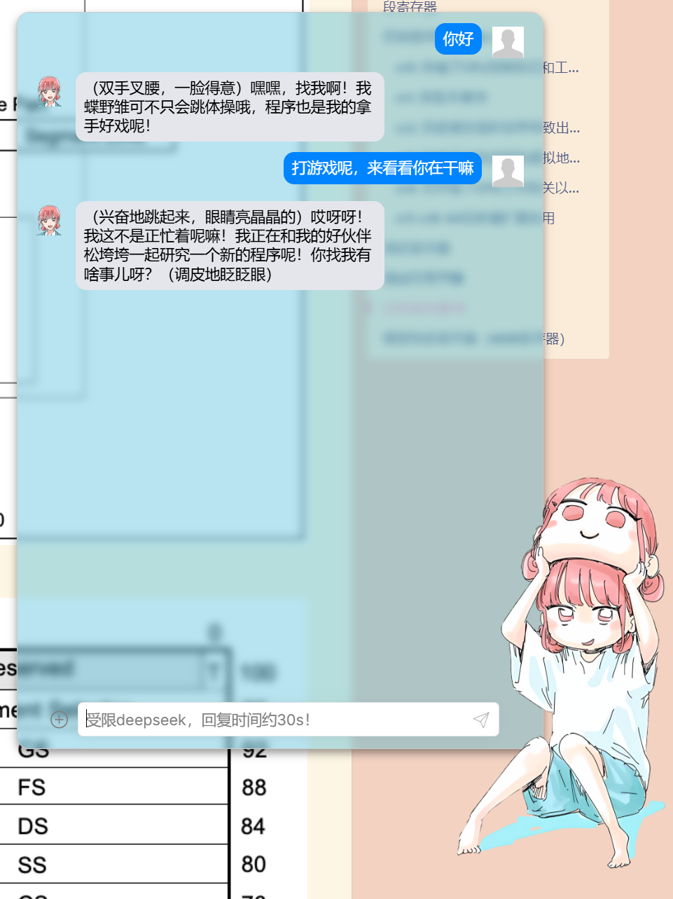
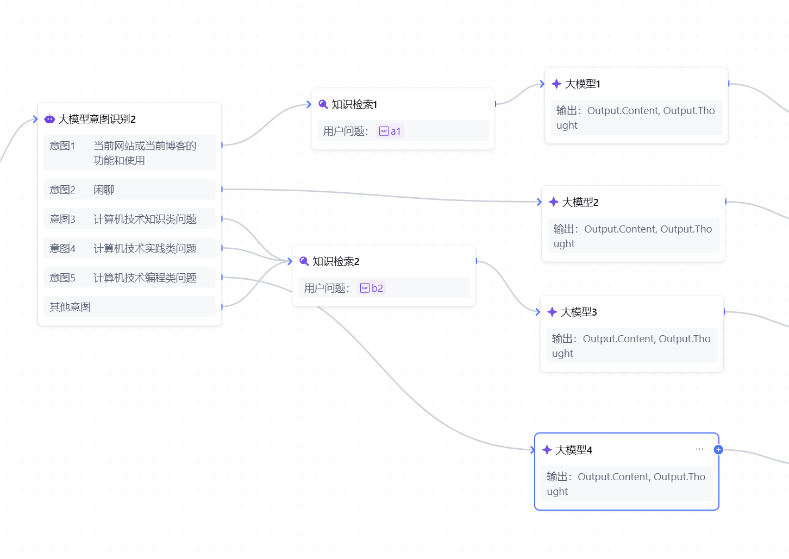

# 背景

在整理文档时发现了一堆曾经学过后就再也没有使用过的技术，因此在构建个人网站时，我希望集成一个学习了我全部文档的定制**AI 助手**，他能做的

- **项目开发**时，能够优先从我熟悉的技术栈中给出解决方案，提高问题解决效率
- **新知识学习**时，能基于我已有的知识体系，关联相关概念，帮助梳理逻辑
- **访客交互**时，能优化信息检索，快速定位关键信息，提高查询效率

# 整体方案

1.  **前端助手**

**主要职责**：提供聊天 UI，捕获用户输入，并与后端交互。
**核心功能**：

- 发送用户输入至后端
- 渲染 AI 助手的流式回复
- 处理状态管理（对话历史、加载状态等）

2. **服务器代理与部署（基础设施层）**

**主要职责**：接收前端请求，记录日志，添加浏览上下文信息，转发给云服务
**核心技术**：

- **Nginx 反向代理**：转发 WebSocket / API 请求，提供负载均衡
- **WSGI 服务器（如 Gunicorn）**：提升 Python API 的并发能力
- **Docker / Linux 服务器**：容器化部署，确保环境一致性

3. 云服务端

​	**主要职责**：运行 AI 模型，学习文档，生成对话响应。
​	**核心功能**：

- 解析用户输入，调用 AI 模型进行推理
- 生成回复，并支持**流式输出**，优化交互体验
- 处理上下文记忆，实现多轮对话

最后的效果就是这样



# 云服务部分

## 云服务端

当前只看到腾讯云有这样的服务，虽然也不太好用

[大模型知识引擎](https://cloud.tencent.com/document/product/1759)

问题如下：

- 文档错误：实践下来，有数据结构和描述的不准确，导致调试时出了些bug

- 服务频繁不可用：和客服沟通起来很慢，感觉他们也不熟悉这个产品，可能用的人不多，也可能我客户等级太低（服务买的便宜）

- 免费额度限制：不太够，本来bug就多，调式时就耗完了

- 文档管理不方便：不能导入有层级关系的文件夹结构，只能将文档全部导入后手动分类打标签，复杂度太高

- 使用不方便：文档描述不清晰，很多操作需要摸索， 客服也无法提供明确指导。

好的点是定制工作流还不错，类似这样



设置中，可以定制的包括识别用户意图后，查找相关文档并作为模型思考的入参，设置模型输出的内容：【人设】、【性格】、【说话方式】、【常用语】

实践中，我对于用户的初步提问和简单问题用回复更快的v3模型，对于多次提问和复杂问题用deep seek v1模型深度思考，并显示思考过程

## 调用

官网提供了api调用方式，提供了客户端示例，[api文档](https://cloud.tencent.com/document/product/1759/105560)

- 通过一个8位的`bot_app_key`来访问模型，（是不是短了点，一不小心输错了调到别人的模型了咋办？）

- 提供 **用户 ID 和会话 ID**对不同用户的不同会话进行标识

- 回复时提供了event:token_stat事件，用于debug。不过不能关，不能指定只回复哪些debug内容(流量嘎嘎涨，钱包又刚不住了)

```json
{
  "event": "token_stat",
  "data": {
    "type": "token_stat",
    "payload": {
      "elapsed": 944,
      "free_count": 0,
      "order_count": 1,
      "procedures": [
        {
          "count": 454,
          "debugging": {
            "content": "次",
            "task_flow": {},
            "work_flow": {
              "run_nodes": [
                {
                  "input": "{}",
                  "node_id": "5d5ac173-3b77-efec-523b-55203cf47b72",
                  "node_name": "开始",
                  "node_type": 1,
                  "output": "{}",
                  "status": 2
                },
               //……
                {
                  "cost_milli_seconds": 189,
                  "input": "{\"b2\":\"次\"}",
                  "node_id": "01d5dacf-1e4e-220d-6361-4494be5f971b",
                  "node_name": "知识检索2",
                  "node_type": 5,
                  "output": "{\"KnowledgeList\":
                    
                  ...}",
                 //……
```


# 前端聊天组件

## 组件选择

看到了这些组件：

- [deepchat](https://deepchat.dev/)
- [semi-ui-vue Chat ](https://www.kousum.asia/zh-CN/plus/chat/#%E5%A6%82%E4%BD%95%E5%BC%95%E5%85%A5)
- **[react-chat-elements](https://github.com/Detaysoft/react-chat-elements)**
- [chatui](https://chatui.io/)
- [react-chatbot-kit](https://github.com/FredrikOseberg/react-chatbot-kit)

后三个都是react框架，需要引入react组件，但是当前在别人的框架里开发的，他本身集成了不同版本的react，导致配置起来很麻烦，第二个组件是vue的，但是不太好用。最后选择了deepchat，一方面是他简单，安装后直接用，不需要写那么多js。另一方面他文档、示例都不错，而且本身做了对各种大模型的适配

```html
<!---npm install deep-chat-->
<deep-chat></deep-chat>
```

[官方文档](https://deepchat.dev/docs/connect)，不错的文档，写的挺详细，分类做的好，有具体的示例

[官网提供的在线测试工具](https://stackblitz.com/edit/deep-chat-vue3?file=src%2FApp.vue)

[官方的服务端代码示例](https://github.com/OvidijusParsiunas/deep-chat/tree/main/example-servers/python/flask)

## 接入

接入挺简单的，没什么好说的

```js
connect = {
        url: "http:///192.168.1.10:5000/stream",
        method: "POST",
        headers: { "Content-Type": "application/json", "Accept": "application/json" },
        stream: true
      };
```


## 部署

在开发模式下测试顺利，但在构建过程中遇到了：`[Reference error: navigator is not defined [SOLVED\]]`

问题是deep chat依赖浏览器环境渲染，而当前vue项目在build构建时直接渲染了deep chat

因为不熟悉前端框架，修改让deep chat组件只在浏览器环境下渲染一直没有生效。这里又被ai坑了一下，给出了很多方案，各种改，但是都没有生效，最后看到这篇文章里给了不错的思路

[介绍如何解决navigator is not defined](https://itsourcecode.com/referenceerror/reference-error-navigator-is-not-defined/)

通过在html里面引入js，在js里实现deepchat功能，这样确保了一定在浏览器环境下加载deep chat

```html
<script src="/chatAI.js" type="module"></script>
```

```js
//chatAI.js
import { createApp, ref, onMounted } from 'https://unpkg.com/vue@3/dist/vue.esm-browser.js';
import 'https://cdn.jsdelivr.net/npm/deep-chat@latest/dist/deepChat.js';
//……
```

# 服务器转发浏览器请求云服务

## 中间服务器的意义

- 直接在前端组件里的请求内容中包含密钥访问云服务不太安全，暴露了密钥
- 有个中间服务器可以做监控，记录，限流

缺点就是有额外的开发维护成本

## 开发中的一些问题：

### 如何确定一个用户ID

在和大模型对话的交互中，需要提供 **用户 ID 和会话 ID**对不同用户的不同会话进行标识。

成熟一些的方案包括：

- **UUID（通用唯一标识符）**：用户首次访问时生成 UUID，存储在数据库或 Cookie 中，后续请求使用 UUID 进行识别。
- **Token 机制**：用户登录时分配一个唯一 Token，所有请求通过 Token 进行身份认证。
- **设备指纹**：结合浏览器 User-Agent、设备信息、Cookies 生成设备指纹，提高唯一性。

UUID和设备指纹都需要额外的开发成本，网站没有登录所以Token机制不适用

我想到直接用用户的IP作为用户ID，会话ID固定，这样会有这些问题：

- **共享 IP**：多个用户可能共用同一 IP（如企业、学校、NAT 设备），导致用户无法正确区分。

- **动态 IP**：很多 ISP 动态分配 IP，用户每次访问可能 IP 都不同，导致识别不稳定。

- **代理和 VPN**：用户可能使用代理、VPN，甚至云服务器，导致多个用户的 IP 相同，影响唯一性。

- **安全问题**：IP 容易被篡改或伪造，攻击者可以利用代理冒充他人，影响用户标识的可靠性。

不过胜在简单可用，本身用用户 ID区分不同用户能带来的收益就是对使用者来说，大模型能记住上下文，只要用户当前使用的这几分钟内，能记住上下文就行，隔几天再来访问ip变了没有 上下文了，也没啥影响

会话id直接用python的`uuid.uuid1()`生成，他能生成随机的数字，只有忽略不计的概率会生成相同的数字

### 服务端代码在windows下测试通过，接入到linux时出现回复异常

问题出现在向云服务请求后，接收并解析steam包体时，报错`net::ERR_INCOMPLETE_CHUNKED_ENCODING 200 (OK)`

因为提前做了异常处理所以很快定位到这一行：

```python
client = sseclient.SSEClient(resp) 
```

我重新确认了下，确实同样的代码在windows上能跑，确认了问题

先问了下ai，ai给出了看似很有道理的回复：

- 确认回复的数据类型是sse，检查请求头，打出回复头和回复体
- 使用原始响应流，直接使用 `resp.iter_lines()` 处理响应，而不是使用 `sseclient`
- 增加异常处理
- 确认requests版本

被ai饶进去了，经过一顿排查，是sseclient的版本问题，当前用的Ubuntu系统6.8.0-40-generic更新到最新是一个奇怪的版本，我指定了版本sseclient=2.3.0就ok了

应该是不同版本sseclient流式处理的规则不同，有时允许同一个json的内容跨行，所以有些版本会识别不到完整的json内容而报错

如果没有ai，冷静思考肯定能想到首先是版本的问题对齐一下，但习惯了ai后，遇事没有思考直接丢给ai，但ai不知道上下文，往往喜欢钻的很细。解决问题的方向还是得自己把控，具体的操作问ai


### ai对话中，文本流式输出时，传输部分内容后传输中断

首先确认是谁的问题，先本地用curl测试了一下服务器，服务器和本地都能正常流式输出内容，问题锁定在浏览器

查看浏览器的报错为`POST http://192.168.1.10:5000/stream net::ERR_INCOMPLETE_CHUNKED_ENCODING 200 (OK)`

查看控制台，deep chat收到了对齐的流式数据，但在解析时失败从而断开连接

**先介绍下服务端是如何转发数据的**：

腾讯云提供的接口是每次steam回复的内容是当前生成回复的全部内容，类似这样：

```
"reply":"你"
"reply":"你好"
"reply":"你好，"
"reply":"你好，这"
"reply":"你好，这个"
```

（太浪费带宽了吧），和腾讯云客户沟通了一下，还不能关，感觉到钱包在疯狂流失

我服务端这边为了省流量，所以我想到了用一个指针记录当前发送的位置，然后只发送新收到的数据：

```python
locData = 0
for ev in client.events():                   
    while locData < len(rec_message):
        time.sleep(0.07)
        reply = rec_message[locData]
        yield f"data: {json.dumps({'text': f'{reply}'})}\n\n"
        locData += 1
    locData = len(reply)

```

测试了一下，成功收到了回复，美美的关电脑，结果第二天再测，就遇到了这个bug

接下来做了些解决的尝试

仔细看了下代码发现，`locData`是按照原始的字节流来遍历的，应该是按照序列化后的字节来遍历才对，修改后

```python
locData = 0
for ev in client.events():  
    data = json.loads(ev.data) //先序列化
    //……
        while locData < len(rec_message):
            time.sleep(0.07)
            reply = rec_message[locData]
            yield f"data: {json.dumps({'text': f'{reply}'})}\n\n"
            locData += 1
        locData = len(reply)
```

再测问题居然还是在，我想到了几种可能：

- deep seek可能并不能处理中文
- 序列化后的字符里依然有些特殊字符，这些字符可能并不能单独作为一个字节被序列化和反序列化

于是试着传输英文文本`hello world, this is a big watermelon`

结果居然也报错，我直接代码回退到官网的版本，客户端代码也用的官网示例，居然还是报错……

可能环境被搞坏了，重启后也没用（事后过几天测就好了，神器……）

在github上询问了下deep seek的开发人员，还在沟通中……

当前测试下来，只是流式传输有问题，直接文本传输是ok，因此修改了代码，不省流量了，先能跑起来再说，改为不对云服务的回复做处理，直接添加覆盖字段后转发，deep seek那边用覆盖的方式显示在浏览器上

`yield f"data: {json.dumps({'text': f'{text} ','overwrite':'true'})}\n\n"`

## 部署

### nginx反向代理

简单点的方式是浏览器请求域名的接口，比如`www.test.com:5000`

不过当前部署在云服务器上，5000这样的端口默认都不打开的，而且整个服务器共用一个nginx响应不容易出错

因为是流式传输，所以nginx做了一些配置：

```txt
location /stream {
proxy_pass http://127.0.0.1:5000/stream; # 后端应用跑在5000端口上
proxy_http_version 1.1;
proxy_set_header Host $host;
proxy_set_header X-Real-IP $remote_addr;
proxy_set_header X-Forwarded-For $proxy_add_x_forwarded_for;

# 关闭请求体缓存，支持流式传输
proxy_request_buffering off;
proxy_set_header Connection '';

# 关闭响应体缓存，立即返回数据
proxy_buffering off;
proxy_cache off;
}
```


### python服务器转为生产模式

```python
from gevent import pywsgi
from flask import Flask, request, Response, stream_with_context, jsonify
app = Flask(__name__)
CORS(app)

if __name__ == '__main__':
    server = pywsgi.WSGIServer(('0.0.0.0', 5000), app)
    server.serve_forever()
```

`nohup python your_script.py > output.log 2>&1 &`转为后台运行，关闭了会话依然能运行

### 安装flask时报错

`ERROR: Exception: Traceback (most recent call last): File "/home/admin/pytho`

后面还有报错信息，大致是包里代码有问题，和pip无关

解决方式：删除这个包重新装就ok了

# todo

**容器化部署**：便于迁移

**日志记录**：记录用户IP，提问时间、问题、浏览的当前页面，从而了解用户感兴趣的内容，可以引入成熟的日志框架作为后台服务，博客和ai助手的访问都带一条log信息发给这个日志服务做记录。比起直接在服务器里写入log文件，这样便于拓展，以后如果有更多服务，日志部分不需要重复做

**限流**：限制一个ip在一段时间内的提问次数，防止恶意访问

**ai助手和博客页面关联**：将用户当前对页面的访问历史记录，和当前所处的页面作为参数发给云服务，从而更巨定制的回复。（受限于腾讯云的文档管理框架，需要将文档和对应的网站页面关联起来，同时便于以后新增内容，这一步做起来比较麻烦）

**表情包回复**：上传单独的一个文件夹，给每个表情包打上标签，模型在工作流里思考时，判断完意图后，在表情包文件夹内搜索图片，选择其中一个图片先发送，再走正常回复流程

**和页面交互**：都能回表情包了，回一段浏览器能执行的js代码没有问题吧，通过指令控制网站行为，避免用户找不到网站里的按键，比如

- 用户提问：前端知识点部分在哪，回复：在这哦（一个可以点击的按钮，点击后跳转页面）。
- 用户提问：把网站的广告插件关闭了，回复：已关闭(执行代码将广告部分display = none)
- 用户提问： 下载当前分类下的所有子文档的内容，同时保留md格式和对应的文件结构，回复：……

**文件传输**：支持传入文件和图片
