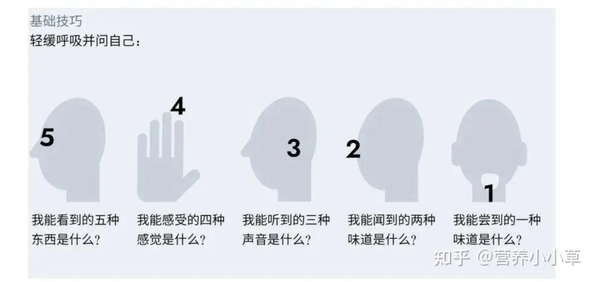

```md

<mark> </mark>

::: [信息类型] [布局]
[信息类型] ：tip warning danger note
[布局] ： center right details theorem right

卡片列表、图片列表：
::: cardList <每行显示数量>
```yaml
- name: 麋鹿鲁哟
  desc: 大道至简，知易行难
  avatar: https://jsd.cdn.zzko.cn/gh/xugaoyi/image_store/blog/20200122153807.jpg # 可选
  link: https://www.cnblogs.com/miluluyo/ # 可选
  bgColor: '#CBEAFA' # 可选，默认var(--bodyBg)。颜色值有#号时请添加单引号
  textColor: '#6854A1' # 可选，默认var(--textColor)
```


可靠：主动沟通进展 完成交代的事

解决问题：确认原始需求 反思流程 

程序员的本质是解决问题，写代码是解决问题的一种方式、

25.2.28

大多的程序问题都是人与人沟通的问题，不要质疑别人的代码功能，优先考虑是否沉默的内容值得信赖

25.3.1

对于当下未入职场的程序员，学习的优先级：

后端基础（语言、系统、网络、数据库等） > 开发工具（linux运维部署监控自动化，代码审查开发拓展维护等）> 系统架构

后端基础：提供找到问题的能力

开发工具：提供高效的处理问题的能力

系统架构: 以更高的维度来解决或避免问题

网站太多告诉我们要注重系统架构，但对于当下的我来说本末倒置了，先扎实基础，首先能做出东西来，其次高效的做出来，反思流程，实现自动化，降低开发成本和沟通成本才是当下的重点

25.3.20

清楚自己的优点和清楚自己的缺点同样重要，这样才能保持优点征地不失手，调整缺点，扩大优点的版图 松垮垮: 03-21 01:52:26 留给自己空白的时间，闲下来时才会去做那些不舒服但又没空解决的小问题

25.3.21

帮别人忙时，一句话给结论就好，除非对方问否则不要解释原理

留给自己空白的时间，闲下来时才会去做那些不舒服但又没空解决的小问题 松垮垮: 03-21 01:59:26 帮别人忙时，一句话给结论就好，除非对方问否则不要解释原理

25.4.3

如果目的是为了让别人更好的理解内容，应该将内容拆分为多个层次，从高度概括的简易版本到每个细节的逐次介绍的版本，虽然将一个事情反复介绍，但是使读者更容易理解，且多次重复也能加深印象强调重点

25.4.7

当我学一门新语言时，我是在学什么？

如何更好的表达

25.4,10

是否深陷具体的技术之中，学习了的内容过细致，耗费了大量时间在呈现假装努力的效果，实际上过细的技术用不到，应该站在更高的维度上，思考系统架构产品等问题。相对立的思路是，勿好高骛远，空谈框架，扎实自身领域基础，沉淀到一定量级才是主线

25.4.13

脑力工作者是指每天花时间思考学习，而不是重复已有的技能

25.4.14

源码并没那么重要，重要的是得到结果的过程

简单的东西也可以做好，用完整的开发周期去看待

25.4.16

将各个零散的知识点用逻辑线串联起来，在知识点之间提供逻辑转折的过渡语句会让文章更容易懂。本质上是让读者从熟悉的东西入手来理解接下来的内容，或者将接下来的东西能不经思考的安放到思维里的某个位置

25.4.28

Treat serious matters with a serious attitude. as an engineer, it is important to be reliable. When acting in an engineering role, avoid performing unreliable actions, such as Inexplicable humour or unwarranted smiles.

Keep your mind joyful instead of pessimistic and dispirited. 


性格分析：

僵硬的肢体->对自己高要求，强迫倾向，内在评价要求高，自我否定

走路快->目标感、独立、效率导向

- 写下3件当天值得认可自己的事，即使很小（如按时起床、主动微笑一次）。
- 自我暗示

- 与信任的人练习表达感受




手指的运动

饮食：

坚果、300ml牛奶、鸡蛋、水果

处理居住环境的卫生

控糖50g以内

像运动员一样管理时间

碎片化运动，站着开会、在地铁上站着、刷牙的时候深蹲

早起在镜子前正向鼓励，

起床前喝杯热水/柠檬水

早晚制造兴奋点，假象一些高兴的事，回忆一天中高兴的事

对于烦恼的事，通过记录来抒发

休息时做些发挥右脑的事情

固定穿搭

一部只有工作的手机

周日晚可以留一点空闲的时间段，什么也不干，对房间指指点点，般般挪挪，做的好吃的，整理整理电脑文件，发呆、正念

父母沟通，

- 每月和家人视频，生活相关，但禁止聊工作和正事和恋爱，禁止教我东西，(古筝/做菜)
- 不要给我带来价值，不带来负担负担
- 不主动给钱，要钱列清单

之所以有这么多规矩，是为了解决问题
